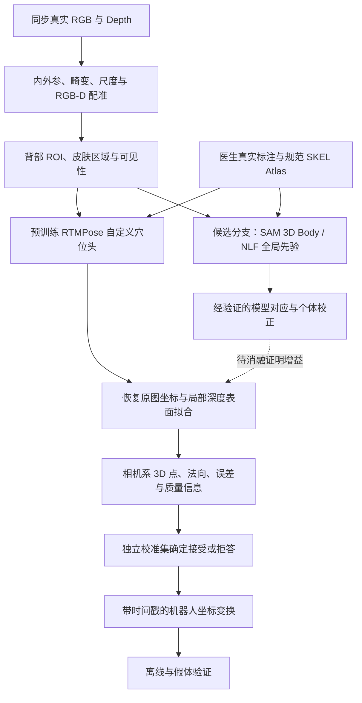

# 真实场景穴位关键点定位：整体 Pipeline

版本：2026-09-06。本文是工程设计与待验证假设，没有新增真实人体实验结果。

## 1. 目标与当前起点

目标是从真实俯卧背部 RGB-D 中获得医生定义的穴位位置、表面法向和定位质量，逐步交给机器人坐标链。工程精度、真实泛化和运行效率优先；论文贡献从经过验证的改进中形成。

现有 SKEL Atlas → 合成 RGB-D → 2D → 深度反投影链路已经提供了坐标、标注和训练基础。冻结结果属于非医学 E01–E20 工程点和合成域；真实人体穴位、个体差异、相机测量和机器人误差尚未验证。现有医生工作台保留为规范先验工具。

**新主线：真实数据监督＋已有视觉预训练＋真实 RGB-D 测量。** 合成数据用于坐标回归检查、可控扰动和可选预训练消融，不继续把扩大自建虚拟图片训练当作主目标。公开预训练模型可能包含合成训练数据；“真实场景优先”不等于排除一切合成预训练。BEDLAM 的现实数据集实验是这一点的反向证据。[Black 等，2023](https://arxiv.org/abs/2306.16940)<!--ref:bedlam--><!--anchor:section:Experiments-->

## 2. 数据流



主路径先独立成立，人体网格分支随后接入比较。RTMPose 具有可用训练、预训练与部署生态，适合作为第一基线；SAM 3D Body 和 NLF 提供不同形式的人体先验，不能直接视为穴位检测器。[Jiang 等，2023](https://arxiv.org/abs/2303.07399)<!--ref:rtmpose--><!--anchor:section:Methodology-->；[Yang 等，2026](https://arxiv.org/abs/2602.15989)<!--ref:sam3dbody--><!--anchor:section:Method-->；[Sárándi 等，2024](https://arxiv.org/abs/2407.07532)<!--ref:nlf--><!--anchor:section:Method-->

## 3. 真实采集与医学语义

第一批限定俯卧、裸露背部、固定 RGB-D 相机与稳定光照，先建立可测量的任务。随后增加体型、肤色、光照、呼吸、轻微转身、遮挡和相机位置变化。公开人体姿态标签只能提供姿态预训练，不能替代穴位标签。

医生先冻结目标穴位清单、侧别、定位依据、不可辨识条件和版本号；K 指具体左右侧实例数，不等于穴位类别数。未获得确认前，所有试运行继续用工程点身份。建议同时记录骨性体表参考点，供个体比例和结构模型使用。

训练输入保存自然、无标记图像。医生标记照片、触诊记录或辅助测量属于标签生成支路，需要与自然图像匹配，并记录期间的人体运动。使用贴纸后擦除或图像修补不能自动证明消除了标签线索；先用自然输入验证。重复标注或双医生子集用于估计标注差异，不将其与模型误差混为一谈。

每条样本至少记录：匿名 subject_id、session_id、时间戳、姿态、原始 RGB、原始 Depth、单位、有效深度、相机标定版本、穴位 schema 版本、2D 标签、可见性、标签来源及质量。人体网格拟合标签单列为伪标签。数据采集按所在机构适用的知情同意与研究流程执行，公开仓库仅放匿名协议和统计。

## 4. 二维定位基线

使用现有 MMPose 工作流，加载兼容的公开预训练 backbone，替换为自定义 K 点输出并真实数据微调。与当前无预训练、160×128 合成 RTMPose 的变化必须明确记录，不能冒称同一 baseline。

先采用人工背部 ROI 做定位器可行性实验，再加入自动 ROI，把检测漏检纳入端到端评估。避免一开始同时更换检测器、关键点头、损失和网格先验。验证输入尺度对小范围定位的影响，在精度与总延迟之间选择。

crop、resize、flip、SimCC 解码及坐标逆变换保持一致。子像素输出只是表达能力，不等于实际亚毫米精度。UDP 适合审计坐标偏差；DARK 主要针对热图编解码，不能直接照搬到 SimCC。[Huang 等，2020/扩展稿](https://arxiv.org/abs/1911.07524)<!--ref:udp--><!--anchor:section:Unbiased Data Processing-->；[Zhang 等，2020](https://arxiv.org/abs/1910.06278)<!--ref:dark--><!--anchor:section:Method-->

## 5. 深度与坐标链

先验证相机实际型号、分辨率、内参 K、畸变、depth_scale、RGB/Depth 外参和时间同步。RGB 与深度尺寸相同或按尺寸比例缩放，不代表完成光学配准。

保存原图到网络输入的变换 A。网络点恢复为 `u_full = A^-1 u_network`，再按标定模型去畸变。对于针孔相机、已去畸变像素及 optical-Z 深度：

```text
Xc = (u - cx) × Zc / fx
Yc = (v - cy) × Zc / fy
Pc = [Xc, Yc, Zc]，单位统一为米
```

局部深度窗口只在可靠皮肤区域取值，拟合表面并估算法向。背景混入、无深度、强倾斜或人体运动时标记质量不足。深度能约束可见表面，不能修正“落在皮肤上但选错穴位”的切向语义误差。

固定相机使用经过标定的 `T_base_camera`；眼在手上使用同一时刻的 `T_base_tool(t) × T_tool_camera`。所有变换写明源/目标坐标系、单位、时间戳和版本。Blender 世界坐标不能直接发送机械臂。

建议输出合同：

```json
{
  "point_id": "待医生冻结的编码与侧别",
  "schema_version": "待冻结",
  "frame_id": "camera_optical",
  "timestamp": "同步采集时刻",
  "xyz_m": [0.0, 0.0, 0.0],
  "normal": [0.0, 0.0, -1.0],
  "visible": true,
  "accepted": false,
  "quality_reason": "示例，非实际预测",
  "calibration_version": "待标定"
}
```

## 6. 全局人体先验如何与穴位结合

SAM 3D Body 候选用途是获得整体姿态、体型及可见区域；NLF 候选用途是查询规范人体任意点到相机系的对应。两者先分别试验，避免直接叠加所有模块。

正式 SKEL Atlas 仍绑定原生皮肤的 face＋barycentric。SAM 使用的 MHR、SMPL、SKEL 与 SMPL-X 不能直接复用面索引。即使 SKEL 与 SMPL 的皮肤拓扑相关，也必须验证规范姿态、性别、模型版本、变形及左右侧约定。

研究映射单独存为有版本的资产：规范点 → 候选模型表面/体积对应 → 个体变形 → 相机空间。用已知点、左右侧及投影检查验证对应，再用真实医生标注评估语义偏差。网格点投到深度表面只能改善表面一致性，不能证明其就是个体正确穴位。

从全局先验产生候选区域，让真实图像局部模型学习残差，是可测试方案；跨体型优势、标注节省和遮挡收益均属于假设。隐藏或不可测点可以可视化为推断结果，不自动进入机器人可执行集合。SKEL 提供结构先验，不是患者 CT。[Keller 等，2023](https://skel.is.tue.mpg.de/)<!--ref:skel--><!--anchor:section:Method-->

## 7. 可靠性和机器人衔接

分开记录关键点可见性、网络置信度、深度质量、人体先验一致性和数据域偏移。用独立 calibration 人员/会话拟合接受规则，在冻结测试中报告完整 risk–coverage 曲线，防止“只接受很少点”造成漂亮误差。

RLE/LUVLi 提供概率回归思路，不能把训练输出方差直接解释为实际误差上界。[Li 等，2021](https://arxiv.org/abs/2107.11291)<!--ref:rle--><!--anchor:section:Method-->；[Kumar 等，2020](https://arxiv.org/abs/2004.02980)<!--ref:luvli--><!--anchor:section:Proposed Method-->

机器人阶段按相机定位、手眼标定、时间延迟、末端工具偏置和接触形变分别测量误差。先离线记录与假体无接触验证，再进入有力反馈的接触实验。定位、运动跟踪和按压控制是不同验收项；已有按摩机器人研究可借鉴系统接口，但其骨架点误差不能替代穴位精度。[Harada 等，2025](https://www.tandfonline.com/doi/full/10.1080/01691864.2025.2469695)<!--ref:massage_robot--><!--anchor:section:Experiments-->

本机当前仅发现 AMD 集成显卡与虚拟显示，未确认 CUDA 训练设备。先确认可用计算资源再安排模型运行；论文报告的 GPU、速度和显存不作为本机承诺。重网格模型可先离线或低频运行，最终测量整个系统的 p50/p95 延迟、失败率和预测时效。
