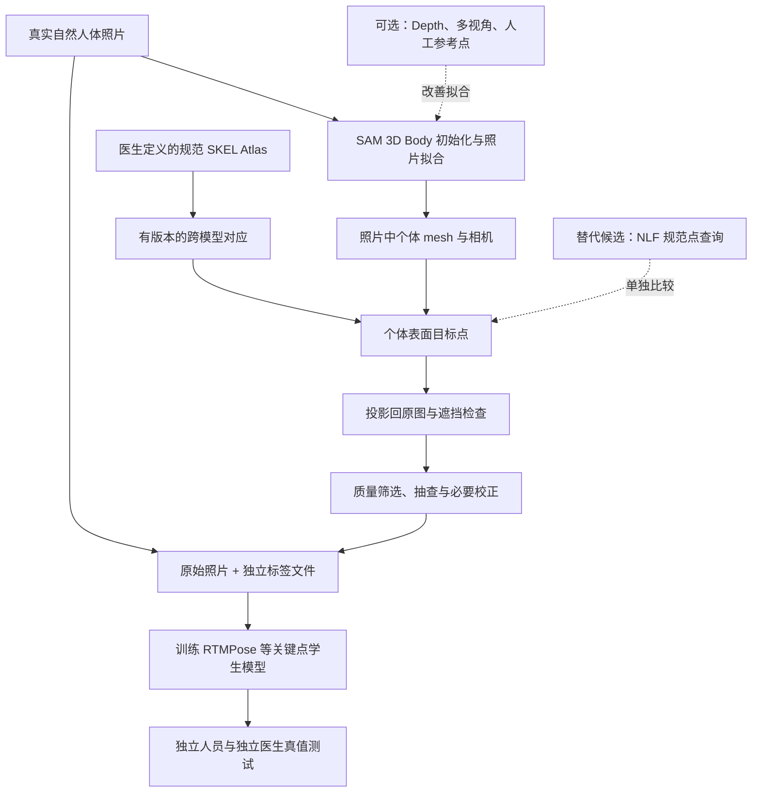

# 真实照片＋Mesh＋Atlas：训练与部署 Pipeline

版本 v2｜2026-09-06。用户已确认：真实照片作为训练输入，通过与真人对齐的 mesh 和 Atlas 生成关键点监督。本文替代前版直接人工标注优先的主路线；属于设计，未完成模型实测。

## 1. 两条链必须分开

**离线产标与训练是本轮主任务；在线定位与机器人坐标是后续任务。** 大型 mesh 模型优先作为离线辅助标注工具，不能因为部署速度要求而提前否定其产标价值。

线上候选：`新的原始照片 → 关键点模型 → 可见性/质量 → 可选标定 Depth 反投影 → 机器人坐标`。只有实验表明有必要，才在线调用 mesh 分支。NLF 与 SAM 可以分别评估，不要求同时串联。

## 2. 真实训练素材与标签定义

原图保留真实皮肤、光照、背景与体型变化；起步优先真实俯卧裸背照片。RGB 已可支持二维训练。RGB-D/多视角用于改善几何，不设为所有训练样本的强制条件。来源、许可、subject_id、session_id 和标注版本需要可追踪。

先由医生确定目标穴位及侧别、定位依据与不可确定条件。规范 Atlas 是起点，医生不必对每张照片从零标全部点；但需要承担规范定义、代表性校准子集、难例修正与独立评价。未获确认的 E01–E20 继续作为非医学工程点。

测试人员先隔离，再开始针对项目的拟合调参或产标。不能先把所有照片投入自训练，再从中分出测试集。网络预训练来源未知的重叠另行披露。

## 3. 照片中的 mesh：初始化、优化与检查

第一步验证公开 SAM 3D Body 推理可用性，并保存 mesh、模型版本、相机参数与原图变换。随后按真实错误决定是否加入稀疏参考点、轮廓、深度或多视角约束进行优化。

论文第 5 节采用人工关键点修正、稠密对应与多阶段拟合，不能将一次前向输出当作同质量标注。我们先复用可取得组件；论文提到但尚未核实公开实现的模块列为缺口，不声称已有完整数据引擎。[Yang 等，2026](https://arxiv.org/abs/2602.15989)<!--ref:sam3dbody--><!--anchor:section:5. Data Annotation and Mesh Fitting-->

检查肩/背部轮廓、局部参考点、投影残差、可见性及个体体型。不以全身平均误差掩盖背部偏差。被衣物覆盖、贴床变形、强遮挡和非常规俯卧姿态需要单独评估。叠加图只作 QA，不作为训练图片。

## 4. Atlas 到个体点：最关键的接口

正式 SKEL 原生皮肤的 face_index＋vertex_indices＋barycentric 保持不变。SAM 的 MHR 与 SKEL 不能直接共享面索引。优先验证两种候选之一：建立规范模型表面对应再变形到个体；或将规范点适配到 NLF 的查询空间。选择依据是实际映射误差和可实现性。

保存 source_model、target_model、模板/拓扑版本、左右侧约定、对应方法与误差。通过成对已知参考点和不同 shape/pose 检查对应；必要时在研究副本拟合 SKEL，不能覆盖医生正式 Atlas。表面近邻只能作为数值初始化，不能直接证明穴位语义。

规范穴位经过个体变形后仍可能有系统偏移。少量医生校正用于估计这种误差，并决定是否需要个体参考点或残差校正。Depth 约束可见表面，不能自动纠正沿皮肤方向的错误穴位。SKEL 不是患者 CT。[Keller 等，2023](https://skel.is.tue.mpg.de/)<!--ref:skel--><!--anchor:section:Method-->

## 5. 投影、可见性与标签质量

使用与拟合一致的相机模型投影，保存 crop/resize 变换并恢复原图坐标。有标定内参时优先使用实测值；普通单张照片的估计相机可以产生二维标签，但不代表可靠的毫米尺度。

用表面朝向、深度排序/射线遮挡、图像边界与可见区域确定监督点。定义可信、需修正、拒绝状态；按点可见性屏蔽 loss，不把遮挡点任意补成可信标签。几何质量分数与医学标签质量分开保存。筛掉的困难样本仍进入覆盖/失败统计。

建议标签合同：image_id、subject_id、session_id、point_schema、point_id/side、xy_original、visibility、label_source（pseudo/corrected/expert）、teacher_version、mapping_version、camera_version、quality_status；可选 xyz_camera_m 仅在具有公制依据时提供。训练图片不绘制 mesh、点或标签文字。

## 6. 学生模型训练

以可复用的公开 RTMPose backbone 初始化，自定义 K 点头。训练原始照片与独立标签文件；先比较自动投影、筛选投影、医生校正后的混合标签。可信人工子集与伪标签可分阶段或加权训练，权重和阈值只能在训练/校准集确定，不预设有益。[Jiang 等，2023](https://arxiv.org/abs/2303.07399)<!--ref:rtmpose--><!--anchor:section:Methodology-->

少量人工监督 baseline 保留，用于判断自动产标是否节省医生时间。模型训练目标是照片到关键点，不要求从头训练 SAM，也不默认需要重建完整 mesh。现有合成实验保留为几何回归和域差距对照，不再优先扩量。

## 7. 独立评价：避免教师偏差自证

产标误差、学生误差和人工修正成本分别报告。最终标签由独立医生/参考流程获得；不能用同一教师投影生成测试真值，再宣称学生准确。按人划分训练、校准、测试，并报告每点/每人、Mean、Median、P95、失败和覆盖率。

二维像素误差适用于 RGB 训练研究；真实毫米结论需要标定深度或独立公制测量。对齐后的 PA-MPJPE、固定 mm/px 近似及容差扣减指标不能替代原始三维误差。标签误差门槛应按医生定义与测量能力事先冻结，当前不承诺数值。

## 8. 后续公制定位与机器人衔接

RGB-D 部署先验证同步、畸变、内外参、深度尺度与光学配准，尺寸缩放不是配准。恢复原图坐标并去畸变后，用 optical-Z 深度：`X=(u-cx)Z/fx, Y=(v-cy)Z/fy`，单位米。局部皮肤深度和法向只在可靠区域估计，深度缺失点拒答。

固定相机使用 T_base_camera；眼在手上使用同一时刻的 T_base_tool(t) × T_tool_camera。独立测量手眼、工具与端到端误差，再进入假体与接触验证。这些保留为后续，不阻止先用 RGB 建训练资料。

目前没有本机 SAM 推理、Atlas 跨模型映射或真实训练结果；可用 CUDA 资源与模型访问仍待确认。效果示意图不能作为这些任务已完成的证据。
