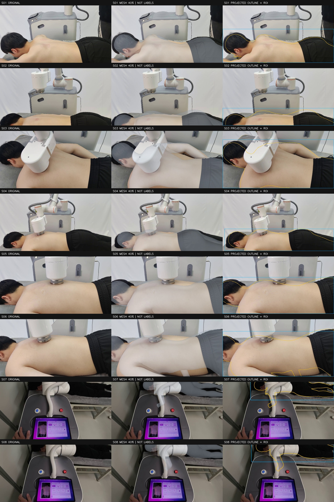
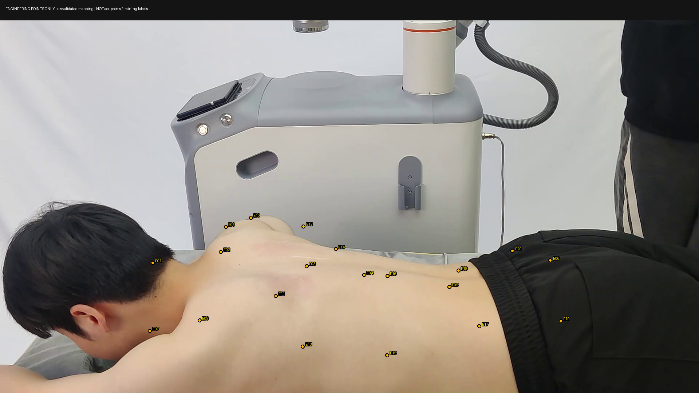

# GPT 网页端交付：真实照片 → Mesh → 工程点投影

> 本页为历史交付。[2026-09-09最新交付：微调、全量mesh对照及对应修正](../real-scene-2026-09-09/README.md)。

> 最新进展：[37点工程参考已由用户复核并另存](reviewed-dmd37-2026-09-07/README.md)，含当前总体进度和公开数据集暂不用于训练的原因。

> 上轮进展：[S05 mask A/B 实测](mask-ab-2026-09-07/README.md)：背部三处偏差 87/68/5 → 86/66/7 px，未显示实质改善，保留基线。

> 前序审查： [2026-09-07 对应链与三帧可见区域审查](audit-2026-09-07/README.md)。官方 MHR 面序核对已通过；新增 60 点区域状态与 9 处轮廓参考草稿。

交付日期：2026-09-06。按用户要求，本目录公开交付本轮 8 张真实原图、全部预测数组、渲染对照图、工程点投影、运行日志、执行脚本及说明。

## 请先读这个结论

目标是用真实照片训练关键点检测器：先通过 mesh 和规范 Atlas 辅助产生标签，再进行质量筛选与医生校正。训练输入保持原始真实图片，叠加图仅用于检查。

当前完成 8 张真实帧输出（S01 复用原预测，另 7 张新增推理）。6 张需要校正，2 张严重遮挡例拒绝作为当前背部标签；尚无可直接采信的高精度训练标签。20 个 E01–E20 是非医学工程点，初步跨模型投影已接通，位置及可见性尚未验证。

本轮没有训练学生模型，没有医学穴位精度、真实毫米精度或跨人泛化结论。所有运行证据见下方文件。

## 图像与预测结果

每行包含原始 PNG、三栏 QA，以及原始预测数组。QA 三栏依次是原图、40% mesh、投影轮廓与人工 ROI。设备遮挡尚未在渲染中建模。

| 样本 | 原始照片 | QA 对照 | 数值预测 | 当前视觉判断 |
|---|---|---|---|---|
| S01 | [原图](input/S01.png) | [对照](results/S01/qa.jpg) | [NPZ](results/S01/prediction.npz) | 肩颈与背部轮廓需校正 |
| S02 | [原图](input/S02.png) | [对照](results/S02/qa.jpg) | [NPZ](results/S02/prediction.npz) | 截断严重，背部与臀部上轮廓偏差 |
| S03 | [原图](input/S03.png) | [对照](results/S03/qa.jpg) | [NPZ](results/S03/prediction.npz) | 设备遮挡上背，需可见区域检查 |
| S04 | [原图](input/S04.png) | [对照](results/S04/qa.jpg) | [NPZ](results/S04/prediction.npz) | 头颈与腰臀偏差、接触遮挡 |
| S05 | [原图](input/S05.png) | [对照](results/S05/qa.jpg) | [NPZ](results/S05/prediction.npz) | 颈部与上缘偏差、接触遮挡 |
| S06 | [原图](input/S06.png) | [对照](results/S06/qa.jpg) | [NPZ](results/S06/prediction.npz) | 手臂与背部边缘偏差 |
| S07 | [原图](input/S07.png) | [对照](results/S07/qa.jpg) | [NPZ](results/S07/prediction.npz) | 严重遮挡，拒绝当前背部产标 |
| S08 | [原图](input/S08.png) | [对照](results/S08/qa.jpg) | [NPZ](results/S08/prediction.npz) | 严重遮挡，拒绝当前背部产标 |



各 results/Sxx 目录还保存 opaque.png、alpha40.png、contour_roi.png。NPZ 保存 faces、18439 个顶点、70 个预测人体关键点、相机与姿态等数组；这些人体点不是穴位真值。

## 工程点投影



[完整投影 JSON](engineering_projection/projection.json) 保存每点坐标、索引、重心权重、来源 hash 与训练禁用状态。

数值链：冻结 SKEL 工程点 → 项目已有 SKEL/SMPL-X 规范近邻对应 → 官方 MHR/SMPL-X 表面对应 → 真实帧 MHR → 原图。

重要限制：旧规范近邻对应尚不是医学对应；MHR 独立面序核对已于 2026-09-07 通过；跨个体迁移仍待验证。部分投影位于头发、衣物或轮廓外，全部 training_eligible=false。相机复算最大差 0.000126 px 仅证明与 SAM 数值约定一致，不能作为真实定位误差。

## 文档与运行证据

- [完整运行报告（原本地目录说明）](evidence/local_run_report.md)：保留原运行目录语境，公开文件请按本页路径访问。
- [逐帧质量记录](evidence/quality_review.csv)
- [输入来源、哈希与人工 ROI](evidence/input_manifest.json)：原采样阶段字段属历史，实际状态以下一项为准。
- [批量完成状态与耗时](evidence/batch_status.json)
- [批量日志](evidence/batch_log.txt)、[S01 原始日志](evidence/s01_inference_log.txt)、[S01 完成状态](evidence/run_status.json)
- [配置](evidence/model_config.yaml)、[配置来源](evidence/config_provenance.json)
- [原始执行脚本](scripts/)：按既有本地运行目录编写的存档副本；网页端重新部署需要按下文准备路径。
- [全库文件 SHA256 清单](files_manifest.json)
- [研究资料、论文分级与 pipeline](../../real-scene-research-2026-09-06.md)
- [本轮精简进度](../../real-scene-pilot-2026-09-06.md)

## 复现说明

SAM 上游固定提交 b5c765a0d89d789985e186d396315e7590887b94；MHR 对应资产提交 e412e12c9d7287a598f00edf19242b476b440211。既有运行环境为 Python 3.10.20、torch 2.4.0+cu121、RTX 2080 Ti，默认未标定 FOV，body-only，人工 ROI。

run_batch.py 与 input/、input_manifest.json 放在同一运行目录；从 evidence/ 复制输入 manifest 到该目录。--pilot 指向准备好的 S01 工程根目录，其中需要 sam-3d-body/、weights/ 和 result/prediction.npz（可使用本交付 results/S01/prediction.npz）。先按官方要求取得授权权重，再执行：

```sh
CUDA_VISIBLE_DEVICES=0 PYOPENGL_PLATFORM=egl python run_batch.py --pilot /path/to/s01_pilot
```

project_engineering_points.py 与 render_engineering_points.py 是原仓库固定路径的执行快照，依赖既有授权 SKEL/SMPL-X 模型及对应资产；不是独立安装包。无需复现即可通过本目录中的图片、JSON、CSV 和日志审阅结论。

## 给 GPT 网页端的接续任务

请先查看 8 张 QA 图及工程点投影，不把生成文件等同于精度通过。下一步优先验证真实可见背部区域与跨模型对应的语义质量，再针对清晰样本的局部偏差做校正。保留失败样本，避免先扩大伪标签训练。医生确认点定义和独立参考后，再评价产标误差及学生模型；测试按人员隔离，不能按相邻帧随机拆分。
