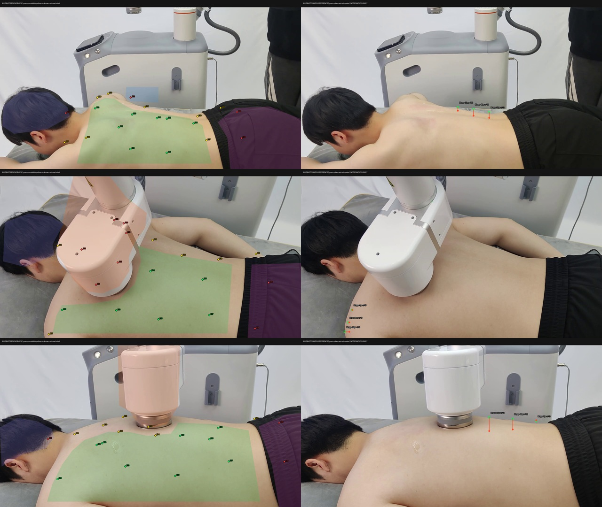

# 2026-09-07：对应链检查与三帧可见区域审查

本轮执行范围：S01、S03、S05。复用已有预测，不改模型、不重新挑点、不修改正式 Atlas、不开始训练。三个样本来自同一视频，不能充当跨人评价。

## 已得结论

1. 数值连接检查通过：SAM 预测 faces 与 MHR 官方转换工具随附的 mhr_face_mask.ply 的 36874 个面逐项、逐序一致；不仅是数量相同。三帧均通过。
2. SKEL 零姿态重新生成的工程点位置与冻结 Atlas 一致，最大差约 2.98e-8 模型米；全部面及顶点顺序匹配。源模板左右侧符号正确，不能据此宣称真人解剖对应正确。
3. 项目 SMPL-X 规范面数组与授权模型面数组一致；官方对应重心和为 1。相机重投影与 SAM 预测二维点一致。模型厘米转换由 SAM mhr_head 已完成，本脚本没有重复除以 100。
4. 60 个点的保守区域初审：23 个在可见背部核心区、16 个明确排除、21 个未知。23 个只是继续几何检查的候选，全部 60 个 training_eligible=false。
5. 9 处可观察轮廓建立了助手目视参考草稿。S05 上缘两处有约 87、68 px 的扫描线间隔；这些位置的参考容许范围设为 ±12 px，仍提示实际轮廓偏差。没有独立解剖参考，不报告工程点或穴位定位精度。

## 图片

左栏：绿色点表示落在保守可见背部核心区，黄色为未知，红色为排除；浅色块是人工视觉草稿区域。右栏：绿色圆为原图目视轮廓参考，红色点为 mesh 轮廓，同色连线仅表示扫描线间隔。

| 图 | 可见背部候选 | 排除 | 未知 | 区域图 | 轮廓图 |
|---|---:|---:|---:|---|---|
| S01 | 8 | 4 | 8 | [查看](S01_regions.png) | [查看](S01_contour_check.png) |
| S03 | 6 | 8 | 6 | [查看](S03_regions.png) | [查看](S03_contour_check.png) |
| S05 | 9 | 4 | 7 | [查看](S05_regions.png) | [查看](S05_contour_check.png) |

S01 E01 位于头发、E12 位于背景。S03 上背的六个点投影到设备覆盖区。S05 E07 在画外。这些点当前不能监督可见背部定位；它们也不能全部归因于转换代码错误。

## 轮廓参考的严格解释

参考来自助手查看原始 PNG 后记录的可见外轮廓，并非医生标注或精密独立测量。区域是保守内区多边形，不是完整人体分割；边缘 ±12 px 及未覆盖区域均保留 UNKNOWN。手工不确定范围是本轮审查约定，不是统计置信区间。

固定原图列或行，查找指定窗口内最接近参考的 mesh 轮廓交点，记录原始间隔。它不是完整轮廓平均距离，也不是人体关键点误差。诊断 CSV 同时保存原始间隔和超出参考范围的部分，不能把后者冒充原始误差。轮廓 raster 来自同一 MHR 面与相机公式，未扣除设备遮挡，所选参考位于可见外缘。

工程 E 点缺少可在真人照片中重复确定的独立语义位置；point_observations.csv 的 target_error_px 留空。不能把这些轮廓参考当作 E 点真值，也不应计算全套穴位精度。

## 文件与复现

- [geometry_audit.json](geometry_audit.json)：源点、官方面序 SHA256、单位与相机检查。
- [visual_annotations.json](visual_annotations.json)：所有草稿多边形、9 个参考位置及不确定范围。
- [point_observations.csv](point_observations.csv)：60 点逐点状态，真实目标误差留空。
- [contour_diagnostics.csv](contour_diagnostics.csv)：9 处原始轮廓间隔。
- [observation_summary.json](observation_summary.json)：三帧分类统计。
- [audit_geometry.py](audit_geometry.py)：从仓库根目录执行，使用现有 SKEL Python 环境，需要本地授权模型与已缓存 MHR 对应资产。
- [review_visible_regions.py](review_visible_regions.py)：系统 Python、NumPy、Pillow，读取已交付预测及本轮检查 JSON 即可重建图和 CSV。

本轮新增图、JSON、CSV 和脚本公开交接；授权模型保持原下载方式。此前检查脚本中的 NumPy bool JSON 序列化问题已修复并重跑，未改预测或实验配置。

## 下一步

先以 S05 明显轮廓偏差作一个具体诊断例。比较当前基线与一个经过检查的人体 mask 输入，保留相同 ROI、相机和模型；本轮可见背部内区不应直接冒充完整 person mask 输入。用预先记录的轮廓及另留出的可见区域检查是否改善，不能仅报告输入 mask 自身的贴合误差。

E 点语义另行推进：需要明确哪些点能从真人外观定位、哪些要触诊或医生定义，再采少量独立参考。没有这部分依据，继续优化 mesh 也无法证明穴位位置正确。

最终目标仍是：真实原图配可靠标签训练关键点检测器。本轮完成数值检查和视觉草稿审查，未完成医学对应与精度验证。
