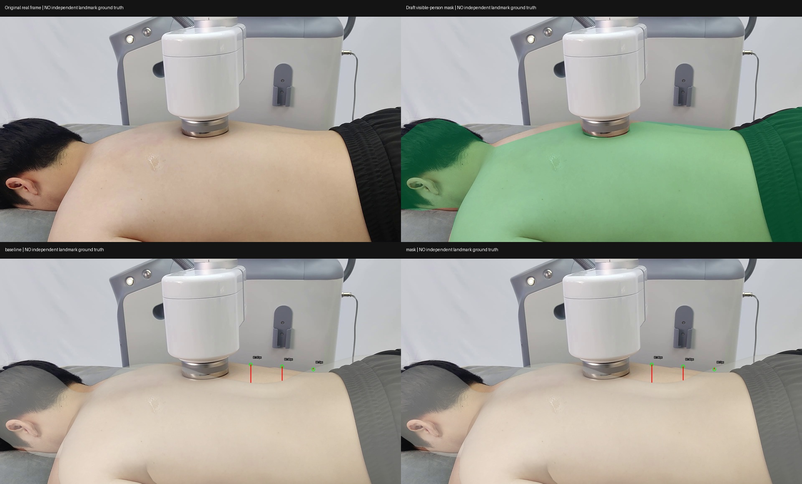

# S05：基线与外部人体 mask 对照

结论：本次手画可见人体 mask 没有实质改善已记录的背部轮廓偏差。保留基线，不将 mask 版预测升级为训练标签。这个单帧结果不能推出所有 mask 或所有场景均无效。

## 实验与结果

输入为原始真实照片 [S05](../input/S05.png)，不是合成图片。两组使用同一官方权重、默认 FOV、ROI `[0,450,1920,1080]`、body 模式与随机种子 17，仅第二组增加外部 mask；没有训练或 refinement。mask 包含可见头发、皮肤和衣物，人工近似描绘并排除设备，不是专家分割真值。

| 冻结轮廓参考 | 基线偏差 px | mask 偏差 px |
|---|---:|---:|
| B1，x=1200 | 87 | 86 |
| B2，x=1350 | 68 | 66 |
| B3，x=1500 | 5 | 7 |

三个参考均来自此前审查，估计不确定带为 ±12 px。这里测量竖直扫描线上的轮廓距离，不是穴位误差、全轮廓平均误差或实际毫米误差。1–2 px 变化不足以支持有效改善，B1/B2 的大偏差持续存在。参考与 mask 依据同一原图，不能作为独立精度验证。

重跑基线与旧预测的 70 个模型关键点最大二维差异为 0.000916 px；mask 与基线的这些点平均移动 46.44 px。这包含全身模型点及画面外点，不能解释为背部改善或精度。两组数组均通过有限数检查。首组推理 2.706 秒，第二组 0.335 秒含预热差异，不构成速度对照。

日志中的 `Mask-condition inference is not supported...` 是估计器在未安装自动 SAM 分割器时的初始化提示。已核对官方源文件 `sam_3d_body/sam_3d_body_estimator.py`：第 43–44 行产生此提示，第 138–148 行仍接收外部 masks 并设置 `use_mask=True`；本次日志有 `Using provided masks`，输出亦确实变化。

## 对整体路线的影响

继续以真实照片训练关键点模型的目标不变；当前 SAM mesh 仅提供待审核的标签候选。不能从“模型吃进了 mask”跳到“标签变准了”。本轮仍无获批训练标签，E01–E20 仍是非医学工程点。

下一步优先建立一小批独立人工参考：先明确最终要检测的点及可见性规则，再由人工/专业人员在真实帧上确认可识别的解剖标志；难以在照片定位的工程点不能硬造真值。按视频与受试者分组，保留不参与校正的评估帧。取得参考后，比较原始 SAM 候选与局部校正方案的点误差和标注耗时，再决定是否值得投入 MHR refinement。不要先把整套 refinement 做完，也不要现在用这些预测直接启动学生训练。

## 文件与复现

- `person_mask.png`、`mask_preview.jpg`、`mask_provenance.json`：实际提示及来源。
- `baseline.npz`、`mask.npz`：两组实际输出；`baseline.png`、`mask.png`：对应渲染。
- `run_status.json`、`run_log.txt`：输入哈希与执行证据。
- `comparison.json`、`contour_comparison.csv`：冻结参考下的量化结果。
- `make_mask.py`：用 Python + Pillow 重建 mask；`evaluate_ab.py`：用 NumPy + Pillow 重建扫描比较及四栏图。
- `run_ab.py`：服务器运行脚本，目录假定为 `<pilot>/mask_ab/`，同级需有 `sam-3d-body/`、授权 `weights/`、`real8/input/S05.png`、旧预测 `real8/result/S05/prediction.npz`。运行 `CUDA_VISIBLE_DEVICES=0 PYOPENGL_PLATFORM=egl venv/bin/python -u mask_ab/run_ab.py`。公开包不包含授权权重。

官方源码版本沿用既有运行环境：`b5c765a0d89d789985e186d396315e7590887b94`。本次只验证流程执行和这三个轮廓检查，不声称科学假设已被全面验证。
