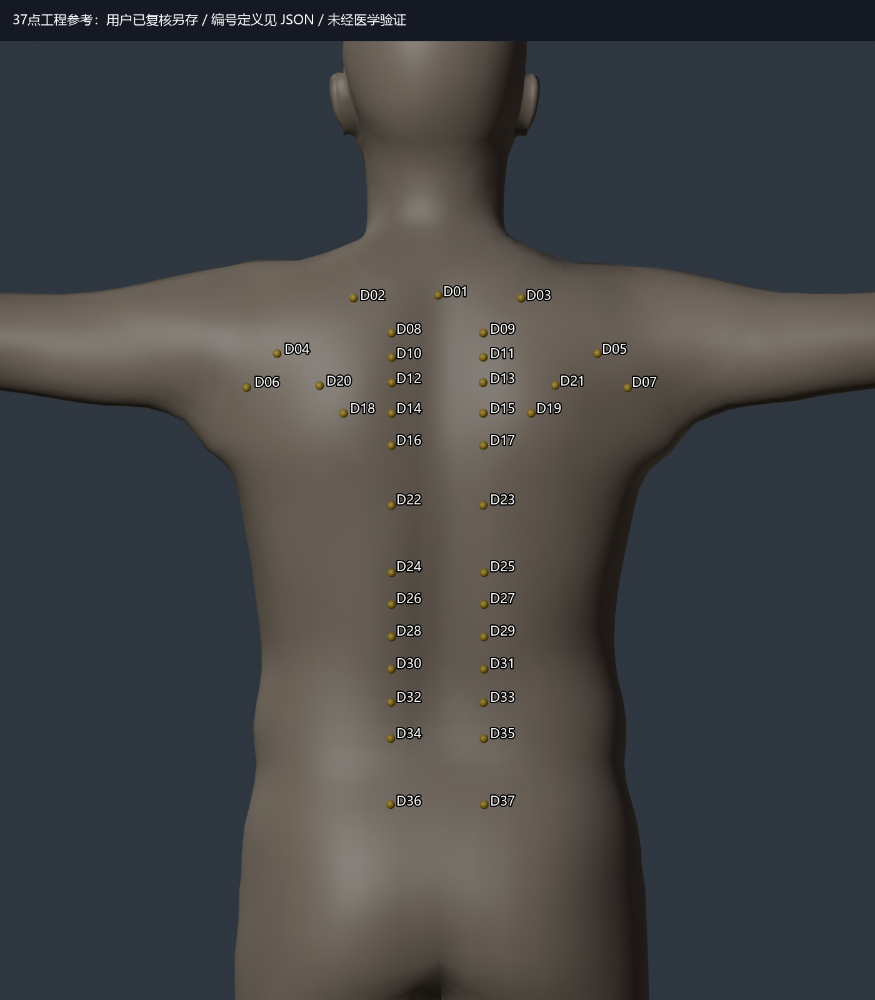

# 网页端交付：37点工程参考已由用户复核并另存

更新日期：2026-09-07。请以本页作为上一轮 mask A/B 之后的最新进度。

**当前状态：真实照片 SAM 推理、初步映射审计和 mask 对照已完成；新增 DMD-BAK 命名的37点工程参考，用户已复核并另存。尚未完成37点向真实照片的投影，也未获得独立真人目标真值或启动真人数据训练。**

## 本轮新增了什么

1. 核对 DMD-BAK 官方 RTMPose-t 配置：19种穴位、37个通道（1个中线点与18对双侧点）。
2. 逐项读取 KMCRIC 标准经穴数据库的定位，结合 SKEL 男性骨架视觉参考，在原生皮肤建立 `ENG_D01–ENG_D37` 工程草稿。每点保留参考名称、侧别、三角面与重心坐标。它不是原始 DMD-BAK 数据标签的复刻。
3. 用户明确报告复核完成，并另存为 `最新点位/DMD37_工程草稿_请复核后另存.blend`。
4. 本次通过 Blender 后台只读打开另存文件，读出37条绑定并重建本页图像。与初始草稿的最大模型坐标差约1.26e-7米，为浮点量级；没有发现超过1e-5米的绑定变化。本轮记录为复核接受，不能声称有37点医学校正。

用户 `.blend` 与授权人体模型仅在本地保存，未上传 Git。源文件 SHA-256、大小及实际点位见 [reviewed_points.json](reviewed_points.json)。数值是模型空间数据，不是机器人坐标。旧 E01–E20、原始8帧预测与正式医生 Atlas 均未覆盖。

## 为什么没有下载那些数据集来训练

实际情况不是所有数据都拒绝下载；已尝试下载 DMD-BAK 当前版本，并成功取得官方代码。

| 候选 | 本次核查事实 | 当前决定 |
|---|---|---|
| DMD-BAK 真人背部数据 | Kaggle v2 的下载ZIP只有415字节，仅含349字节更新说明；作者说明因采集/标注质量整理暂时下架初始数据。网页描述仍保留2691张，不能据此认定图片可用 | 代码和点定义已利用；没有图片与标签可供训练。优先争取作者新版数据 |
| Frontiers 430张重标子集 | 论文数据声明仍指向上述Kaggle，未找到可核验的独立重标包 | 作为结构先验论文参考，不冒称另一份已取得数据 |
| JBHI 84点背部研究 | 本轮未找到公开数据与最终权重下载 | 作为高相关研究，后续可申请共享；不说数据确定永远私有 |
| AcuSim | 官方有13.04GB下载入口，但为合成头颈RGB-D数据 | 当前不下载全包；其部位与真人背部目标不同，数据生成方法可参考 |

DMD-BAK 元数据还标注非商业许可，代码为GPL-3.0，最终工程用途需按取得版本核对许可。获取新版数据后仍须检查左右编码、受试者划分和与俯卧机器人遮挡场景的差异。其代码目前按图像x排序双侧点、按文件随机划分，不能直接当作人体侧别和跨人评估。

详见[数据资源核查报告](../../../public-back-dataset-audit-2026-09-07.md)及[下载证据摘要](dataset_access_evidence.json)。原始入口：[DMD-BAK](https://www.kaggle.com/datasets/chunzheye/dmd-bak)、[官方仓库](https://github.com/Ye-ChunZhe/DMDBAK)、[430张论文](https://www.frontiersin.org/journals/physiology/articles/10.3389/fphys.2025.1662104/full)、[84点论文](https://pubmed.ncbi.nlm.nih.gov/40030421/)、[AcuSim](https://datadryad.org/dataset/doi:10.5061/dryad.zs7h44jkz)。

## 整体进度与证据边界

| 环节 | 当前状态 |
|---|---|
| 合成工程训练与坐标链 | 已有工程验证，仍可作辅助 |
| 8张真实视频帧 SAM 推理 | 已完成；输出成功不等于标签合格 |
| 原20点跨模型数值审计 | 已执行；不证明解剖语义对应准确 |
| S01/S03/S05区域审查 | 已完成助手草稿审查 |
| S05 mask A/B | 87/68/5 → 86/66/7 px，未观察到实质轮廓改善 |
| 新37点规范参考 | 已建立并由用户复核另存；工程身份不变 |
| 新37点真实照片投影 | 尚未执行；当前男性模型，不能直接套用之前女性映射资产 |
| 独立真人目标点、真人毫米精度 | 尚未建立/验证 |
| 高精度真人训练标签 | 当前仍为0份获准标签 |
| RTMPose真人数据训练 | 尚未启动 |

椎节高度由骨架图近似判读；1.5/3骨度寸在草稿中用模型局部42/84毫米表现比例，并非人体实测换算。肩部仍受T姿态影响。用户复核确认的是本轮工程布局，不自动升级为医生确认医学真值。

## 下一步建议

先冻结本次用户另存文件作为37点工程参考，检查男性SKEL对应资产及侧别，再将这37点投影到既有S01/S03/S05预测中，输出原图、点编号、可见性和遮挡状态供复核。先检验工程投影主路径，不能把投影坐标自动当真人真值。

同时保留取得公开真人数据与自采独立标注的路线。获得可靠标签后，再比较直接2D检测、mesh/Atlas传播与融合是否值得投入；不继续优先调S05 mask，也不先上完整MHR refinement。

## 本次交付验证

已读取用户另存文件、检查37点数量及绑定并重建预览。文档与源码/数据事实已对齐；本轮未改模型、未训练、未改会话记忆或项目规则。无需要清理的文件；无关组会讲稿改动保留在工作区，不纳入本次Git提交。
