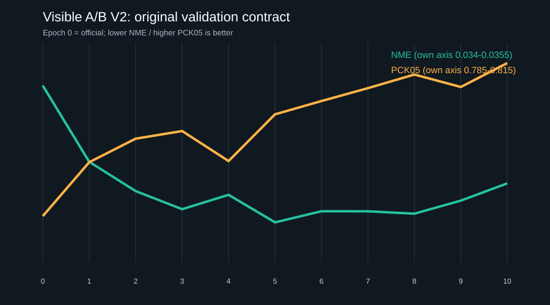
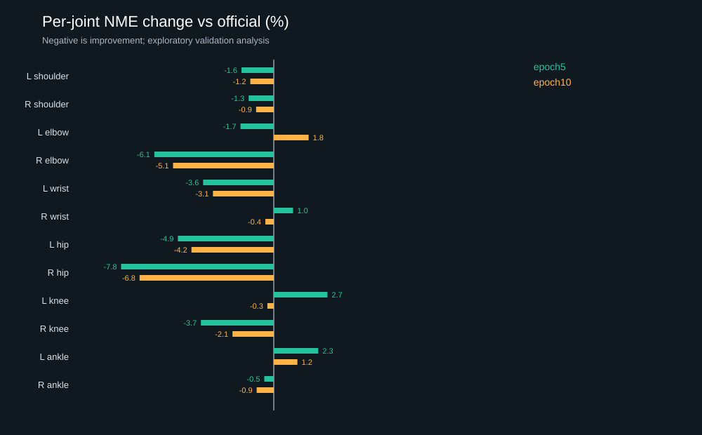

# 背部 Surface 监督可行性审计与 V2 训练复盘

更新日期：2026-09-09。结论是 **`INSUFFICIENT_NEED_NEW_SURFACE_REFERENCE`**。本轮完成 V2 全 11 个检查点（官方初始化加 10 轮）的只读复算、逐关节/可见性/长尾分析和损失梯度审计；由于现有数据没有独立、未见受试者的目标背部 surface 评价，本轮主动停止正式 surface 训练，没有为了得到结果再跑 10 轮。

## 先看结论

V2 的二维关节提升复核成立，但范围比“Mesh 变准”小得多。原训练评估合同下，官方模型 NME 为 0.035207、epoch5 为 0.034273、epoch10 为 0.034539；PCK05 分别为 79.13%、80.52%、81.22%。epoch5 的 NME 相对下降约 2.65%，epoch10 的 PCK05 增加约 2.09 个百分点。

新的逐图配对诊断显示，epoch5 相对官方模型的 NME 差为 -0.000928，10,000 次 image bootstrap 的 95% 百分位区间为 [-0.001464, -0.000328]，69 张图中 57 张改善。epoch10 的 NME 区间跨 0，但 PCK05 差的区间为 [0.00392, 0.03700]。这是对当前 COCO 来源 validation 的描述，不能替代未见目标场景受试者测试；10 轮、多关节和多指标均被查看过，因此不把探索性比较包装成确认性结论。

最大的任务相关增益在髋部：epoch5 左右髋平均相对 NME 下降 6.32%。肩部只下降 1.46%；右肘改善明显，腕部小幅混合改善；膝部接近不变，脚踝总体没有改善。由此不能说提升只来自手脚，但也不能把髋/肩二维位置改善等同于背部曲面改善。

## 训练损失实际在做什么

当前 V2 只优化 `head_pose.proj` 与 `head_camera.proj`，共 2,634,250 个参数。损失由归一化 fitted 2D joints、骨盆相对 fitted 3D joints 和训练图中 v=2 的人工 COCO 2D body joints 组成；没有 silhouette、裸背区域、深度或曲面点监督。

在从官方初始化确定性抽取的 12 个训练人体上，只做反向诊断、不做优化：

| 损失 | 平均 loss | 平均参数梯度范数 | pose proj | camera proj |
|---|---:|---:|---:|---:|
|fitted 2D|0.000226|0.04735|0.04315|0.01809|
|fitted relative 3D|0.000317|0.04477|0.04334|0.01036|
|manual visible 2D × 1|0.000194|0.00754|0.00386|0.00628|

`manual_weight=1` 只表示 loss 标量乘 1，不表示三项对参数的影响相同。人工项的平均参数梯度约为 fitted 2D 的 15.9%、fitted 3D 的 16.8%。人工项和 fitted relative 3D 的梯度余弦中位数为 -0.022，12 个样本有 7 个为负；它是在纠偏，但经常与拟合 3D 目标方向冲突。完整数值和逐样本结果见 [LOSS_GRADIENT_AUDIT_V1.json](LOSS_GRADIENT_AUDIT_V1.json)。

## 为什么没有继续正式 surface 训练

现有直接图像观察只有 5 个保守公共来源/人物组、5 张有标签图片和 25 个稀疏二维外轮廓参考。B1/B3/N1 的 18 个参考原计划训练，B2/B5 的 7 个参考只是开发验证；所有参考都在作者看过模型预测之后制作，B2/B5 也不是封存测试。B4 因手臂与躯干接触没有合格参考。

用户视频 S01–S08 是真实目标场景，但 8 帧来自 2 段视频，身份没有核验，当前没有 dense bare-back mask、深度或多视角表面真值。S01/S03/S05 的 9 个轮廓点和 S05 手画 person mask 可作开发诊断；后者包含头发、皮肤和衣物，不是裸背表面。此前 mask prompt 几乎无收益，只能说明该单帧推理提示实验无收益，不能否定把独立 silhouette/contour 作为训练损失的假设。

COCO 人体 mask 是通用衣着人体 silhouette；SAM/MHR 拟合与投影是模型派生信息；DMD37 是固定工程 Atlas。它们分别可做通用预训练、拟合监督和下游工程回归，但都不能作为独立目标背部 surface 真值。完整盘点见 [SURFACE_SUPERVISION_INVENTORY_V1.json](SURFACE_SUPERVISION_INVENTORY_V1.json)。

因此，如果现在运行 contour 训练，最多只能证明这 25 个已查看的二维点能被拟合。没有可冻结的独立 primary surface metric，也就不能命名 `BEST_MESH_CHECKPOINT`。停止训练是对研究问题的回答，不是执行遗漏。

## README 要求的 14 个明确回答

1. **V2 的 2D 提升是否成立？** 成立于当前 COCO 来源 validation 和原有评估合同。epoch5 NME 最低，epoch10 PCK05 最高；这不是 untouched test。
2. **提升主要发生在哪些 joint？** 最大在髋部，epoch5 左右髋平均相对 NME 下降 6.32%；其次含右肘。肩部只改善 1.46%，膝踝混合或基本不变。逐点表见 [PER_JOINT_EPOCH5_EPOCH10.csv](PER_JOINT_EPOCH5_EPOCH10.csv)。
3. **epoch5 和 epoch10 各自优势是什么？** epoch5 的均值/NME 更好，坏尾点由官方的 35 个降至 31 个，但 P99 比官方更差；epoch10 的 PCK05 最好，P90/P95 比 epoch5 略好，但 NME 更差且有 32 个坏尾点。epoch10 更像把更多点推过 0.05 阈值，未全面支配 epoch5。
4. **当前 loss 驱动哪些 MHR 参数？** 只驱动 pose 与 camera 两个输出 projection。raw-output 诊断显示 body pose 和 global rotation 的梯度最大，camera projection 也明显；shape 与 scale/skeleton 可被驱动但小得多，face 为 0。没有直接 surface loss。
5. **是否有足够独立的背部 surface supervision？** 没有。
6. **缺什么？** 缺受试者独立、按姿态/遮挡覆盖、在看 Mesh 前标注的裸背可见区域/轮廓；缺封存 validation/test；还缺能约束 3D 曲面的标定 RGB-D 或多视角观测。
7. **加入 surface 监督是否改善未见人体？** 未执行，也无法回答；现有数据不满足独立评价条件。
8. **改善是训练拟合还是 validation 也改善？** V2 的二维 joint validation 有改善。surface 路线没有新实验，所以没有 surface validation 改善结论。
9. **joint 是否退化？** V2 总体 joint 没退化；局部并非全好，epoch5 左膝和左踝、epoch10 左肘和左踝变差。未来 surface A/B 必须继续把 joint NME/PCK05 作为回归指标。
10. **是否出现 camera/shape 异常作弊？** V2 没有 surface 目标，因此本轮不能用 surface 训练检查这个问题。历史单图 contour 原型的改善同时来自 camera 与 geometry，已经证明作弊风险真实存在；未来必须报告 camera、shape、scale 和 depth sanity。
11. **能否说 Mesh 变准？** 不能。当前证据只支持二维关节 validation 信号。
12. **能否说 DMD37 变准？** 不能。DMD37 可继续做 topology/binding、通道顺序、传播和可视化回归，`medical_truth=false`。
13. **下一步做什么？** 先扩充独立 surface 数据并加入 RGB-D/多视角子集；这之前暂停正式 contour/surface 训练，不改 loss weight、不扩大解冻范围。数据到位后先做“当前输出头 + 原 joint loss”对照“完全相同 + surface loss”的单变量 A/B。per-image refinement 可在有传感器观测后作为机器人端并行工程路线。
14. **为什么？** 当前瓶颈是监督与评价，不是已经证实的模型容量。先解冻 decoder 或加 LoRA 会增加可拟合自由度，却仍然不能证明未见人体背部曲面更准。

## 最小数据与实验计划

[BACK_SURFACE_SUPERVISION_DATA_DECISION_V1.json](BACK_SURFACE_SUPERVISION_DATA_DECISION_V1.json) 将可控 pilot 的工程下限定为 30 位核验身份的受试者，每人 2–4 张非相邻、目标区域可判断的观测，约 60–120 张。按人和拍摄 session 预先切为 18 train / 6 validation / 6 sealed test；同人、相邻视频帧不得跨 split。

至少覆盖三类事件：治疗床俯卧并含有/不含机器人遮挡、坐姿或前倾、站姿中立/抬臂/强转体。标注者只看原始 RGB/depth，不看 Mesh overlay；分别标 visible bare-back skin、其它皮肤、衣物、头发、机器人、床、自遮挡和 unknown，并保存不确定边界。validation/test 至少双人独立标注并仲裁。主要指标是 held-out 裸背对称轮廓距离；有标定深度时增加 point-to-observed-depth，按 mean/median/P90/P95/worst/per-subject 报告。

训练前固定初始化、split、seed、优化器、学习率、可训练参数、增强、joint loss 和预算。A/B 只增加 surface observation。validation 可选择 epoch 和 weight，使用后不再冒充 test；sealed test 只在协议、阈值、代码和 checkpoint 冻结后打开。若第一轮出现信号，再补新受试者或独立 seed 做确认。

## 微调策略的执行顺序

[MODEL_ADAPTATION_DECISION_V1.json](MODEL_ADAPTATION_DECISION_V1.json) 分析了四条路线。当前输出头微调是首个 surface A/B 的最小基线；只有在有效标签下出现 train 与 validation 同时欠拟合，才比较额外解冻最后一层 body decoder。LoRA/adapter 需要更多目标人物，不能因参数少就假设不会过拟合。per-image refinement 解决当前观测的单人拟合，global fine-tuning 解决未来未见图泛化，两者分开评价。

## 可复核文件

- [VISIBLE_AB_V2_POSTMORTEM_V1.json](VISIBLE_AB_V2_POSTMORTEM_V1.json)：逐 epoch、visibility、joint、tail 和配对 bootstrap。
- [LOSS_GRADIENT_AUDIT_V1.json](LOSS_GRADIENT_AUDIT_V1.json)：三种 loss 的数值尺度、参数/输出梯度和冲突。
- [SURFACE_SUPERVISION_INVENTORY_V1.json](SURFACE_SUPERVISION_INVENTORY_V1.json)：所有候选 surface 监督及其独立性/污染/覆盖。
- [BACK_SURFACE_SUPERVISION_DATA_DECISION_V1.json](BACK_SURFACE_SUPERVISION_DATA_DECISION_V1.json)：数据结论和 30 人最小 pilot 方案。
- [CHECKPOINT_MANIFEST.json](CHECKPOINT_MANIFEST.json)：官方、epoch5、epoch10 的服务器路径、大小和 SHA256；授权权重不进入公开 Git。
- [STATISTICAL_VALIDATION_V1.json](STATISTICAL_VALIDATION_V1.json)：11 项统计解释检查。
- [raw/](raw/)：2.2 MB 逐观测结果与两份运行日志；[code/](code/)：远端只读推理、梯度审计和交付生成代码。

复算服务器为 `172.18.18.151`，官方与 V2 epoch5/10 均保持原路径且未覆盖。完整 V2 audit 对 69 图、82 人、11 个检查点执行 902 次人体推理；梯度审计是 12 个确定性抽样人体、0 次 optimizer step。没有运行新的 surface 优化。

## Material Passport

授权 SAM 3D Body checkpoint 与派生 V2 head checkpoints 仅记录服务器路径、字节数和 SHA256，不公开上传。COCO 图片/标注沿用逐图来源和许可元数据；本交付只新增派生指标。B/N 稀疏参考是助手工程观察且不盲，S01–S08 是项目真实视频帧，均不声明受试者身份或医学真值。机器可读清单见 [MATERIAL_PASSPORT.json](MATERIAL_PASSPORT.json)。

当前证据等级停在 **LEVEL 2：source-domain 2D joint validation improvement**。LEVEL 3 未见受试者泛化、LEVEL 4 背部 surface accuracy 和 LEVEL 5 DMD37/医学准确性均未达到。
