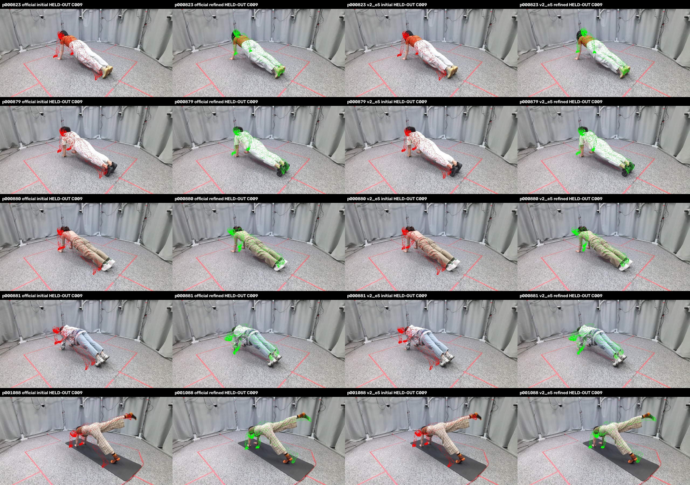
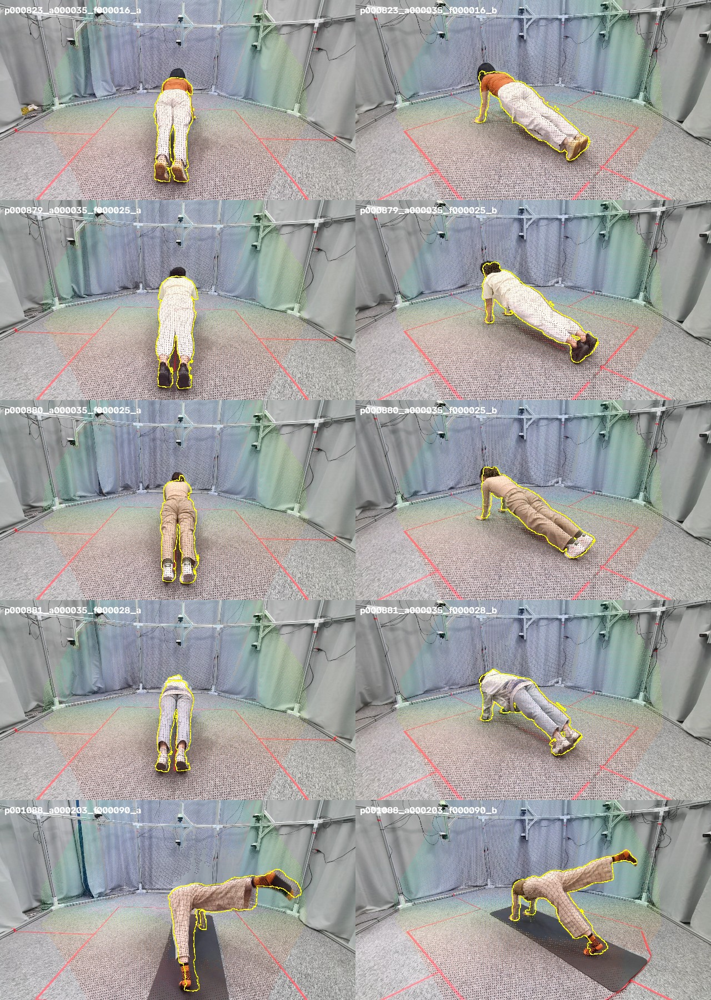
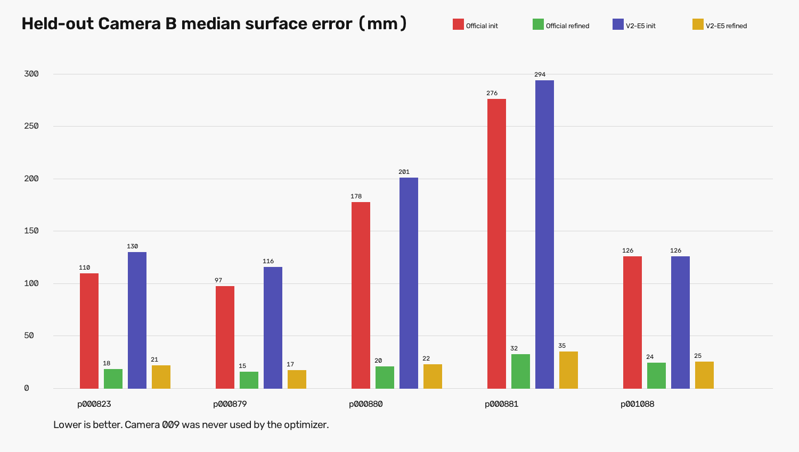
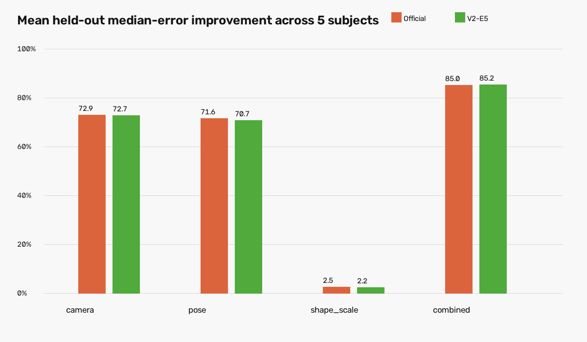

# PUBLIC RGB-D MHR 可拟合性实验 V1

**Gate：`PASS_PUBLIC_MHR_FITABILITY_SANITY`。** 这个 PASS 的含义很窄：在 HuMMan-Point 的 5 名穿衣真人、支撑类复杂姿态上，冻结 SAM 3D Body 后，只调每个人当前帧的 MHR 与相机参数，未参与优化的另一台相机也稳定变准。因此，当前 MHR“模具”具有继续做目标域验证的价值，主要问题更像是 RGB 到 MHR 参数的预测不准，而不是已经证明 MHR 无法表达人体。

它不证明治疗床俯卧、裸背皮肤、DMD37 或医学精度。公开样本实际看图后只有 4 个直臂平板支撑和 1 个四点/平板支撑式单腿抬起；action 203 的名字含 `Prone`，但画面不是胸腹贴地的标准俯卧。

## 数据、实验和结果

审计了 HuMMan、PROX、Goliath-4 和 BEHAVE。HuMMan-Point 是当前唯一进入主实验的数据：真实 Kinect 深度、10 路同步 RGB/Depth、每台相机的 K/R/T、受试者与动作 ID、深度空间人体前景 mask 都实际取得。PROX 和 BEHAVE 留作以后接触/遮挡压力测试；Goliath-4 与 SAM 3D Body 训练数据存在高重叠风险，只适合作实现校验。

由于 HuMMan 使用 solid 7z，虽然只取 5 人，仍需下载包含它们的完整分卷。实际下载并校验 6 个文件，共 **55,753,113,208 bytes（约 51.9 GiB）**；最终只解出 5 个序列的 8,040 个文件、约 1.01 GiB。原数据、授权权重和运行结果 NPZ 没有提交到 Git。

每人冻结一个同步时间点。`kinect_008` 的 RGB 和传感器 Depth 用于初始化与 fitting，`kinect_009` 的 Depth 只在优化全部结束后读取。RGB 与 Depth 原本不是同一相机：先在 640×576 Depth 像素中应用 person mask，再按官方 world-to-camera K/R/T 反投影、跨相机变换和投影到 1920×1080 RGB。五人的 RGB-D 叠图没有发现镜像、轴翻转、尺度或相机编号错误；跨视角共同表面的中位最近距离约 5.6–6.5 mm。这个检查排除了大错误，不等于证明标定有亚厘米绝对精度。

Official 和 V2-E5 都分别测试 camera、pose、shape/scale、combined 四组，每组从原预测重新初始化、Adam 100 步，共 5×2×4=40 次。网络参数全部冻结，`vertex_offsets` 禁用。主损失是 Camera A 人体深度点到稠密 MHR 顶点的 robust point-to-point，加初始化先验；本版没有可靠法线与部位标签，因此没有假装报告 point-to-plane 或上/中/下背医学区域指标。

| Camera 009 held-out 中位误差，5 人 subject-mean | 初始 | 组合优化后 | 相对改善 subject-mean |
| --- | ---: | ---: | ---: |
| Official | 157.3 mm | 22.1 mm | 85.0% |
| V2-E5 | 173.1 mm | 24.1 mm | 85.2% |

5 人、两种初始化的组合优化全部超过预注册的 10% held-out 改善条件，实际为约 83–89%；40 次实验均未触发参数阈值。组合优化的相机平移变化约 8.6–17.6 cm，body-pose RMS 约 0.045–0.063，shape/scale 变化也远低于阈值。看图与数值均未发现靠异常放大人体或相机大幅逃逸来“作弊”，但这仍不是临床解剖合理性证明。

参数组给出很清楚的工程方向：camera-only 平均改善约 72.8%，pose-only 约 71.2%，shape/scale-only 只有约 2.3%，combined 约 85.1%。因此近期重点应是相机/根平移和姿态预测，以及能约束它们的真实 surface supervision；目前没有证据支持先扩大 shape 分支或加自由局部 deformation。

## 用大白话回答 17 个问题

1. **找到了什么公开数据？** HuMMan-Point 可直接用；PROX、BEHAVE 适合后续接触压力测试；Goliath-4 只适合作实现校验。
2. **是真 RGB-D / multi-view 吗？** HuMMan 的 Depth 是 Kinect 传感器实测，且 10 路同步；附带的 SMPL 拟合没有被当作真实表面。
3. **哪个最适合当前任务？** HuMMan-Point，因为现在能拿到多人的独立传感器深度、同步多视角和完整 K/R/T。
4. **有没有 lying / prone / back-visible？** 这 5 人后侧躯干都可见，但没有确认真正胸腹贴地俯卧。名字含 Prone 的序列实际也不是标准俯卧。
5. **Official 初始 Mesh 离真实 surface 多远？** held-out 中位误差的 5 人均值为 157.3 mm；单人约 97.3–276.0 mm。
6. **V2-E5 初始 surface 更好吗？** 没有。5 人全部是 Official 更好；V2-E5 均值为 173.1 mm。这与它在旧验证集上二维 joint 更好并不矛盾。
7. **给真实 Depth 后 MHR 能调准吗？** 能。在这批穿衣支撑姿态上，组合优化后的 held-out 均值降到 Official 22.1 mm、V2-E5 24.1 mm。
8. **另一视角也变准吗？** 是。上述数字全部来自完全未进入 optimizer 的 Camera 009。
9. **主要误差来自什么？** camera 和 pose 都是大头；shape/scale 单独只带来约 2% 改善；组合最好。
10. **有没有参数作弊？** 40 次均未越过预注册阈值，组合优化投影图也没有明显异常；仍需在目标域继续审查解剖合理性。
11. **MHR 能表达真实人体吗？** 当前证据支持“足以表达这批穿衣、支撑姿态的可见人体表面”，尚不能外推到俯卧接触软组织。
12. **contact 场景是否更差？** 没有回答。当前有手脚与地面/垫子接触，但没有治疗床胸腹接触对照；PROX/BEHAVE 也尚未运行。
13. **vertex_offsets 有作用吗？** 当前 wrapper 没有把它传入 TorchScript；非零输入的变化不高于重复前向数值噪声，因此主实验未使用。
14. **继续公开数据还是采自己的 3 人？** 现在应采自己的 3 人，重复同一个 A-fit/B-held-out Gate。
15. **现在值得采 30 人吗？** 还不值得。公开数据与目标域差距仍是最大未知量。
16. **现在值得加 decoder / LoRA 吗？** 还不值得。先证明 3 名真实治疗床俯卧、背部暴露受试者也可拟合。
17. **为什么？** 公开实验已经说明 MHR 参数有很大可恢复空间，但没有覆盖最关键的接触软组织和裸背表面；直接扩训练会把“域差距”和“表示不足”混在一起。

## 判断与下一步

下一阶段定为 `TARGET_DOMAIN_MHR_FITABILITY_V1`：先采约 3 名真人，治疗床、真实俯卧、背部暴露；每人至少一台/一组相机用于 fitting，另一台同步相机只做 held-out，保留标定板、原始 RGB、原始 metric Depth、K/R/T 与 person/skin validity。重复这次四参数组和 Gate。只有该 Gate 也 PASS，才设计约 30 人的 subject/session-disjoint 数据集并考虑 surface-supervised 全局微调；届时优先监督 camera/translation 与 pose，再根据残差决定 decoder、LoRA 或低维平滑背部 deformation。

当前最大未解决问题是 **MHR 对治疗床俯卧接触后的裸背皮肤和软组织形变能否保持 2 cm 级甚至更低误差**。本实验的约 22–24 mm 是穿衣人体、单向点到顶点、无部位分解的几何 sanity 数字，不能拿来当穴位定位精度。

## 文件入口与来源

- 数据审计：[PUBLIC_RGBD_DATASET_AUDIT_V1.json](PUBLIC_RGBD_DATASET_AUDIT_V1.json)
- 坐标与观测合同：[PUBLIC_RGBD_GEOMETRY_CONTRACT_V1.json](PUBLIC_RGBD_GEOMETRY_CONTRACT_V1.json)、[OBSERVATION_VALIDITY_CONTRACT_V1.json](OBSERVATION_VALIDITY_CONTRACT_V1.json)
- 40 次逐人结果与汇总：[PER_SUBJECT_SURFACE_RESULTS_V1.json](PER_SUBJECT_SURFACE_RESULTS_V1.json)、[SURFACE_METRICS_V1.json](SURFACE_METRICS_V1.json)
- Official/V2 与参数检查：[OFFICIAL_VS_V2_SURFACE_V1.json](OFFICIAL_VS_V2_SURFACE_V1.json)、[PARAMETER_SANITY_V1.json](PARAMETER_SANITY_V1.json)
- 最终 Gate：[MHR_FITABILITY_DECISION_V1.json](MHR_FITABILITY_DECISION_V1.json)
- 可复现实验代码：[code/README.md](code/README.md)

HuMMan 官方数据页：[Hugging Face](https://huggingface.co/datasets/caizhongang/HuMMan)，工具箱与 S-Lab License 1.0：[MotrixLab/humman_toolbox](https://github.com/MotrixLab/humman_toolbox)。本交付按非商业研究用途使用少量派生审查图，数据权利与许可仍归原贡献者；商业用途没有被默认授权。
