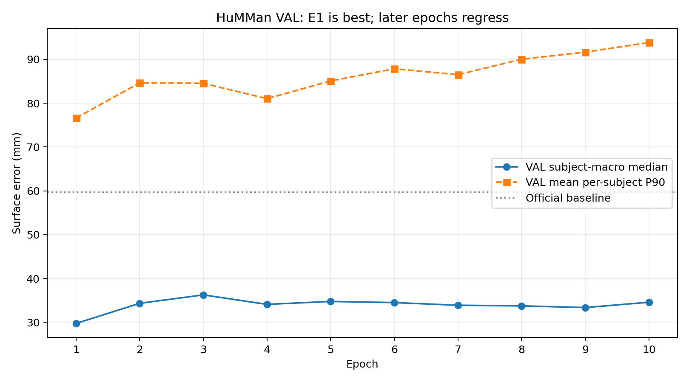
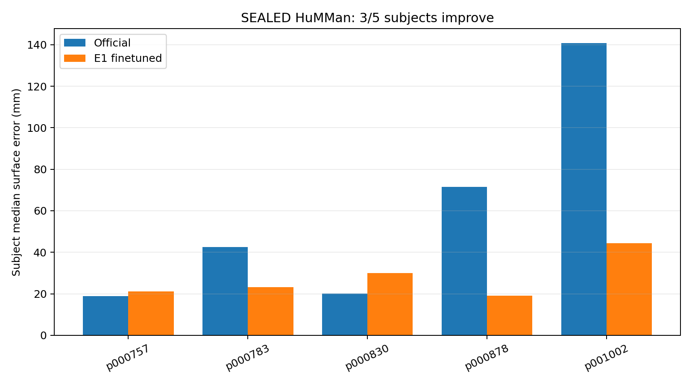

# PUBLIC RGB-D Surface Finetuning Pilot V1

## 结论

本阶段 Gate 为 `PASS_REAL_RGBD_SURFACE_FINETUNING_PILOT`。我们第一次证明：使用真实 HuMMan RGB-D 人体表面监督微调 SAM 3D Body 的 pose/camera 输出头后，对训练和选模都未见过的 5 名 SEALED 真人，只输入 RGB 与相机内参、完全不做 test-time fitting，第一次 forward 的 MHR 表面总体比 Official 更接近 Camera-B 真实深度。

这项结论仅适用于公开 HuMMan 的穿衣人体表面。它不代表治疗床裸背、穴位、医学或机器人精度已经解决。

## 数据与划分

- 55,753,113,208 bytes 的既有 HuMMan 压缩归档实际覆盖 340 人；其中 131 人具备本实验所需 RGB、cam008/cam009 Depth、Mask 和标定组合。
- 本阶段新增下载为 0 GB。以后数据集、缓存、日志和权重均以服务器 `172.18.18.151` 为主存储位置。
- 非 SEALED 训练缓存 566,269,128 bytes；SEALED 缓存在模型选定后独立生成。
- DEV 6 人只用于开发；TRAIN 15 人；VAL 5 人；SEALED TEST 5 人。所有划分按 subject 隔离，同一人的帧、动作和相机不会跨 split。
- 每人固定一个动作序列和 25/50/75% 三帧。Camera A 提供训练 surface，Camera B 只做 held-out 评价。

## 监督和模型

输入始终是 RGB 与相机内参，Depth 只产生训练 loss。模型从 Official SAM 3D Body 初始化，只训练 `head_pose.proj` 与 `head_camera.proj`，共 2,634,250 个参数；shape、skeleton、scale、backbone、decoder 及 vertex offsets 均未训练。

新增主监督是 person-mask 内真实点云到可微 MHR 三角表面采样的 Huber loss。Official 的 2D joints、骨盆相对 3D joints和输出头初值只作为稳定项，并不是新的真实关节标签。选模指标为 Camera-B 上先按人计算帧级 exact point-to-triangle median，再对 5 人等权平均。

旧 nearest-vertex 指标只保留用于历史兼容。正式结果同时报告 exact point-to-triangle、rendered Z-depth、P90/P95、覆盖率、参数漂移以及 Official-relative joint stability。

## 训练曲线与停止决定

1 epoch 工程 smoke 通过：1 个 optimizer update、4 次观测暴露、pose/camera 两个输出头均收到有限非零梯度、checkpoint 精确回读、参数检查通过、SEALED 访问为零。

正式窗口实际运行 10 epochs、120 个 optimizer updates、450 次训练观测暴露，耗时 1,707.2 秒，峰值 CUDA allocated memory 3.19 GiB。E1 的 VAL 主指标为 29.75 mm，是全程最佳；E2–E10 从未刷新 E1，而训练 surface loss继续下降。因此 E10 审查决定为 `STOP`，没有扩展到 E20/E30。最终 checkpoint 必须选 E1，不能按训练 loss 或最后一轮选模。

## SEALED TEST

| 指标 | Official | E1 finetuned | 变化 |
|---|---:|---:|---:|
| subject-macro point-to-triangle median | 58.72 mm | 27.54 mm | -53.1% |
| mean per-subject frame P90 | 128.26 mm | 73.81 mm | -42.5% |
| mean per-subject frame P95 | 146.46 mm | 94.32 mm | -35.6% |
| rendered-depth subject-macro median | 75.06 mm | 44.36 mm | -40.9% |
| rendered-depth median coverage | 0.746 | 0.749 | +0.003 |

5 名 SEALED 真人中 3 人改善。`p000757` 轻微退化 2.24 mm，`p000830` 退化 9.98 mm；其余三人分别改善 19.24、52.56 和 96.33 mm。总体提升主要来自修正 Official 的高误差个体，而不是让每个人都更好。

2D joint stability proxy 的 NME 为 0.0111 bbox scale，PCK05 stability 为 0.9971；骨盆相对 3D joint 改变量均值为 26.52 mm。这些是相对 Official 的结构稳定性，不是真实关节精度。Camera、global rotation 和 body pose 漂移均在预先固定阈值内。因为 shape/scale 完全冻结，本次提升来自 feed-forward camera/pose 输出变化；DEV 消融还显示在 camera+pose 已拟合后加入 shape/scale 只再改善约 0.5–0.8 mm，不能据此永久排除 shape。

## Synthetic 与 V2

MHR native synthetic generator 的 100 样本几何 smoke 为 100/100 PASS，但姿态分布仍偏近中立站姿，尚未生成合格的 1000 张多姿态集，也没有把 synthetic 用于本次训练。这样可把本次提升归因于真实 RGB-D surface supervision。

V2-E5 保留为二维关节历史候选。既有 DEV5 三维表面实验中 V2-E5 的初始 surface 5/5 弱于 Official，因此本轮没有从 V2 初始化，也没有在 SEALED 上增加一次会扩大试验范围的 V2 对照。

## 独立判断与下一步

这项实验回答了核心研究问题：真实 RGB-D surface supervision 确实能改善 unseen-subject feed-forward MHR surface。但当前 head-only 学习存在“高误差人显著修正、低误差人可能被拉坏”的条件性偏差，而且 E1 后快速过拟合。下一步不应先解冻 decoder 或上 LoRA，而应：

1. 设计 Official-aware trust region 或按初始置信度加权的 surface loss，保护原本已准确的个体；
2. 扩充独立 subject 数和动作覆盖，保留新的 SEALED split，验证 3/5 是否稳定；
3. 增加 rigid/root-aligned 和区域诊断，拆分 translation、pose 与 local surface 的收益；
4. 采集治疗床裸背 RGB-D，单独建立目标域 Gate；
5. 完成多姿态 MHR synthetic-1000 后，再做 Official / Real-only / Synthetic-only / Synthetic→Real 的受控比较；
6. 只有在真实监督信号稳定且 head capacity 明确受限后，才比较 limited decoder 与 LoRA。

## 文件入口

- [最终 Gate](FINAL_EXPERIMENT_GATE_V1.json)
- [正式训练报告](FORMAL_E1_E10_TRAINING_REPORT_V1.json)、[逐轮 CSV](PER_EPOCH_METRICS_V1.csv)、[停止决定](TRAINING_CURVE_DECISION_V1.json)
- [SEALED 完整结果](SEALED_TEST_SURFACE_RESULTS_V1.json)、[失败个体](FAILURE_CASES_V1.json)
- [Joint stability](JOINT_REGRESSION_V1.json)、[参数检查](PARAMETER_SANITY_V1.json)
- [Checkpoint 清单](CHECKPOINT_MANIFEST_V1.json)（权重只在授权服务器，不提交 Git）
- [数据索引](HUMMAN_EXISTING_ARCHIVE_INVENTORY_V1.json)、[subject split](HUMMAN_SUBJECT_SPLIT_V1.json)
- [Metric contract](SURFACE_METRIC_CONTRACT_V2.json)、[gradient audit](RGBD_SURFACE_GRADIENT_AUDIT_V1.json)
- [训练与只读评测代码](code/)
