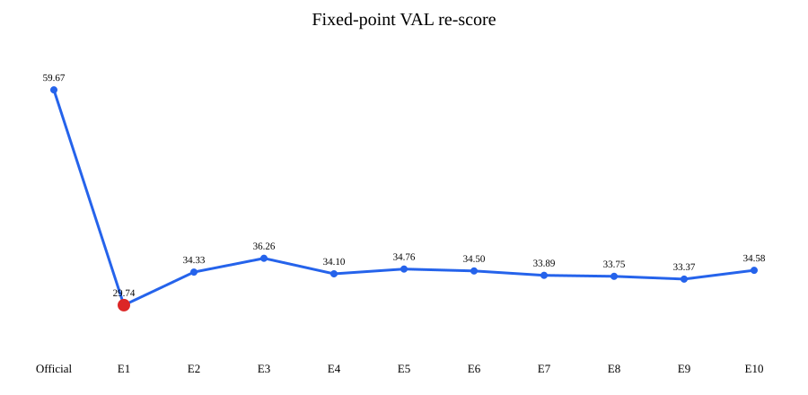

# PUBLIC RGB-D Surface Finetuning V1 复盘与修正门

**Final Postmortem Gate：`V1_SIGNAL_CONFIRMED_BUT_ATTRIBUTION_UNRESOLVED`**

上一轮的核心正信号保留：固定同一批评分点后，E1 仍把 VAL 主误差从 **59.67 mm** 降到 **29.74 mm**，仍是 E1–E10 中最优；旧 SEALED 只重算 Official 与历史冻结 E1，**58.71 → 27.54 mm** 仍成立。旧 SEALED 已经消耗，本次没有拿 E2–E10 重选模型。

需要修正的是原因解释。V1 并非严格的“pose/camera-only”训练：它更新了整个 519 维 `head_pose.proj` 和 camera projection，共 2,634,250 个参数。shape、scale、派生 MHR 身体比例、hand、pose 和 camera 输出都变了。约 89%–91% 的绝对误差收益可由整体 XYZ 平移解释，translation-aligned 后 VAL 只剩 **23.13 → 19.89 mm** 的改善。因此，V1 证明了真实 RGB-D surface supervision 能改变并改善 feed-forward MHR，但尚不能把收益归因于局部姿态或躯干形状。

## 25 个问题的直接回答

1. **V1 真的训练了什么？** 整个 `head_pose.proj`（519 维输出）和 `head_camera.proj`，不是严格分块冻结的 pose/camera-only。
2. **Shape 有没有变？** 有。Official→E1 的 shape 输出 RMS 变化均值为 0.0357。
3. **Scale 有没有变？** 有。scale 系数 RMS 变化均值为 0.0432。
4. **Skeleton 有没有变？** 当前头没有独立 skeleton 输出段，但 scale 会生成 68 维 MHR scales；它的 RMS 变化均值为 0.00576，所以身体比例相关输出没有冻结。
5. **ROI 从哪里来？** HuMMan 的 `mask_color` 人体掩码生成 bbox；该掩码与 Depth 注册。
6. **是不是完整 RGB-only pipeline？** 不是。模型 forward 使用 RGB、K 和 bbox，但 bbox 是数据集提供的。准确说法是：**在 dataset-provided person ROI 条件下，RGB+K feed-forward MHR improved**。
7. **固定相同评分点后 E1 还是最佳吗？** 是。E1 为 29.7413 mm；E2–E10 均为 33.37–36.26 mm。
8. **旧 SEALED 的 58.72→27.54 还成立吗？** 成立；固定复算是 58.7114→27.5371 mm，并明确标为 `CONSUMED_TEST_POSTHOC_ANALYSIS`。
9. **两个失败 subject 为什么变差？** `p000757` 与 `p000830` 在共同覆盖区域也退化，说明是真实局部失败，不只是评分覆盖差异。V1 同时改变 camera、pose、shape、scale，现有证据不能单独锁定一个原因。
10. **是否靠减少 coverage 得到低误差？** 整体没有。subject-median coverage 从 0.74569 略升到 0.74919，共同覆盖区域误差仍从 78.36 降到 36.80 mm；失败 subject 局部伴随覆盖下降，需要保留为风险。
11. **收益来自什么？** 主要来自 root/camera translation，同时混有 pose、shape、scale 变化；现有 checkpoint 不能作严格因果拆分。
12. **Translation-aligned 后还有多少改善？** VAL 23.13→19.89 mm，约 3.24 mm；旧 SEALED 19.78→16.87 mm，约 2.91 mm。
13. **简单 Txyz bias 能吃掉多少收益？** 只用 TRAIN 得到的常量偏移在 VAL 达到 40.30 mm、旧测试 35.41 mm，分别吃掉约 65% 和 74% 的绝对收益；E1 仍优于该傻瓜基线约 10.43/8.10 mm。
14. **为什么不马上继续微调？** E1 仍优于常量校准，说明学习模型可能有额外价值；但训练范围和 loss 合同需要先修，否则下一轮无法解释。
15. **完美几何时 loss 接近 0 吗？** 随采样数增加而接近 0，但有近似 floor：4096/8192/16384 点约为 1.59/0.76/0.33 mm。
16. **seed 对 loss/gradient 影响多大？** 4096 点扰动测试的跨 seed 梯度 cosine 约 0.36，8192 约 0.53，16384 约 0.70；4096 对梯度而言偏不稳定。
17. **梯度方向合理吗？** ±50 mm 的 XYZ 平移和 ±3° 整体旋转方向均正确。玩具 mesh 没有运动学人体参数，不能宣称 pose 参数方向已经验证。
18. **area-weighted sampling 值得替换吗？** 当前证据不足。它略降 perfect-geometry floor，但没有稳定改善扰动梯度一致性。
19. **surface 与 teacher 2D/3D 是否冲突？** DEV 上 E1 有局部负 cosine（约 -0.27、-0.49），E10 转为正；这说明局部冲突存在，不能直接推出 teacher loss 应删除。
20. **sensor 多视角一致性是多少？** subject-macro median/P90/P95 为 14.10/90.58/146.53 mm。该量混合标定、遮挡、衣物和深度噪声，不是可从模型误差中扣除的真值噪声下限。
21. **torso surface 真变好吗？** `NOT_DETERMINABLE`。当前 MHR 资产没有经核对、且拓扑 hash 匹配的 body-part 映射，本次没有凭坐标阈值编造躯干区域。
22. **历史 V1 PASS 怎么处理？** 保留 Pilot 信号，状态为 `CONFIRMED_WITH_CORRECTED_ATTRIBUTION`；撤销“严格 pose/camera-only”和“完整 RGB-only 自动系统”两项解释。
23. **下一轮值得训练吗？** 值得，但现在不启动。先落实输出块冻结、固定评价/监督采样和强制傻瓜 baseline。
24. **下一轮只改变什么？** 前置修复通过后，只比较 **single-view 与 synchronized multi-view surface supervision**。
25. **为什么？** 它能检验多视角是否带来超越整体平移的局部几何收益，同时保持数据划分、初始化、训练参数、loss 和评价尺子不变。

## 修正后的实验链路

`数据集 mask/depth 支持的 ROI → RGB+K+bbox forward → 全 pose projection + camera projection 更新 → sampled-surface loss → 固定 observation 的 subject-equal 评价 → translation/simple-bias 归因诊断`

## 关键证据与边界

- 固定评分只在 1/15 个 VAL 帧触发 25,000 点上限，其余 14 帧使用全部有效点，因此随机 observation 不是 E1 选型的主因。
- `pred_cam_t`、global rotation、body pose、shape、scale、derived scales、hand 和最终 vertices 都发生非零变化；face 在 forward 中被置零。
- surface loss 是“按 face index 均匀抽三角形 + 随机重心点 + 单向最近点 + Huber”，不等于精确 point-to-triangle。
- 主指标合同固定为：逐帧 observation-to-exact-triangle 中位数 → 每名 subject 的帧中位数 → subject 等权平均。
- 历史 joint 指标只能称 `JOINT_OUTPUT_STABILITY`，因为没有独立人工 joint GT。

## 决策

当前最严重漏洞是：**一个主要由整体平移驱动、同时又改变 shape/scale/hand 的 checkpoint，被解释成 pose/camera-only 的局部几何改进。** 下一次正式训练必须先证明冻结合同真实成立，并把 Official、TRAIN-only 常量 Txyz 校准列为强制基线。完成这些工程前置后，才启动 single-view 与 multi-view 的单变量对照；新的 untouched test 只在模型选择规则冻结后使用。

机器可读的总修正见 [PUBLIC_RGBD_SURFACE_FINETUNING_V1_CORRECTION_V1.json](PUBLIC_RGBD_SURFACE_FINETUNING_V1_CORRECTION_V1.json)，下一步门控见 [NEXT_TRAINING_DECISION_V1.json](NEXT_TRAINING_DECISION_V1.json)。历史 2026-09-09 handoff 未修改。
