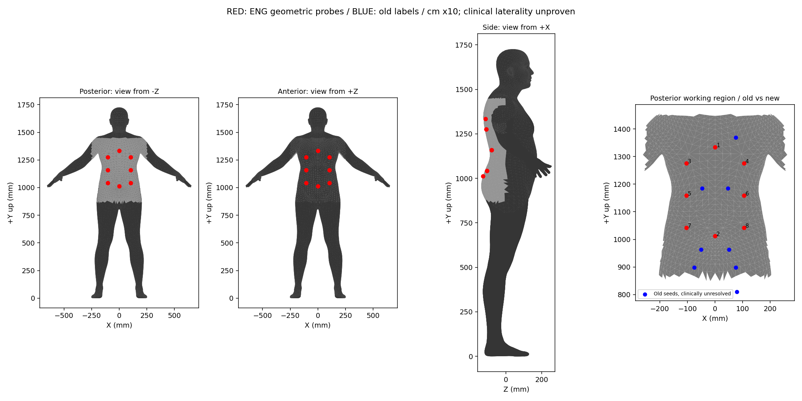
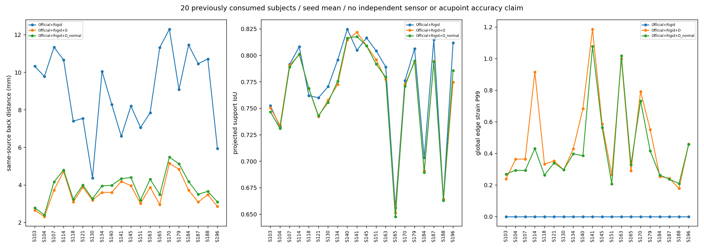

# 工程模板与背部几何机制验证 V2：完成报告

任务于北京时间 2026-10-03 启动，2026-10-04 完成交付。按 [原计划](../../../research/2026-10-03-no-deployment-camera/NEXT_EXECUTION_PLAN_V2.md) 执行；BEHAVE 走计划预先允许的资格不足分支，没有凑数运行。旧结果保留。

## 结论先说

**法向约束有用，但没有把问题解决。** 它减少同拓扑工程点相对 Rigid 表面的切向移动，保留大部分同源深度拟合收益；距离略差于原向量 D，轮廓和完整网格质量仍有代价，跨种子点位波动也没有改善。现在适合保留为对照基线，不能升级为最终机器人定位方案或论文的已验证主方法。

新工程 atlas 的中线、上下顺序、单位和表面绑定已核查；它是 8 个中性几何探针，**不是新生成的穴位标签**。本轮没有训练、SAM 新推理或临床准确率验证。

## 1. 实际做了多少

| 部分 | 实际工作与产出 |
|---|---|
| A 工程模板 | 8 个 ENG 点、300 个历史缓存实读、2,400 条新传播记录 |
| B 独立观测资格 | 300 个新 timestamp、1,200 个相机视图的数据检查；K0 原图筛查、候选四机位图及后背小块投影审计 |
| C/D 法向 D | 20 人 × 3 seeds，复用 Official/Rigid/向量 D 的 180 个网格，新增 60 个法向 D 网格；240 条评价 |
| 工程点诊断 | 1,920 条四方法点位、960 条形变移动记录、640 条跨种子探针跨度 |
| 可视化 | 60 页四方法预测对照 + 总图 + canonical 对照；另有本地/服务器 60 页 RGB 对照及 60 页 BEHAVE 资格图 |

20 人全是历史使用过的人物。4 个开发角色、16 个测试角色及 seeds 0/1/2 不变，测试角色不称新人物泛化集。Official 在同一人三种子下的最终顶点完全相同，重复评价没有增加推理次数。[执行记录](EXECUTION_LEDGER.json)

## 2. A：工程 atlas 完成，医学语义继续 HOLD

canonical MHR raw 单位为 cm，转 mm ×10；推理网格为 m，转 mm ×1000。新点为两个中线点与三对 NEG_X/POS_X 点，中线 X 恰为 0，上点高于下点，均绑定实际后侧三角面，保存 face/vertex ids、重心坐标、坐标与法向。

后背旧评价口径仍为 2,152 个面。工程工作区另排除旧面重心 Y 范围底部 20%，得到 1,738 个面，**没有改变历史评价区域**。工作区是几何定义；没有证明其边界对应具体椎体或医学臀部边界。人体解剖左右尚未独立核实，因此只写 X 的正负方向。

旧 8 点的临床名称保持待核实。本轮没有从躯干比例推断 C7/T3/L2，也没有把 ENG 点当骨度分寸规则的真实参考。跨方法传播只证明程序对应，不证明医学对应。

红点是本轮中性工程探针，蓝点是语义待核实的历史种子；各视图投影展示点的位置，没有执行遮挡筛选。[Atlas 与检查](results/a_atlas/ATLAS_QA.json)、[完整绑定](results/a_atlas/ENGINEERING_BACK_ATLAS_V2.json)

## 3. B：没有取得计划所需的独立后背观测 cohort

在既有 Date03/05/06、15 个序列内，每序列均匀取 20 个时间位置，先排除旧 45 帧，合计 300 个候选。以原 RGB 提出后背源块，再把 K0 块内传感器点转到 world，投影至其它相机。资格要求双方各至少 30 个有效 person-depth 点，且双向至少 50% 的点在 50 mm 内得到近邻支持。

Date 对应外参、畸变及 pointcloud table 被实际读取。与官方 `KinectTransform` 的数值比较通过，投影自洽检查通过；这证明代码合同一致，**不是传感器物理毫米精度证明**。

| 人物 | 源块 RGB 通过且有数值共同支持的候选 | ≥3 秒间隔的候选上限 | 涉及序列 |
|---|---:|---:|---:|
| Sub03 | 11 | 8 | 2 |
| Sub04 | 7 | 6 | 2 |
| Sub05 | 21 | 21 | 3 |
| Sub06 | 18 | 13 | 3 |
| Sub07 | 5 | 3 | 1 |

**Sub07 不能提供计划的 6 帧/至少 2 个动作。** 在每人最多 6 帧的预算下，即使其它人物后续视觉确认全部通过，也最多 27 帧，达不到 30 帧。于是新正式 manifest 未签发，BEHAVE 新推理/拟合均为 0。

62 是数值候选数，不是完成全部 held-out RGB 确认的正式样本数；整体 NO GO 后停止其它人物的逐块 held-out 确认。Sub07 的瑜伽球图确有相机同时看见背部，但冻结块没有通过双向数值支持，不能据此说“没有其它相机看见背部”，也尚未定位是表面可见性、衣物、深度或登记误差哪项主导。

源块中心修订、误把前胸列入的 #153 撤回、5 个最终源块排除、初始草案均保留；这些是模型运行前的原图资格审核。[资格总表](results/b_qualification/COMMON_SUPPORT_COHORT_LIMITS.json)、[全部排除记录](results/b_qualification/EXCLUSION_REASONS.json)、[未签发 manifest](results/b_qualification/FROZEN_MANIFEST.json)

## 4. C/D：法向约束的收益与代价

四方法共用旧相机合同、初值、后背区域及评价点。新分支只从冻结 Rigid 缓存开始；形变为 `delta_i = u_i * n_i_Rigid`，法向固定。求解的是原向量能量在该子空间的精确限制，平滑项为 `Nᵀ (L ⊗ I₃) N`，不是事后投影，也不是直接在标量 u 上套一个不同平滑项。

D 保持 λ=0.15、μ=0.0001、τ=0.05、n0=6、4 次 IRLS、σ=0.012 m、原 confidence/robust weighting，无床约束；没有按测试结果调权重。保留原 6 cm 空间块、20% 留出，实际优化索引与留出索引交集为零。历史 Txyz/Pose 未重跑；它们只在 A 的历史 300 网格传播中出现。

### 16 人测试角色结果

聚合为三种子算术平均 → 每人结果 → 16 人中位数。这里的 P95 是“每人三种子 P95 平均后的人物中位数”，不是把所有点混起来的 P95。

| 指标 | Official | Rigid | Rigid+D 向量 | Rigid+D 法向 |
|---|---:|---:|---:|---:|
| 后背点→面 median mm | 152.88 | 8.25 | 3.66 | 3.99 |
| 后背点→面 P95 mm | 174.51 | 22.11 | 13.80 | 14.87 |
| 射线命中率 | 97.26% | 98.60% | 97.95% | 97.87% |
| 四方法共同命中点上的 Z 残差 median mm | 161.81 | 9.08 | 3.99 | 4.38 |
| 全身投影支持 IoU | 0.681 | 0.792 | 0.774 | 0.778 |
| 轮廓双向距离 P95 px | 30.98 | 17.76 | 17.24 | 17.67 |
| 完整网格相对边长变化 P99 | ≈0 | ≈0 | 44.45% | 39.18% |
| ENG 点切向移动 mm，相对 Rigid | — | — | 1.86 | 0.48 |

“50 mm 内覆盖”在三个修正方法的人物中位数均为 100%，区分力有限，完整逐人值仍交付。共同射线命中集合本轮是**四方法交集**，不能与旧五方法交集指标直接当同一数对账。冻结合同内继承的 supporting 字符串仍有旧 five-method 字样，实际 `common_hit_methods`、缓存与此表均为上述四方法，没有暗改运行后合同。

逐人比较更能说明问题：

- 法向 D 相对 Rigid：16/16 人后背距离下降，但 14/16 人全身投影支持 IoU 下降。
- 法向 D 相对向量 D：16/16 人距离略差，逐人差值中位数 +0.208 mm；16/16 人探针切向移动下降。
- 完整网格边长 P99：11/16 人改善，5/16 人变差；IoU 仅 9/16 人略升，7/16 人下降。
- 三种子工程点最大两两位移，先每人对 8 点取中位数再取人物中位数：向量 D 7.39 mm、法向 D 7.75 mm。**切向移动减少不等于点位跨划分稳定性改善。**

所有 60 个法向网格都无数值退化面，但都有相对初始面的方向反转代理（每网格 7–670 个面），且没有做完整自交检测。S163/seed2 最大相对边长变化达 18.83；不能只凭 P99 略好宣称质量合格。邻域、法向、面积与逐点移动完整保留。

[240 条完整结果](results/c_pressure_normal/ALL_METHOD_RESULTS.json)、[逐人表](results/c_pressure_normal/PER_SUBJECT_RESULTS.csv)、[逐人差值](results/c_pressure_normal/PAIRED_PERSON_DELTAS.csv)、[工程点移动](results/c_pressure_normal/ENG_MOVEMENT_960.json)、[网格质量](results/c_pressure_normal/GEOMETRY_QUALITY_120.json)

### 证据边界

PressurePose 相机仍是历史床垫角点/官方 viewer 相机中心重建的近似合同，原始相机畸变不可恢复；本轮没用预测 Mesh 反调相机。bbox 来自共享完整过滤点云，支持轮廓也来自这份点云，因此并非所有上游信息对留出点盲化，IoU 不是独立手工 GT。优化自身不读留出点；这仍是**同源空间留出的工程诊断**，不是独立 sensor、裸背或穴位毫米精度。

## 5. 核验与运行中修复

470 个冻结源文件/合同前后 SHA 校验通过；240 缓存实际校验通过；60 划分实查。180 个复用基线的后背/torso 逐点距离、单方法射线残差和命中数组与旧缓存完全一致。4 个开发人物 seed0 的法向 D 从最终网格独立重算点→面和射线数组，结果完全一致；不声称 240 个网格都做了第二次几何重算。[完整性](results/c_pressure_normal/POST_EXECUTION_INTEGRITY.json)、[复算](results/c_pressure_normal/INDEPENDENT_CACHE_RECOMPUTATION.json)

首次批次在 S141 触发一个诊断断言：沿用的顶点法向长度最小为 0.9999982，`d-dot(d,n)*n` 错把很小的平行剩余量当切向分量。修正为真实正交投影 `d-dot(d,n)/dot(n,n)*n`，**没有改优化器的解、数据或权重**。保留首次 57 个成功缓存及 1 次失败调用；修后完整重跑固定 60 分支。总物理求解调用 118 次、成功保存 117 个法向网格，正式分析只用第二批 60 个，不算 117 个独立实验。

首次57个成功缓存与最终重跑的对应缓存，实际顶点和标量变量均完全一致，支持诊断修正没有改变求解结果。[实际重跑对账](results/c_pressure_normal/DIAGNOSTIC_FIX_RERUN_AGREEMENT.json)

汇总代码另修两处报告问题：CSV 字段取所有行的并集；50 mm coverage 从原逐点距离数组计算，而非读取不存在的旧字段。两项只重新汇总，不重新拟合。[修复审计](IMPLEMENTATION_CORRECTION_AUDIT.json)

## 6. 下一笔时间投在哪里

本轮不支持直接扩大训练，也不支持用法向 D 替换所有分支。保留 Rigid、向量 D、法向 D 三种工程基线：法向 D 是移动代价较小的候选，完整网格与定位可靠性尚未通过。

**优先投入观测资格和目标对应，而非继续压同源距离。** 下一阶段先完成一小套“源后背块确实被其它视角观察到”的独立参考，或有已知相机/表面/对应的受控几何闭环；它回答的是登记与表面对应，不冒充真人医学精度。在此之前，ENG 探针可以继续验程序、规则接口可以用代理输入，但不把它们变成椎体/穴位真值。

若后续独立参考确认形状错误，再立项 RGB-D 几何学习；若表面接近参考而位置对应仍错，再立项个体解剖参考/对应模块。当前法向约束后处理只能做 baseline 和机制证据，尚不足以承担顶会主贡献。

完整 RGB 对照、最终 Mesh/变换/形变/实际索引留在服务器并已下载本地复查副本；Git 包含全部代码、合同、60 划分、240 逐点指标、240 缓存元数据、全人物图与哈希清单。[可视化入口](VISUALIZATION_INDEX.md)、[复现与位置](REPRODUCTION.md)
