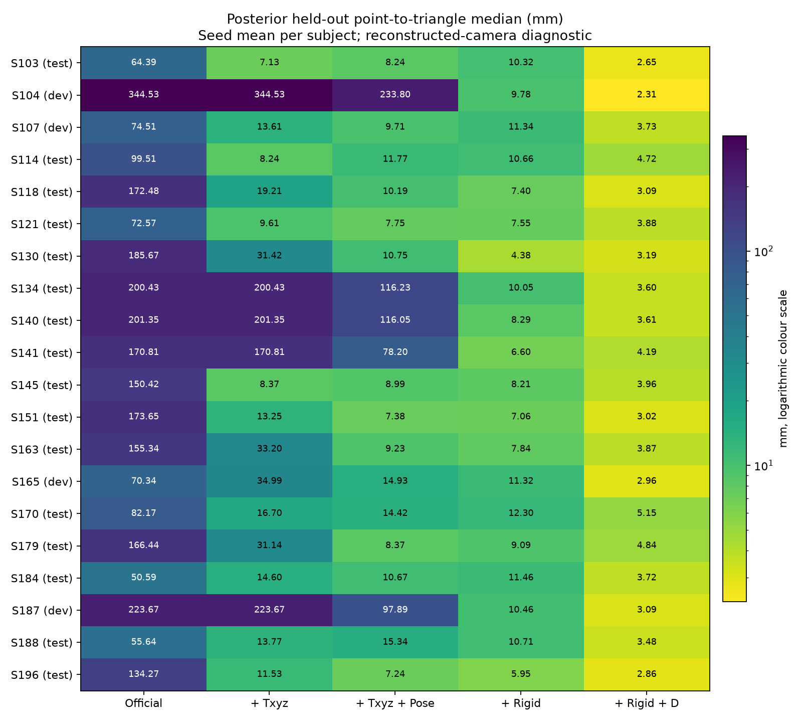
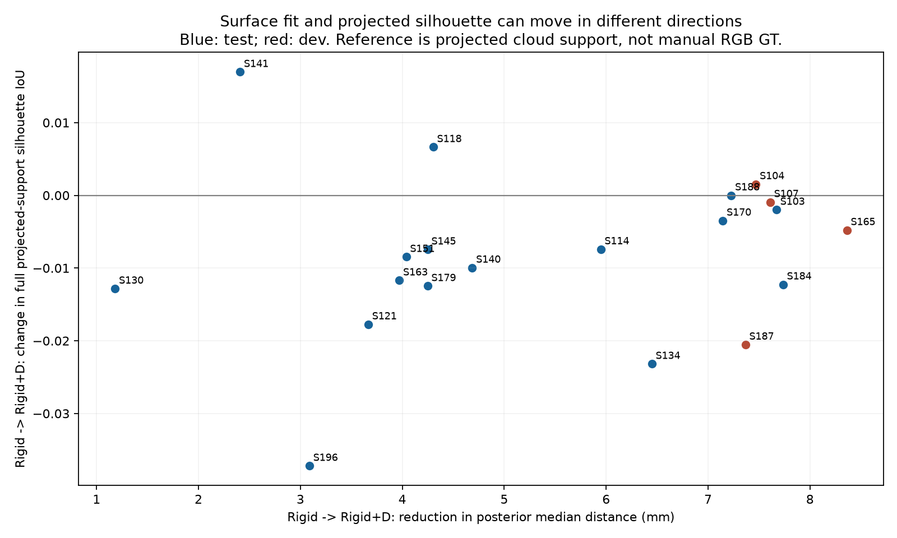

# 可信俯卧背部 Mesh 修正版对照：最终报告

日期：2026-10-03。**正式实验完成，结果可复算；患者真实毫米精度与解剖对应尚未验证。**

## 1. 本轮实际做了什么

沿用 PressurePose `p_select.p` 的 20 人、每人一个俯卧样本，开发 S104/S107/S165/S187，测试角色 16 人，种子 0/1/2。所有人已用于历史工程诊断，不是全新泛化集。没有训练或微调模型。

先在相机 XY 建立 6 cm 空间块，随机留出 20% 的块，再运行每人一次新的 Official RGB 推理。所有深度分支只读取训练点，共享该 Official 和相同评价点；不用历史全点云优化后的 T+Pose 初始化。深度是数据集过滤点云，原始 depth 仅用于独立于 Mesh 的数据对应核查；没有把显示用 depth 图作几何输入。

五方法为 Official、Txyz、Txyz+Pose、Rigid、Rigid+D。Txyz 保留六次迭代与 177.888 mm 总范数限制；O2 保留 25 次、1024 点、stride 2、Huber 0.02、学习率 0.003/0.001、两项先验 0.01，只优化 translation/global_rot/body_pose。Rigid/D 完全沿用冻结历史配置，没有看到结果后调参数。

主指标：预先冻结的 RGB 后背工程 ROI 内留出点，到固定 2152 个 MHR 后背三角面的距离。辅助射线取同一 ROI 点沿连续透视射线与**完整 Mesh**的最近正交点；同时报告命中与五方法共同命中。旧 torso-band → 全 Mesh 口径保留对账。聚合为种子算术平均 → 逐人 → 组内人物中位数；表里的 P95 也是逐人 P95 经此聚合，不是把全部点混成一个 P95。

本轮是**同源空间留出**，不是 BEHAVE 的 K1/K2/K3 独立传感器留出。完整点云还参与历史 bbox 和轮廓辅助参考，不宣称整个上游输入与评价彻底独立。

## 2. 三个问题的答案

### A. Official 的大误差与相机/坐标有关多少？

**不能定量分解，但排除了本轮新引入输入处理差异这一解释。** 20/20 人的新旧 K、bbox、faces 完全相同，新的 Official 与历史 Official 最大顶点差异只有 **0.001169 mm**；完整 MHR 参数重建与当前预测最大差异 **0.000358 mm**。[实际历史身份审计](results/OFFICIAL_HISTORY_IDENTITY_AUDIT.json)

相机仍来自床垫四角与官方 viewer 位置的历史 pinhole 重建。原 pickle 没有物理 K/外参字段，畸变不可用。四角 RMS 小不代表人体非平面区域正确：20 人后背过滤点云与同像素 raw depth 的 Z 差异中位数，逐人范围 **4.94–47.08 mm**，人物中位数 **10.91 mm**，S130 最大。差异混合过滤、遮挡、投影和可能的标定问题，不能全部归到相机；没有用预测 Mesh 反调 K/外参。[20 人核查](results/camera_audit)

因此 Official 的百毫米残差可能混合模型恢复与坐标合同偏差，现有证据不能指定各占百分之几，也不能由拟合到该点云后残差很小反推相机准确。

### B. 排除测试点参与优化、修好评价后，D 的改善剩多少？

**局部表面拟合的增益仍在，并非只靠漏掉困难射线。** 测试角色 16 人结果：

| 方法 | 后背距离 median / P95 mm | 共同命中射线 median / P95 mm | 本方法命中率 | 轮廓 IoU |
|---|---:|---:|---:|---:|
| Official | 152.88 / 174.51 | 161.84 / 178.91 | 97.26% | 0.681 |
| Official+Txyz | 15.65 / 34.31 | 18.18 / 36.59 | 98.30% | 0.781 |
| Official+Txyz+Pose | 10.43 / 24.77 | 10.19 / 32.27 | 97.53% | 0.777 |
| Official+Rigid | 8.25 / 22.11 | 9.09 / 27.49 | 98.60% | 0.792 |
| Official+Rigid+D | **3.66 / 13.80** | **3.93 / 14.88** | 97.95% | 0.774 |

五方法共同命中的覆盖人物中位数为 **95.65%**。主三角面距离不因射线未命中而删点。D 相对 Rigid：**16/16 人**的后背 median、P95、共同命中射线 median/P95 均改善；逐人 median 改善量的中位数为 **4.28 mm**。开发 4/4 人同方向，但不把开发人计入测试人。

Txyz 在 **15/60 个种子分支**超过限制而 fallback，对应 S104/S134/S140/S141/S187 全部三种子；测试组为 9/48，开发组为 6/12。raw/applied translation 均保存。T+Pose 相对 Txyz 在测试组 12/16 人 median 改善、11/16 人 P95 改善，仍有失败；它也允许继续优化 translation，不能把其全部改善叫作纯 pose gain。[配对与平移审计](DESCRIPTIVE_PAIRED_AUDIT.json)

Rigid 没有 Txyz 的总平移限制，同时增加整体旋转自由度。因此它优于受限 Txyz 的幅度混合了平移救援与旋转作用，本轮不能单独给旋转贡献定量归因。

### C. 数值改善时，背部形状和图像对齐是否也改善？

**缓存切片可见部分背部曲线更贴近点云，但整体投影没有同步合格。** 已人工查看全部开发三种子 12 页和测试 seed 0 的 16 页，共 28/60 页；还查看 S104/S141/S179/S196 的相机 X 切片。其余页面全部交付，但不冒称手工逐张检查。[视觉记录](VISUAL_REVIEW.md)

S104/S130 等例子显示，移近相机后人体投影放大，局部距离虽降低，头、手臂、躯干边界或脚仍偏大/错位。D 相对 Rigid，**13/16 测试人物**的全身投影轮廓 IoU 下降，组中位数 0.792→0.774。该 IoU 的参考是过滤点云投影支撑，不是手工 RGB 分割 GT，也不是单独后背轮廓，不能据它单因裁决背部形状；但人工图像检查确实保留了明显错位证据。

质量也有代价：D 的测试人物 P99 相对边长变化中位数 **44.45%**；S141 为 **118.67%**。全局旋转移除后的法向反转代理中位数 **0.201%**，S179 为 **2.349%**。这些是完整 Mesh 的诊断，不能说变化都发生在背部，也不是自交或三角形翻面已被严格证明；同样不能宣布网格保持解剖对应正确。

## 3. 旧结果究竟被修正了多少

相同旧 torso-band 口径、同样种子→人物汇总，在测试 16 人上：

| 方法 | 旧 / 新三角面 median mm | 旧 / 新射线 median mm |
|---|---:|---:|
| Official | 129.68230 / 129.68218 | 146.79848 / 146.78232 |
| Official+Rigid | 8.49837 / 8.49796 | 10.41052 / 10.40969 |
| Official+Rigid+D | 3.59736 / 3.59725 | 4.20493 / 4.20333 |

历史约 3.60 mm 的 **O+Rigid+D torso 数值基本复现**；评价解析例的错误没有变成真人结果统一 166.67 mm 偏差。旧新射线差异包含修正公式、候选检索和新初值微小数值差异，不能全归于某一个因素。新主后背 **3.66 mm** 与旧 torso **3.60 mm** 区域不同，不当作直接优劣竞争。

180 条逐人—种子—方法对账在 [OLD_NEW_PAIRED_AUDIT.json](OLD_NEW_PAIRED_AUDIT.json)。旧 `Txyz(lifted)` 移除了限制，旧 T+Pose 读取全点云，因此不作为本轮冻结 Txyz/O2 的公平旧基线；旧 P90 也不与新 P95 混比。所有历史结果保留不覆盖。

## 4. 完成与复查证据

| 检查 | 实际状态 |
|---|---|
| 解析射线、最近交点、大三角面检索、透视光栅等主路径 | 8/8 纯代码/mock 测试通过，另实际运行 GPU 五方法 |
| 开发先行 | 4 人 / 60 条，结构 Gate PASS 后才运行 Full |
| 初始化 | 20 次新的 Official 推理；深度优化不进入初值 |
| 实际优化点与留出点交集 | 300 条缓存验证，均为 0 |
| 最终网格、完整 MHR prior、R/t/D、实际索引/配置 | 300/300 缓存；各方法参数语义明确 |
| 从缓存独立重算 | 300/300 逐字段与逐点数组精确一致；没有重新拟合，原结果/网格不改 |
| 数量 | 300 网格、300 独立叠图、300 残差图、60 对照页、60 切片/质量图、60 三轴平移图、20 数据源图 |
| 交付前后与重算后 | 冻结代码/配置、checkpoint、MHR、anchors、SAM 源码及网格身份 PASS |

运行于 `172.18.18.151` GPU 0、2080 Ti，既有 Python 3.10/Torch 2.4.0+cu121 环境。Full 人物循环耗时合计 **33.03 分钟**，含开发缓存的重新评价/绘图，不含加载/准备和后续独立重算。全部 800 张运行展示图与两张汇总图、划分 NPZ、逐点残差 NPZ、逐人完整表已交付。完整大 Mesh 与源数据在 [SERVER_PATHS.md](SERVER_PATHS.md)，冻结代码/配置见 [准备提交](https://github.com/32muyuxuanshou/massage-physiotherapy-robot/tree/bfbdf095b89b0142b0e6fbe6fdf5ee3da842e76d/docs/handoffs/real-scene-2026-10-03/pressurepose-prone-corrected-comparison-v2)。

## 5. 下一笔时间投向哪里

保留 **Rigid+D 作为工程表面拟合基线**，同时保留其失败和形变代价。下一步优先核实实际 RGB-D 的物理标定、RGB/depth 配准以及后背几何对应，先让点云本身有可信的图像/物理坐标。

该基础成立后，再在同一表面比较“固定拓扑传播”和“参考点＋穴位规则”；不能从本轮衣物表面残差推导出穴位精度。如果在可信坐标下背部形状/解剖对应仍明显错误，再设计 RGB-D 几何模型或针对性微调。本轮不启动训练，也没有新增触诊或不确定性模块。
