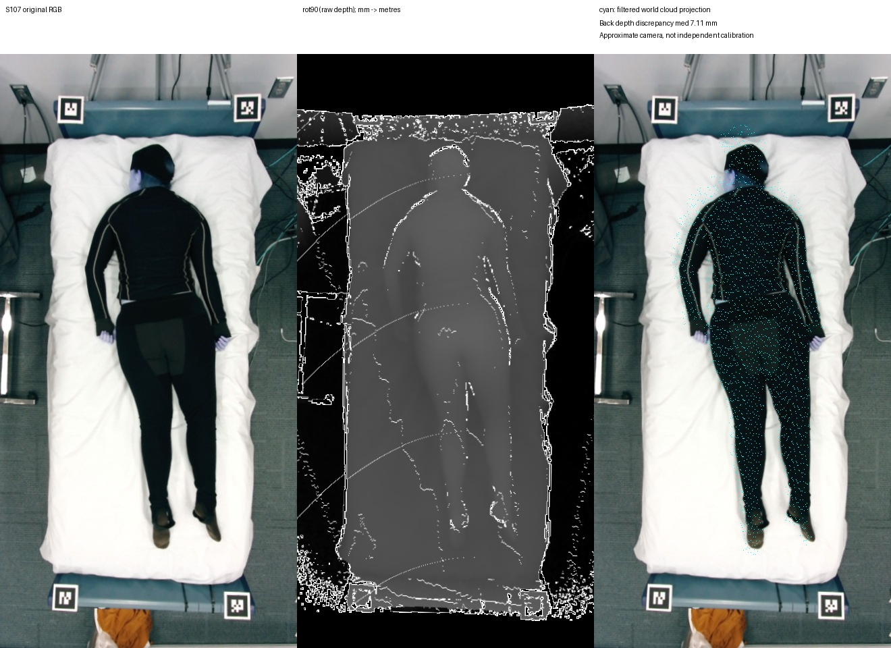

# 相机与数据对应核查

## 已确认的来源链

[PressurePose 官方仓库](https://github.com/Healthcare-Robotics/bodies-at-rest)提供真人床上 RGB、depth、过滤点云和压力数据。官方称其数据进行了共注册；这不意味着我们后续重建的每张图 K/外参已被独立验证。

[官方真人可视化脚本](https://github.com/Healthcare-Robotics/bodies-at-rest/blob/master/PressurePose/viz_real_cvpr_release.py)对原始 depth 使用 `np.rot90`，并在 3D viewer 中设置位置 `[1.09898028, 0.46441343, -1.66]`。这个 viewer 设置本身不是物理相机外参的独立测量证明。

历史实现以床垫几何及四角拟合每张图的 pinhole K/旋转，并使用上述中心：

`P_camera = (P_world - C) @ R.T`。

点云单位为米，原始 depth 的毫米值经 `/1000` 转为米；转置/旋转仅按官方链，不用 512×512 显示图作几何输入。RGB 保持原始 440×880，无额外非等比 resize；历史 bbox/K 为各方法共同输入。当前未知 lens distortion，不补造厂家参数。

本地打开 S107 原始文件，只有 `pmat_corners / pose_type / depth / pc / RGB / images` 六个键，没有 K 或外参字段；俯卧索引为 4。其 raw depth 440×880，经 `rot90` 为 880×440，与 RGB 对应尺寸一致。**尺寸相同不足以证明所有像素几何一致。**

## S107 非平面人体检查

源文件身份、旋转、单位、正 Z、点云 RGB 投影、后背 raw depth 同像素一致性均实际检查。没有读取预测 Mesh 来调相机。

| 项目 | 结果 |
|---|---:|
| 床垫四角 RMS | 0.727 px |
| 点云投影处 raw depth 有效比例 | 99.855% |
| 全过滤点云与 raw depth 的 Z 差异 median / P95 | 14.56 / 159.62 mm |
| RGB 后背 ROI 内同像素 Z 差异 median / P95 | 7.11 / 38.52 mm |

这些是不同来源几何的一致性诊断，混合了过滤、遮挡、投影及可能的标定问题，不能单因归结为 K 错误；也不能用小四角 RMS 抹掉人体非平面的差异。详细非平面 Z 范围和同像素 3D 差异在 `local_s107/camera_audit/S107.json`。

## 当前裁决

**APPROXIMATE_PINHOLE_NOT_INDEPENDENTLY_VALIDATED。** 后续对照可以测“同一重建坐标合同内的拟合改善”，不能称为独立毫米级精度验证。不能通过移动/缩放预测 Mesh 来反调相机。

开发阶段 S104/S165/S187 的原始点云、raw depth 尚未在本机核查：本地没有它们的原始 pickle，服务器当前不可用。`CALIBRATION_INPUT.json` 中它们的历史 QA 只是已有记录，不冒称新检查。`camera_qa.py` 将在模型运行前对四个开发样本和后续全部样本产生同样的源数据图/数值。

如后续获取原物理相机标定，应建立新版本合同重新对账；当前不通过拟合反推出“厂家标定”。
