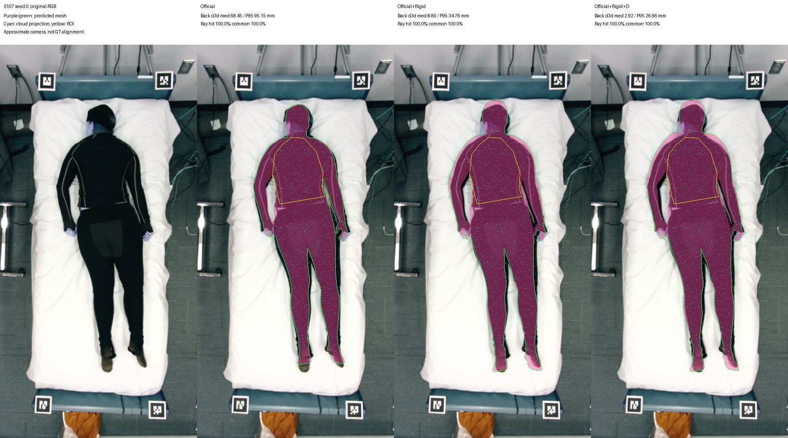
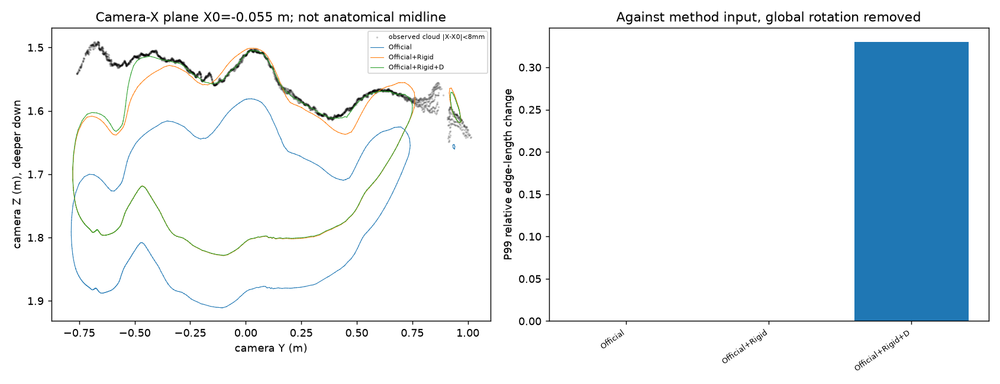

# 本地 S107 检查结果

**仅用于验证修正版代码和缓存流程。正式 20 人五方法实验尚未执行。**

使用本地 S107 原始文件（SHA256 见 `local_s107/inputs/S107/input_manifest.json`）和历史 **Official** 顶点初值；没有读取历史 Txyz/T+Pose 作为优化起点。该历史 NPZ 缺少完整 shape/scale/hand/face 参数，故此结果不能计入要求“新 Official 初值”的正式实验。

使用种子 0，训练 51,899 点、留出 13,047 点，两者交集为零；后背评价 1,190 点、旧 torso 评价 1,407 点。三个分支用相同点索引。种子 1/2 的数据划分也已生成，但未运行几何分支。所有索引公开于 `SPATIAL_SPLIT_INDICES_S107.json`，不是三个独立受试者。

| 方法 | 后背三角面 median / P95 mm | 射线绝对残差 median / P95 mm | 后背命中率 |
|---|---:|---:|---:|
| 历史 Official，仅 RGB 初值 | 68.45 / 95.15 | 81.07 / 96.86 | 100% |
| Official + Rigid，训练点拟合 | 8.80 / 34.76 | 9.54 / 93.35 | 100% |
| Official + Rigid + D，训练点拟合 | 2.92 / 26.96 | 3.31 / 73.78 | 100% |

三方法共同命中率为 100%，本例后背射线指标改善不是由漏掉困难点造成的。旧 torso 的共同命中率为 76.05%，详见 CSV；不能把后背与 torso 两种区域混在一起。

**这不是“2.92 mm 工程精度”证明。**

- Rigid+D 的后背距离 P95 仍有 26.96 mm，射线 P95 仍有 73.78 mm。
- D 相对输入出现 26 个三角面法向反转代理事件（26/36,874 ≈ 0.0705%）；P99 边长变化约 33.01%。该检查不等于完整自交检测。
- 透视图仍能看到肢体轮廓错位。此时不能以整体/局部中位数低判为“人体已全部对齐”。
- 后背 raw depth 与过滤点云的同像素 Z 差异 median 7.11 / P95 38.52 mm；相机合同仍未独立验证。

切片是 **相机 X = −0.055 m 平面**与真实缓存三角面的交线，点云为该平面两侧 ±8 mm；不是解剖正中线，图中横轴是相机 Y、纵轴是深度 Z。此图只提供侧面解释，不冒充 RGB 透视叠图。

## 已通过的工程检查

1. 4 个射线解析检查与 4 个流程/渲染检查，共 8 项通过。五分支检查使用 mock SAM/优化数学，仅证明调度、输入隔离、一次初值复用和保存路径。
2. 本地实际运行 CPU Rigid/D，所有优化只收到 train 点；保存三个最终 Mesh、R/t/D 和实际索引。
3. 独立执行缓存评价，后背与 torso 数值精确重现，缓存 Mesh SHA256 不变，未调用拟合或模型。见 `CACHE_RECOMPUTATION_CHECK.json`。
4. 图像由缓存网格生成并已实际查看；没有使用旧“阈值放宽”图片。
5. 历史四份源文件 SHA256 不变，历史输出不覆盖。

GPU SAM3D、完整 MHR 参数 round-trip、真实 anchor Txyz 与 O2 尚未在服务器运行；它们不能从 mock 检查升级为已验证。
