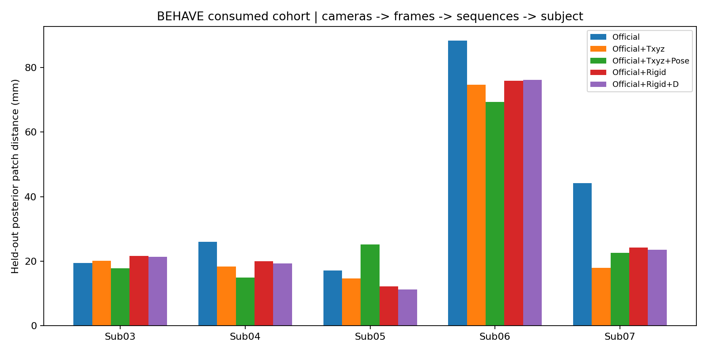

# 无部署相机阶段：表面几何与工程点对应验证

日期：2026-10-03。**离线传播、五方法跨相机对照、公开数据资格审计和代理规则链已实际执行；尚未验证医学穴位准确率。没有训练或微调。**

## 决策

保留 Rigid+D 作为局部表面拟合基线，暂不把它定为最终定位方法或论文主贡献。PressurePose 的同源空间留出增益，在这轮 BEHAVE 小块穿衣后背的独立机位上只留下很小的改善；当前 atlas 还存在明显的语义问题。下一阶段先修正工程参考点及其语义合同、补充有正确坐标与独立参考的后背验证，再决定几何/对应模块如何训练。

没有部署相机仍能完成离线研究，但不能保证未来设备效果不变。

## 1. 实际完成规模

| 阶段 | 实际运行与产出 | 能证明什么 |
|---|---|---|
| P0 单位/拓扑 | 300 个实际缓存逐一读取；canonical cm→mm ×10；缓存 m→mm ×1000 | 同拓扑传播合法、单位已更正；穴位语义未通过 |
| P1 缓存点位诊断 | 20 人×3 seeds×5 方法×8 点＝2,400 点；480 个 Rigid→D 点位配对；60 页 RGB/点位复查及 60 页不含原图的网格图 | 点位传播、法向/切向移动及局部质量；不是目标定位误差 |
| P2 BEHAVE | Sub01 一帧 Smoke；已消费 5 人、固定 45 帧、seed 0；45 次 Official 初值、225 个最终方法网格，900 条相机—方法记录 | K0 修正对 K1/K2/K3 可见后背小块的影响 |
| P3 数据资格 | DMD 205 组文件身份与全部 35 页视觉复核；PCdare 324 非 Output PLY / 1,326 邻近线候选 | 来源、单位、结构和适用范围；未取得三维穴位 GT |
| P4 规则链 | 60 个共享参考框架；2,400 个规则代理点；旧 T0 保留，新代理候选另存 | 同表面规则可计算及方案分歧；没有独立参考裁决谁正确 |

全量数值与索引见 [审查导航](README.md)。原始数据、权重及完整 Mesh/参数保存在服务器。

## 2. P0：单位修正通过，旧 atlas 语义 HOLD

实际 canonical rest 是 MHR raw **cm**。源码 `mhr_head.py` 将其除以 100 输出 m。零姿态 forward 与 rest 最大差异 0.000415 mm，保留 rest 为 canonical 来源。canonical 身高范围约 1,727 mm，旧 bbox/xyz/projection distance 的单位错误在独立修正版中 ×10；B1–B5 预测 m→mm ×1000 没改。

300/300 缓存的 faces 数组与 canonical 一致。历史 int32 hash `f6748e…`、int64 hash `0e47f5…` 的差别来自 dtype，不是拓扑变化。没有更换 face/barycentric，也没有重新推理这 300 个网格。

但几何合法不等于标签正确：

- 旧“GV14”canonical y=809.56 mm，“GV4”y=1,369.17 mm，在 +Y 向上的模板中上下顺序颠倒。
- 两个“中线”种子的 |x| 分别约 79.35 / 75.02 mm，实际不在 canonical 中线。
- 旧左右点与“+X 为受试者左”的历史声明相冲突；尚不能独立确认应改声明还是点名，未自动交换。
- 固定 2,152 面 posterior 区域只是历史几何 mask，包含上臀附近；不是已经验证的完整临床后背分区。

因此本轮旧点名只是回归标识，**不可将其用作穴位监督、准确率参考或机器人治疗目标**。新 proxy 候选只改明确的模板方向，不声称恢复了真实椎体水平。

证据：[实际资产审计](results/p0/POINT_ASSET_AUDIT.json)、[单位修正 atlas](results/p0/ENGINEERING_ATLAS_UNIT_CORRECTED.json)、[300 缓存身份](results/p0/CACHE_SOURCE_MANIFEST.json)、[旧规则单位重算](results/p0/RULE_VS_TRANSFER_UNIT_CORRECTED.json)。

## 3. P1：D 的移动主要是法向，但切向与局部代价不能忽略

在相同 face/barycentric 上插值，Rigid→D 的位移按 Rigid 三角面法向分解。先 seeds 均值，再人物内点位中位数，最后人物等权中位数：

| 指标 | 数值 |
|---|---:|
| 总移动 | 6.90 mm |
| 法向绝对分量 | 6.58 mm |
| 切向分量 | 1.63 mm |
| 目标三角面法向角变化 | 7.85° |
| RGB 投影移动 | 0.85 px |
| 一环边长相对变化 P99 | 6.00% |

这些独立聚合量不能当作同一个向量再相加。480 个点位配对中，420 个（87.5%）法向分量大于切向。描述性尾部：总移动最大 28.48 mm（S121/seed1/旧 GV14），切向最大 11.64 mm（S141/seed1/旧 GV14），局部边长变化 P99 最大 24.23%。点位周围一环未检测到法向反转或退化面；这不证明整张 Mesh 无自交，也不推翻历史完整 Mesh 的质量代价。

2,400 个输出均保留支持与语义状态：1,515 条在冻结 RGB 后背 ROI 外，1,806 条没有 20 mm 邻域内的留出点支持。这里混合方法起点错误、旧 atlas 位置错误与观测覆盖，不能全部归因到 D，更不能把“最近点云距离小”叫作穴位准确。

证据：[逐点输出](results/p1/PROPAGATED_POINTS.jsonl)、[480 配对](results/p1/PER_POINT_DIAGNOSTICS.csv)、[人物等权汇总](results/p1/SUMMARY.json)、[全部尾部与限制](results/p1/ALL_POINT_TAILS_AND_LIMITATIONS.json)。

## 4. P2：独立机位仅有小幅 D 增益，覆盖限制很强

### 数据与执行合同

保持原 5 人 / 15 sequences / 45 timestamps，全部为已消费人物。K0 原 RGB、mask bbox ±25、原 K，body decoder 一次生成 Official 完整 MHR 初值，五分支共享。K0 全部有效 person depth 点参与修正；K1/K2/K3 完全不进入优化。

Txyz 原 177.888 mm 上限、6 次；O2 原 25 次 / 1024 点 / stride 2 / Huber .02 / lr .003、.001 / 两先验 .01，仅 T/global_rot/body_pose；Rigid/D 从历史冻结配置读取，未改权重。Rigid 相比受限 Txyz 同时增加旋转并取消该平移上限，不能把两者差异纯归因到旋转。

180 个原始相机视图先于新模型结果完成检查与 ROI 冻结：46 个有保守可见穿衣后背小块，其中 K0 10 个、held-out **36 个**。最终 28/45 帧有 held-out 后背参考，5 人均有；只有 **5 帧 / 3 人**同时有 K0 和 held-out 可见后背参考。其余缺失原样保留，不填 0 mm、不换 timestamp。没有俯卧裸背视图。

实际变换与 BEHAVE 官方 `KinectTransform` 数值一致，最大差异 <8×10⁻¹⁵ m；color-domain 点云重投影 P95 最大约 0.000101 px。16 个 sequence 的 world 点云图在模型输出前查看。Sub06 stool K2 整体点云双向最近距离中位数 211.13 mm，触发原粗 gate；原失败记录保留。相反相机观察不同表面，并含原始深度离群点，因此改为记录整云距离警告，采用官方变换、重投影和 world 点云视觉 QA 的数据合同。**这一调整发生于正式模型结果之前，没有反调相机、过滤优化点或放宽模型成功阈值。** 这些检查仍不等于部署物理标定验收。

主指标为同一冻结 posterior sensor 点→同一 2,152 个 predicted posterior 三角面的连续最近距离。射线直接使用原点云的几何射线，与完整 Mesh 求透视交点，避免原 distorted pixel 和 pinhole render 混用；同时交付命中率与五方法共同命中。叠图使用原 K+dist；画图的 painter 排序仅用于定性展示。

聚合：held-out 相机中位数→frame→sequence 中位数→subject 中位数→有效人物等权算术平均。此处不是历史 whole-body BEHAVE 31.17→17.80 mm 的区域或聚合口径，也不是 PressurePose 的跨人中位数，不能直接比较这几张表的绝对数值。

表中 P95 是逐相机 P95 经同一层级聚合的结果，不是把所有点混在一起算的全局 P95。

### 结果

| 方法 | posterior median / P95 mm | ≤50 mm | 射线命中 | 共同命中射线 median mm |
|---|---:|---:|---:|---:|
| Official | 39.00 / 55.16 | 75.28% | 97.03% | 37.69 |
| +Txyz | 29.16 / 44.62 | 81.85% | 97.61% | 27.61 |
| +Txyz+Pose | 29.98 / 44.99 | 82.20% | 97.50% | 29.68 |
| +Rigid | 30.80 / 46.55 | 81.74% | 97.05% | 31.77 |
| +Rigid+D | 30.32 / 45.79 | 81.73% | 97.12% | 31.25 |

Txyz 0/45 fallback。Rigid→D median 约改善 **0.48 mm / 1.56%**，4/5 人改善，Sub06 75.94→76.18 mm 略退化；50 mm coverage 没改善。28 个可评价 frame 中 17 个 median 改善，11 个退化。5 个同时有 K0/held-out 后背参考的 frame 中 4 个 held-out 改善，1 个 K0 改善但 held-out 退化；该例保留在 [配对审计](results/p2/RIGID_D_PAIRED_AUDIT.json)。这个小样本不能支持“稳定独立背部增益”或普遍 overfit 的强结论。

**结论：** PressurePose 同源留出 Rigid 8.25→D 3.66 mm 支持局部拟合，但这次稀疏穿衣后背跨机位证据没有复制同等幅度。不能据此宣布 D 已满足俯卧裸背/穴位定位要求；也不能仅由这组覆盖不足结果判定所有俯卧 D 方案失败。当前数据不足以决定训练哪种背部模型。

证据：[五方法原聚合](results/p2/RESULTS.json)、[逐相机](results/p2/PER_CAMERA_METHOD.csv)、[逐帧](results/p2/PER_FRAME_HELDOUT.csv)、[逐 sequence](results/p2/PER_SEQUENCE_HELDOUT.csv)、[逐人](results/p2/PER_SUBJECT_HELDOUT.csv)、[输入可见性描述性分层](results/p2/K0_VISIBILITY_DESCRIPTIVE_AUDIT.json)。

## 5. P3：下载到的资产，哪些可用

**DMD：** 205/205 文件 hash 匹配；全部 35 页实际查看，确认 `dmd_audit_020` 是支撑面上的俯卧裸背，结构合格，可作二维流程诊断。其余不将横置 JPEG 当俯卧。185 个结构开发候选、20 个身份/坐标待核实案例；5 个精确重复。3 组 embedded image 与外部图同尺寸但非逐像素相等，平均像素差仅 0.48–1.16，可能是重编码，**不是已证明错图**。源 V1 已撤下，全部医学标签及 subject 身份仍未验证；V2 下载为 415 bytes 声明、0 图片。0 个校准三维穴位参考，没有启动训练。

**PCdare：** 原始点云 m，saved `pcLinePts` mm，有源码证据；枚举了全部 324 非 Output 扫描及 1,326 邻近 JSON 候选。7 个 candidate 的旧索引长度/范围可用，但 0 个按旧索引逐点匹配。官方软件本来就会对 saved 线坐标重新 `knnsearch`，不能仅凭旧索引不匹配宣布线无用。重新检查这 7 组，其中一组最大最近表面距离 0.0000634 mm，其余约 1.22–1.24 mm；只支持开发性 surface-line 关联，未确认唯一 session/subject 或解剖语义。0 个已绑定校准 prone RGB-D 元组、0 个穴位 GT。

DMD 的 RGB 不能与 PCdare 的另一个人扫描拼成“真实 RGB-D”。这些数据适合格式/表面/参考线开发，当前不能替代独立的俯卧背部目标验证。

资格与原标签拼写清单见 [数据报告](DATA_QUALIFICATION.md) 和 `results/p3/`。

## 6. P4：规则链能运行，不代表规则输入是真实解剖

旧 T0 保留；新 T1-proxy 用 canonical posterior mask 的纵向分位与横向 span/8 构造五个 level 的 15 个工程参考绑定。每个人/seed 只从 Rigid 构建一次框架，五表面共用；不是对每种方法另算参考来刷结果。2,400 个输出、60 个框架均生成，源缓存前后不变。

但这些 level **没有测到真实 C7/T3/T5/T9/L2，span/8 也不是已测 B-cun**。旧 T0 的上下/中线问题导致两方案有数百毫米分歧；这既不是 T1 的医学优势，也不是模型穴位误差。后续要先建立可审计参考，再比较拓扑与规则，不能用本轮代理生成所谓真人真值。

证据：[代理候选](results/p4/CANDIDATE_CANONICAL_RULE_PROXY_V2.json)、[共享参考框架身份](results/p4/SHARED_REFERENCE_FRAME_MANIFEST.json)、[逐点规则输出](results/p4/RULE_PROXY_POINTS.jsonl)。

## 7. 验证、失败与交付边界

- Sub01 Smoke 实际通过，45 帧正式输入与资产运行前后 hash 不变；5 张 GPU 按人独立运行，5/5 返回 0。
- 45 个 Official 用完整参数重新构造，最大顶点差异 <0.000373 mm。最终 vertices 已是 camera m；绘图不再次加 cam_t。
- 第一批冻结顺序中的 3 个有效 held-out views、五方法共 15 组，从最终 NPZ 独立重算 distance/ray 数组，**逐项完全相等**。这不是全部 225 个 Mesh 的二次指标重算；全部 Mesh 则有 hash/维度和完整记录。
- 射线工具沿用已通过解析点在面上、大三角形候选和透视深度测试的修正版，未改历史实现。
- 保留准备阶段的 coarse camera gate 失败，以及 Smoke 公共 estimator 字段与底层 `forward_step` 字段名称不同造成的 KeyError；修复明确映射后重跑 Smoke。未使用这些失败结果更改方法权重、正式人群或 ROI。
- 原始 RGB 完整对照留在服务器/本地，Git 提供全部 105 页不含原图的预测/点位图、数值、索引、代码和执行元数据。BEHAVE 原始数据重发受限制；公开图不会冒充原 RGB 对齐证据。[官方数据条款](https://virtualhumans.mpi-inf.mpg.de/behave/license.html)

## 8. 下一阶段安排

1. **先修工程语义：** 独立 atlas V2 明确几何轴、上/下顺序、中线与左右；代理点使用来源与语义状态，保留旧版回归。没有可靠椎体/体表参考时，不自动把候选认定为医学穴位。
2. **补足后背观测条件：** 新验证 cohort 应先按 RGB/参考 metadata 找到“输入与独立评价都能看到同一后背”的样本，不按模型误差选。当前 45 帧维持冻结，新增 cohort 另建版本。优先取得真实俯卧校准 RGB-D/独立参考；公开资源访问状态单列，不拿网页介绍当到手数据。
3. **几何改进先做机制对照：** 在有效后背数据上比较限制切向移动/局部形变的版本与本轮 frozen D，检查独立 sensor、轮廓和局部质量；新配置只在开发数据决定。这是待执行实验，不是本轮新增成功结果。
4. **训练和论文后移到证据成立：** 只有几何/对应误差被独立参考分开定位后，才设计 RGB-D 几何分支或 landmark/correspondence 分支。当前结果不足以支持强接受承诺，简单后处理的拟合增益也不是架构创新证据。

本轮完成的是一项可复查的离线证据任务。医学对应、部署标定、机械臂变换与接触执行仍未验收。
