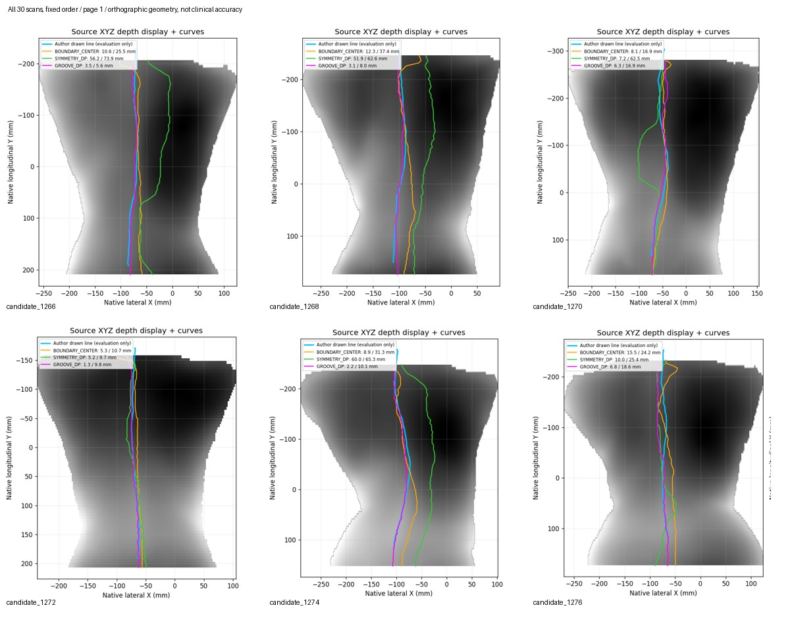
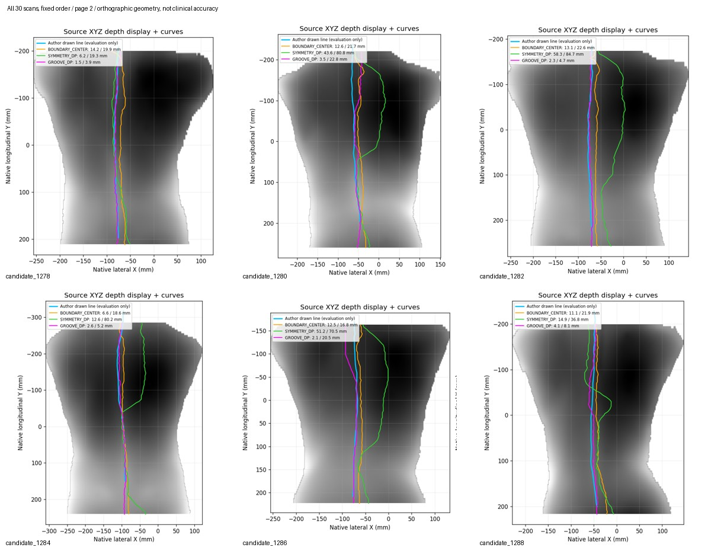
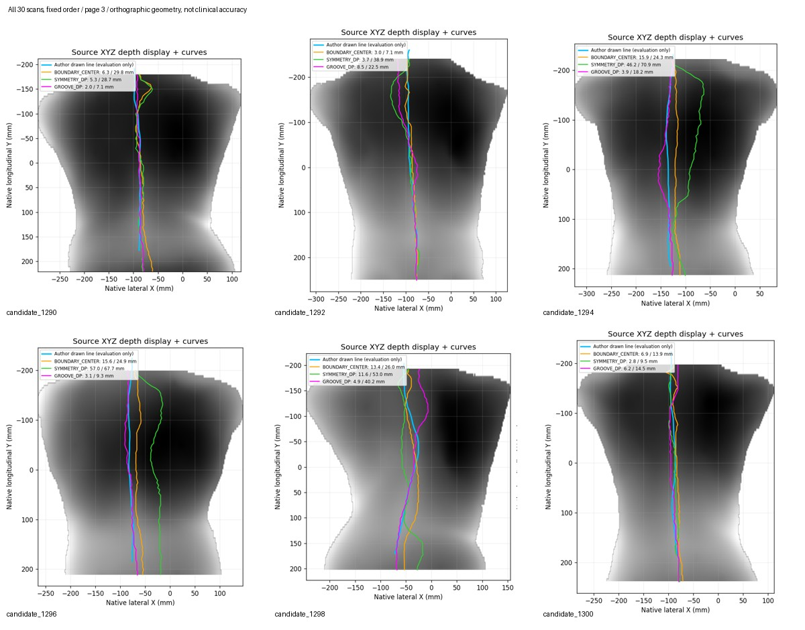
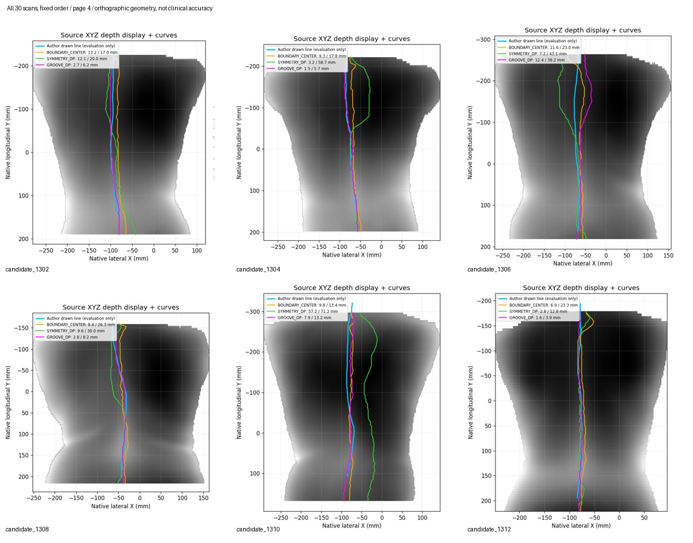
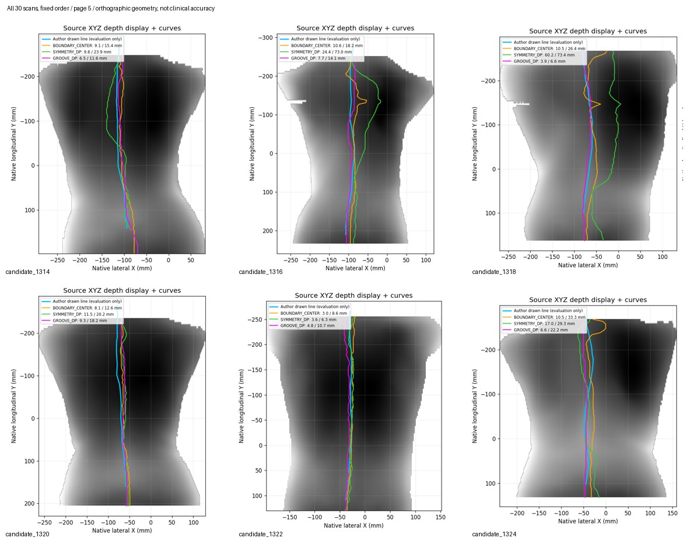

# 全部真实扫描曲线对照

所有30份扫描按固定顺序展示，三方法都保留；灰色为源XYZ深度，蓝色为作者评价线，橙/绿/紫为三个估计。不是照片、穴位或临床精度。

## 全量摘要

## 完整三视图

- [candidate_1266](candidate_1266.png)
- [candidate_1268](candidate_1268.png)
- [candidate_1270](candidate_1270.png)
- [candidate_1272](candidate_1272.png)
- [candidate_1274](candidate_1274.png)
- [candidate_1276](candidate_1276.png)
- [candidate_1278](candidate_1278.png)
- [candidate_1280](candidate_1280.png)
- [candidate_1282](candidate_1282.png)
- [candidate_1284](candidate_1284.png)
- [candidate_1286](candidate_1286.png)
- [candidate_1288](candidate_1288.png)
- [candidate_1290](candidate_1290.png)
- [candidate_1292](candidate_1292.png)
- [candidate_1294](candidate_1294.png)
- [candidate_1296](candidate_1296.png)
- [candidate_1298](candidate_1298.png)
- [candidate_1300](candidate_1300.png)
- [candidate_1302](candidate_1302.png)
- [candidate_1304](candidate_1304.png)
- [candidate_1306](candidate_1306.png)
- [candidate_1308](candidate_1308.png)
- [candidate_1310](candidate_1310.png)
- [candidate_1312](candidate_1312.png)
- [candidate_1314](candidate_1314.png)
- [candidate_1316](candidate_1316.png)
- [candidate_1318](candidate_1318.png)
- [candidate_1320](candidate_1320.png)
- [candidate_1322](candidate_1322.png)
- [candidate_1324](candidate_1324.png)
