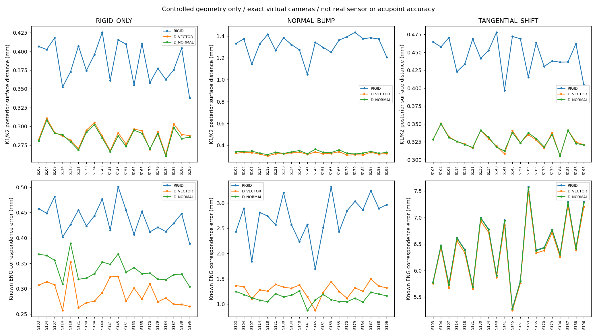
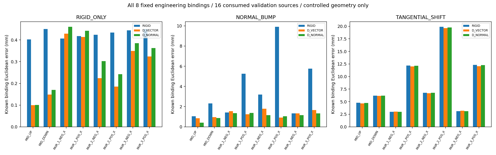
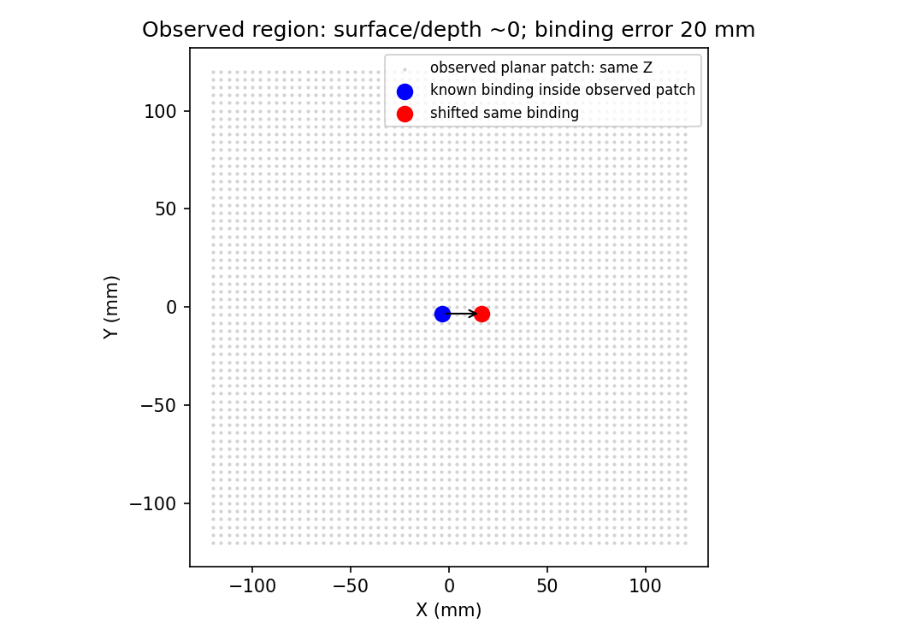

# 表面贴准是否等于工程点对准：受控参考闭环 V1

完成日期：2026-10-04。**本轮完成，结果可复查；不能放行为真人穴位精度或机器人部署精度。**

## 结论

整体位置错误与法向凸起能被现有求解器大幅修复；沿表面方向的绑定点错位基本留在原处。切向组的后背表面距离约0.32 mm，同时八个绑定点误差中位数仍约6.4 mm，注入中心附近的绑定点仍约20 mm。**低表面距离不能替代正确的点位对应。**

这不推翻 Mesh→穴位路线，而是把它分为两件事：恢复患者表面；在该表面确认个体解剖参考和目标位置。只把canonical的face/bary原样搬过去，不能凭贴面分数确认第二件事完成。

## 实际执行

20份历史Official/seed0预测作为程序生成的参考几何；4开发、16已消费验证角色，精确虚拟K0/K1/K2，无畸变、无噪声。三类固定注入×四方法，得到60 case、240最终网格、480逐点指标、1,920工程点结果、60页三视图对照。Rigid、向量D、法向D各实际求解60次；**零新SAM推理、零训练**。参考不是患者GT，虚拟留出不是独立物理传感器证据。

三类注入：整体Rodrigues旋转(2,-1,1)°和(15,-10,40) mm平移；在此基础上分别增加峰值12 mm法向凸起或20 mm切向平滑移动。完整合同及固定权重见 [PROTOCOL](PROTOCOL.md) 和 [CONTRACT](CONTRACT.json)。开发后没有改权重、选样或改变评价索引。

## 完整核心对照

下表为16份验证角色参考：K1/K2分别计算后背点→预测posterior三角面距离，两视图取中位数，再人物取中位数。绑定点误差先对固定8点取中位数，再人物取中位数。单位mm。INITIAL是人为扰动初始网格，**不是本轮Official SAM输出**。

| 注入情况 | 方法 | 后背表面median | 后背P95汇总 | 8点对应median |
|---|---|---:|---:|---:|
| 整体误差 | INITIAL | 40.089 | 54.853 | 47.004 |
| 整体误差 | Rigid | 0.376 | 0.465 | 0.425 |
| 整体误差 | Rigid+向量D | 0.287 | 0.461 | 0.278 |
| 整体误差 | Rigid+法向D | 0.284 | 0.453 | 0.330 |
| 法向凸起 | INITIAL | 34.902 | 54.531 | 43.648 |
| 法向凸起 | Rigid | 1.330 | 8.172 | 2.778 |
| 法向凸起 | Rigid+向量D | 0.322 | 0.699 | 1.316 |
| 法向凸起 | Rigid+法向D | 0.330 | 0.821 | 1.128 |
| 切向错位 | INITIAL | 39.802 | 54.882 | 47.051 |
| 切向错位 | Rigid | 0.440 | 1.100 | 6.431 |
| 切向错位 | Rigid+向量D | 0.324 | 0.853 | 6.378 |
| 切向错位 | Rigid+法向D | 0.323 | 0.844 | 6.420 |

这里的P95为各视图P95经相同层级取中位数，不是把全部点混在一起求全局P95。4个开发角色也完整交付，未混进本表。[机器可读完整汇总](AGGREGATED_RESULTS.json)、[240行表](PER_SOURCE_CASE_RESULTS.csv)、[全部原始结果](results)。

## 对应误差为什么重要

法向凸起组，两个D均16/16改善表面及8点误差；法向D将8点中位数由2.778降至1.128 mm。但切向组，虽然两者仍16/16数值改善，相对Rigid的**逐人配对**8点变化中位数只有向量D −0.059 mm、法向D −0.012 mm，不能用“16/16改善”掩盖改变量很小。

切向组 `ENG_PAIR_2_POS_X`附近点：Rigid 19.912、向量D 19.651、法向D 19.766 mm（逐点、人物中位数）。另外所有8点都保留；没有按位置或可见性挑点。ENG是工程探针，尚无医学定位语义。[1,920行完整展开](ENGINEERING_PROBE_RESULTS.csv)、[逐点审计](ENGINEERING_PROBE_AUDIT.json)。

平面解析反例更直接：只观察平面中央区域，将同拓扑绑定点沿平面移动20 mm。表面距离及射线残差接近数值零，但INITIAL、向量D、法向D的绑定误差均保持20 mm。它说明这类局部观测存在对应歧义；不声称真实人体任意切向移动都不改变表面。人体组的切向注入仅是一阶切向场。

视觉审计发现原解析探针在观察区外，原例和缓存完整保留：[原解析记录](GEOMETRY_CHECK.json)。补充检查直接读取同一已拟合平面，选取观察区内的固定face/bary，移动前后均在观察区内，三方法绑定误差仍20 mm，表面/射线残差仍近零；没有重新拟合或更改60个人体case。[观察区内检查](PLANAR_OBSERVED_BINDING_CHECK.json)。

## 不能遗漏的质量代价

两种D不是最终合格网格的保证。即使只有整体误差，Rigid已恢复至约0.4 mm后，D仍引入局部边长变化和少量面法向反转。验证角色的全身边长相对变化P99中位数约7.7%–10.4%；最差人物的P99最高111.7%（向量D）/96.1%（法向D，跨三情况）。这不是平均边长变化，也不能直接称自交；指标定义是相对参考的边长变化，以及参考/结果面法向点积为负。

切向注入自身已有小比例法向反转。报告保留INITIAL与Rigid的值，不能全部归咎于D。纯整体组无注入反转，而D后8/16、9/16份参考出现至少一个面法向反转。没有依据这些结果过滤失败或重调参数。[逐人质量](PER_SOURCE_CASE_RESULTS.csv)、[计数及极值](PAIRED_COUNT_AUDIT.json)。

D后双视图射线命中率逐人最低约99.83%，共同命中指标也完整保存，本轮低距离不是主要靠大量未命中点造成。命中高同样不能证明解剖对应正确。全身轮廓图只作支持，不当独立临床验证。

## 核验与交付

- 解析透视交点、camera往返通过；20参考×2视图的真实参考表面残差接近零，未见几何评价器把已知点错算为大距离。
- 52冻结源、20参考、60虚拟观测、240最终网格SHA及优化索引核验通过；4开发case从缓存独立复算K1逐点结果完全一致。
- 优化只读K0；K1/K2评价索引在优化前固定。每分支共享对应case初始化、K0与评价点，未读历史深度优化网格作初值。
- 全60页对照已生成并逐文件绑定缓存SHA。人工查看汇总图及部分case，未冒称对全部60页进行了医学视觉验收。

[执行记录](EXECUTION_LEDGER.json)、[完整性检查](POST_EXECUTION_INTEGRITY.json)、[全缓存索引](FINAL_MESH_MANIFEST.json)、[服务器全输出SHA](SERVER_OUTPUT_MANIFEST.json)、[实际复现与数据边界](REPRODUCTION.md)。原始人体参考/虚拟点云/完整网格在服务器，Git交付源码、合同、索引、所有逐点指标与图。历史实验未覆盖。

## 下一项应投入哪里

保留现有求解器作工程基线，先补**独立的个体参考或表面对应依据**，再比较固定拓扑传播与“个体参考点＋规则”。现有近似相机结果仍需要独立真实标定验证；本轮只隔离了受控几何条件下的误差机制。

现在不应把D网格当穴位teacher，也不应仅因0.32 mm贴面数字启动模型训练。若后续学模型，必须分别监督/检验几何与对应，证明它修复的是当前绑定点问题，并在可靠真人参考上验证。受控闭环是诊断证据，不是已经够发顶会的完整方法与验证。
