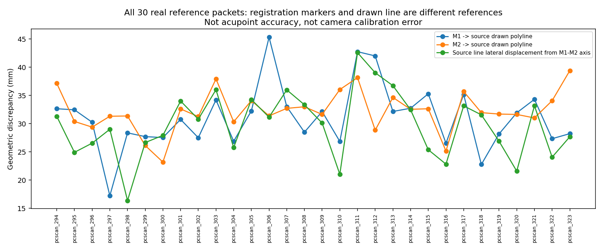

# 真实背部参考：哪些资料现在能用

2026-10-04，已实际完成扫描/标注读取、个体坐标构建、数值复查及图像检查。**有30份真实扫描参考包可作工程开发；没有新增合格俯卧穴位真值。**

## 回答上一轮的缺口

四个准确参考能帮助点位对应，但合成ENG点并不说明真实图像能取得同类参考。本轮没有继续修改RBF，也没有启动推理、Mesh拟合或训练；先实际建立参考来源。

20张现有PressurePose俯卧RGB全部复看并与服务器输入逐像素哈希一致：目标背部区域均由衣物覆盖，没有可用的独立C7/L5/PSIS标签。衣缝、腰带和模板关节不作解剖参考。PressurePose继续用于姿态/表面工程诊断，不能补上独立穴位目标。[20图资格](PRESSUREPOSE_VISUAL_QUALIFICATION.json)、[原输入核验](PRESSUREPOSE_INPUT_AUDIT.json)。原RGB复查图留私有目录。

## PCdare实际建立了什么

固定作者仓库35f7a1d9，实读324个非Output扫描和1326条扫描—标注候选；候选包含656份不同标注文件。重新计算线、标记与扫描的距离，不依赖旧点索引是否兼容。固定门槛仅筛查几何关联，不能代表医学精度。[执行前合同](PROTOCOL.md)、[全部扫描](ALL_SCANS.csv)、[全部候选及失败原因](ALL_CANDIDATES.csv)。

| 项目 | 实际数量 |
|---|---:|
| 无标记 / 4标记 / 6标记候选 | 687 / 183 / 456 |
| 几何兼容候选 | 459 |
| 四标记路由且无`_wMarkers`注入命名的候选 | 60 |
| 合并重复标注后的参考包 / 不同扫描SHA | 30 / 30 |
| 已核实独立受试者人数 | 未核实，不以文件数代替 |
| 合格俯卧校准RGB-D / 穴位GT | 0 / 0 |

30包均为IIR路由。每包保存四个原选择标记、原体表画线、重新绑定索引及距离、原点/三轴、归一到该坐标的线。另有30页完整三视图图形，**是点云的正交几何图，不是相机照片或新的Mesh叠图**。[参考包](REFERENCE_PACKET_MANIFEST.json)、[全部图](figures/INDEX.md)。

作者源码的四标记选择顺序对应C7/L5及图中两侧SIPS候选；`World`单位按其载入分支恢复。图像侧向没有升级为患者解剖左右，6标记其它路由也未凭数量套用同一顺序。体表线与当前扫描最近距离的逐候选median再取中位数为0.620 mm；前四标记最大最近距离的中位数为0.864 mm。**它们说明数据几何兼容，不是人体重建、标记检测或穴位准确率。**[几何摘要](PACKET_GEOMETRY_SUMMARY.json)。

## 发现的关键限制

四标记可以计算坐标，但M1→M2并不自动是后正中线。结果后的只读审计用连续折线最近点计算：M1到作者画线的中位距离31.33 mm，M2为31.82 mm；先每包对两标记取中位数、再跨30包取中位数为31.72 mm。体表线相对标记纵轴的侧向偏离中位数为30.44 mm。原标记、体表线和全部病例均未移动/修改/删除。

**这不是SAM误差，也不是已定位的相机错误。**它是两类参考位置不一致。不能把这30 mm直接解释为脊柱曲率、医生误差或标记错贴；当前未完成这种归因。论文也明确限定标记的用途为配准，未以其位置验证解剖定位。应保留两种来源，禁止将注册标记轴直接喂给穴位规则当后正中线。[完整分歧审计](MARKER_LINE_CONSISTENCY_AUDIT.json)、[作者讨论](https://pmc.ncbi.nlm.nih.gov/articles/PMC12728027/)。

相关论文使用站立/前屈等背部扫描，不能替代俯卧相机数据；体表画线与体内脊柱线分别定义，不可互换。[原始方法](https://pmc.ncbi.nlm.nih.gov/articles/PMC11954992/)、[PCdare验证研究](https://journals.plos.org/plosone/article?id=10.1371/journal.pone.0321429)、[文献与源码证据](PRIMARY_SOURCE_EVIDENCE.json)。没有按C7→L5百分比命名T3/T5/L2，没有生成B-cun或穴位标签。

## 实际核验与范围

解析坐标、旋转/平移等变及world/local重建通过。服务器重新打开30个原扫描和标注，对标记做独立暴力最近点核对，重建所有坐标，原1043项冻结文件前后SHA一致。30页图及所有参考包哈希通过。结果后的分歧脚本只读原包，未改变冻结资格规则。[解析检查](ANALYTIC_FRAME_CHECK.json)、[原始源重放](REFERENCE_PACKET_VERIFICATION.json)、[结束完整性](POST_EXECUTION_INTEGRITY.json)、[执行记录](EXECUTION_LEDGER.json)。

五页摘要复看了30包的正面几何投影，全部均可看到注册标记与画线的分离；不是医学标注审核。完整云、原RGB、含原名/session的路径映射留服务器；Git包含匿名派生参考、代码、指标和全部几何图。[运行说明](REPRODUCTION.md)、[许可和边界](ATTRIBUTION.md)。

## 下一步判断

现在可以用这30包开发**真实扫描上的标记提取、体表线表达与对应**。注册标记只用于配准；后正中线候选单独从体表画线或可观察表面结构建立，验证两者的身份与位置。随后才比较固定拓扑和参考辅助对应，保持没有作为输入的目标单独评价。

本轮未签发真人穴位准确率实验：这些扫描没有合格的同一人俯卧RGB-D/MHR关联，注册标记也不能充当临床目标。后续优先解决**可观察参考的提取和语义**，暂不靠训练把衣物/坐标/参考身份混淆补过去。
