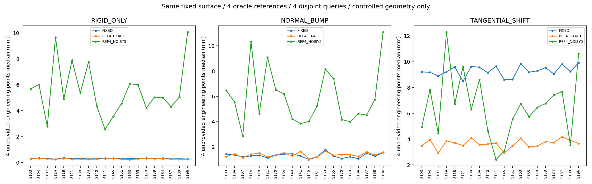

# 四个参考点能否纠正贴面后仍存在的点位错位

完成：2026-10-04。**全部60 case完成；技术核验通过，真实定位仍未验收。**

## 结论

在已知几何中，提供准确的四个工程参考点，能改善另外四个未输入点的切向对应：验证角色误差9.271→3.681 mm，16/16改善。但准确参考也没有让法向组普遍改善；带5 mm参考误差时，原本较准的控制情况全部退化。**有参考的对应路线值得继续验证，当前简单插值不能直接用作最终定位方法。**

这是在同一固定Mesh上移动点位绑定，不是再次修Mesh。四个参考身份与位置假定已知，来自程序生成参考，不是自动识别、医生标注或穴位真值。

## 实际做了什么

沿用上一轮20份缓存几何、三类固定误差、4开发/16已消费验证角色。固定60个D_VECTOR最终表面；不重新推理或拟合。四个输入索引[0,1,2,7]，四个考试索引[3,4,5,6]，峰值附近PAIR_2_POS_X始终只考试。输入文件与评价真值分开，估计函数不读取考试位置。

用预测表面上的图距离构建Gaussian RBF加常数项，带宽由输入点间距离确定；插值参考偏差后，逐三角面投影回同一后背，得到新的face/bary/xyz/normal。这是工程基线，不声称模型架构创新或已经实现WHO/GB穴位规则。[执行前协议](PROTOCOL.md)、[代码](code/correspondence.py)。

输出180点位缓存、1440逐点记录，其中720条为未输入点；全部60页三视图对照。实际120次小型线性求解，零新Mesh拟合、零SAM推理、零训练。

## 主要结果

16份验证角色参考；每case先对4个未输入点取median/P95，再逐人物取中位数。单位mm。EXACT指输入参考无误差，不表示输出必然无误差。5 mm为每参考三维扰动长度，三个情况复用每人物同一噪声实现。

| 误差注入 | 固定拓扑median / P95 | 四准确参考median / P95 | 四带噪参考median / P95 |
|---|---:|---:|---:|
| 整体误差修正后 | 0.306 / 0.417 | 0.267 / 0.386 | 5.056 / 7.303 |
| 法向凸起修正后 | 1.277 / 1.765 | 1.370 / 2.367 | 5.491 / 7.185 |
| 切向错位修正后 | 9.271 / 18.490 | 3.681 / 7.435 | 6.586 / 9.269 |

P95仅来自每case的4个考试点再做人物汇总，不是大量真人定位的尾部统计。[完整180条方法表](PER_CASE_RESULTS.csv)、[1440逐点表](PER_PROBE_RESULTS.csv)、[完整汇总](AGGREGATED_RESULTS.json)。开发组完整保留并分开统计。

**与上一轮6.378 mm不矛盾：**上一轮D_VECTOR汇总全部8点；本轮主要评价固定4个未输入点，基线因此是9.271 mm。所有60个FIXED缓存的8点坐标与父实验完全相同，没有偷偷换网格、样本或基线。[完整性对账](POST_EXECUTION_INTEGRITY.json)。

## 改善和失败必须一起看

相对固定拓扑，四准确参考：整体组16/16改善但逐人改善中位数仅0.035 mm；法向组4/16改善、12/16退化，配对变化中位数+0.079 mm；切向组16/16改善，配对变化中位数−5.694 mm。切向组中心附近PAIR_2_POS_X从19.651降到8.054 mm，仍没有恢复正确对应。

四带噪参考：整体、法向组均0/16改善；切向组13/16改善、3/16退化。不能用切向组平均趋势遮住这些失败。输入点自身的拟合误差仅作支持，未混进主分数。[全部配对](PAIRED_CHANGES.csv)、[计数和输入审计](INPUT_NOISE_AND_PAIR_AUDIT.json)。

参考只有5 mm扰动，未输入点却可能受到更大影响：当前RBF权重允许负值，不是凸组合；查询权重绝对值和最大3.325。本轮逐case独立复算了“权重×噪声”，与缓存偏差完全一致；投影前同一查询在EXACT与NOISY5之间最大差14.730 mm。它解释了噪声放大，**不是单位错误，也不是14.730 mm的真人穴位误差**。只有一种固定噪声实现，不能据此推导噪声分布或成功率。

## 核验与数据边界

- 解析平面：固定绑定错20 mm，四个准确参考使四个未输入点接近零；零偏差参考不额外移动点。
- 准备前冻结407项源、合同、输入/评价参考、依赖源码；开发、验证、结束实算SHA通过。
- 60个固定表面未改变；180个点位缓存全部重算指标，60个FIXED的原8点精确一致，输入/考试身份交集为零。
- 80/80参考在合成K0第一层可见；这是几何可见性，不是自动找点能力。新估计不读取K1/K2点云。
- K1/K2后背表面指标完全继承父实验，三方法相同；本轮没有新的表面精度增益。父实验局部边长及面法向代价也仍然存在。

[执行记录](EXECUTION_LEDGER.json)、[结束核验](POST_EXECUTION_INTEGRITY.json)、[输入噪声审计](INPUT_NOISE_AND_PAIR_AUDIT.json)、[固定表面对账](FIXED_SURFACE_METRICS.json)、[运行与复查位置](REPRODUCTION.md)。程序生成的参考来自历史预测，不是人体真值。ENG身份没有解剖或穴位语义。本轮也没有验证B-cun、椎体水平、医生一致性或机器人定位。

交付阶段再次独立实读180个缓存，复算全部逐点指标、18组汇总和120配对，核对60页图片SHA；全部通过。[独立数值核验](DELIVERY_NUMERICAL_VERIFICATION.json)不重新调用估计器，也不改正式结果。

## 下一步判断

应当继续验证实际可观察、可复核的个体参考点，先确认真实图像/深度能提供哪些对应，再比较参考点辅助规则与固定拓扑。当前四个ENG参考不能直接冒充解剖标志。简单RBF保留作对照，不能拿合成oracle参考的3.681 mm当最终方案或真人训练标签。

工程下一项的重点是**参考点来源与语义、稀疏参考之间的局部对应约束**。仅继续压低Mesh距离不会自动解决该问题；论文后续也需要实际数据与方法贡献，而非把这一插值基线包装成完整创新。
