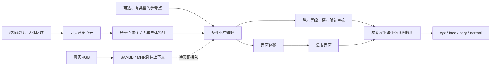

# 从贴面推进到解剖坐标：候选方法与数据路线

## 最终任务

俯卧背部 RGB-D → 个体 Mesh → 解剖参考/坐标 → 规则候选 → 机器人坐标接口。现役 SAM3D/MHR、Rigid、Rigid+D 和两参考比例先验保留。目标是找到治疗所需的位置，表面距离降低只是其中一个条件。

## 核心研究问题

同一份观测能否同时支持：①可接触的背部表面；②这个表面上的解剖身份？我们已证明贴面不能自动保证绑定点正确，外部 CT 上简单两参考比例先验又优于小查询网络。因此，新方法必须证明它利用了个体形状，而不是只学习扫描尺寸或复杂地重写比例公式。

候选方法：**参考点条件化的联合表面—解剖坐标场**。这是待验证的研究假设，不宣称已形成顶会贡献。

### 当前实际原型

- 512个观测点，局部16邻域、两层位置注意力，局部特征＋整体max-pool特征；126,917参数。
- T3/L2两种参考token；缺少参考有显式空token。只验证无参考路径数值可用，尚未证明无参考的定位能力。
- 任意3D查询融合局部几何、整体上下文和参考条件；两个输出：3D表面位移、二维解剖坐标。
- 当前CT输入没有RGB、SAM特征或MHR。未来接入这些信息必须单独实现、训练和对照；不把CT皮肤点当作MHR预测。
- CT表面坐标使用RAS/mm、皮肤中位数居中、固定500mm归一化；没有通过参考标签偷偷完成无参考归一化。

### 解剖监督到底是什么

18个等级：C7、T1–T12、L1–L5。标签中的椎骨后侧2%体素均值投影到CT皮肤，得到**等级代理**。纵向场在线性插值这些代理后定义为`(level_index - 3) / 11`，T3=0、L2=1；横向为距插值脊柱投影线的RAS-X位移/500mm。只在有标签的垂直范围和中线±150mm内监督解剖场。

这不是触诊的棘突下凹陷，也不是临床穴位真值。标签缺失、扫描边缘截断或椎体逆序保留记录并掩码；不把未知等级当负例。L6变异单独保留来源，不强行塞进L1–L5身份。

**本轮四例原型只使用旧五等级代理验证训练路径。** 18等级数据构造器另行验证，完整V3训练尚未执行。

### 损失与比较边界

原型损失是表面位移Smooth-L1（beta=.02，归一化单位）＋解剖坐标Smooth-L1（beta=.05）。几何查询人为加入10mm高斯扰动，观测加入2mm；这是训练路径检查，既不是RGB-D噪声实测，也不是临床去噪性能。

正式比较至少保留：固定拓扑、两参考比例先验、全局点编码器/坐标查询、局部查询；同样的输入参考、训练数据和测试目标。候选模型再做“有无参考、有无真实高度、有无表面分支、完整/部分观测”消融。简单比例先验是必须击败的基线，不因其结构简单而删除。

现阶段不加不确定性head，不把未确认穴位当标签，不用CT考试结果反调相机。

## 如何真正走向工程

1. 大规模CT先学习外表面与等级代理关系，且单独报告来源域成绩；测试图像与训练分开。
2. 公共同步皮肤/骨骼来源验证跨来源能力；此前TUM17例已消费，继续结果只能称开发/回归证据。
3. 既有20个俯卧样本验证相机合同下的输入、Mesh查询、规则和缓存接口，不计算无真值的穴位准确率。
4. 最终部署时采集校准RGB-D；需要时输入少量可靠参考和个体比例，不能自动用AI建议冒充已确认参考。
5. 找医生做独立俯卧标志/目标验证，评价几何、解剖对应和实际接触目标。CT不能取代这一项。

## 可能形成的贡献与目前的缺口

候选贡献是：把可见几何和解剖身份分别监督、在同一个参考条件场中共同恢复，并验证稀疏参考怎样纠正部分观测的身份歧义；最终规则查询落在同一患者表面。单纯“两头网络＋Point Transformer”不够新，收集TotalSegmentator也不是我们的新数据集贡献。

只有大规模对照优于比例先验、局部模型和已有表面到解剖方法，并且独立真实背部验证支持，才值得把它作为论文主方法。若表面分支没有额外收益，保留可靠几何基线，只主张解剖对应方法，不强行凑联合任务。
