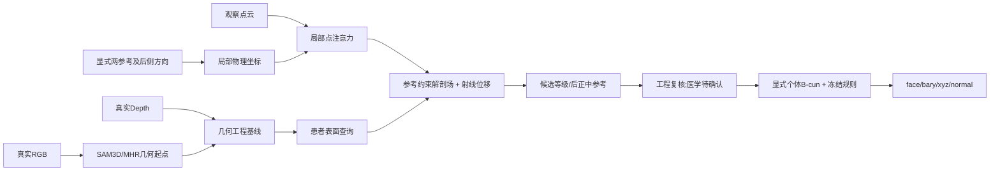

# 方法设计和论文边界

## 真正要解决的问题

贴合背部的Mesh不自动提供正确椎体水平或穴位身份。课题需要同一患者表面上的**几何位置与解剖坐标**，然后规则引擎才有明确参考。当前候选用两个显式参考降低定位歧义，再从局部体表学习个体偏差；它不是直接预测全部穴位的黑箱。

上图是目标整体；本轮实际使用CT点云与20缓存Mesh，**没有新SAM推理、RGB融合、真实Depth输入或机器人运行**。历史几何阶段已完成的范围见当前状态；不能把图中所有箭头都标成完成。

## V2核心定义

令a=T3、b=L2，后侧方向与a→b正交化，构成右/后/下刚体坐标。统一500mm尺度，s为查询沿a→b的投影比例、l为局部旁向坐标。基础场c₀=(s,l)。点网络输出r(q)，硬参考场为：

`c(q) = c₀(q) + r(q) - (1-s) r(a) - s r(b)`。

由此c(a)=(0,0)、c(b)=(1,0)；训练不必靠参考损失去近似满足。输入参考有误时，它也会遵守错误参考，故0/5mm输入条件必须分别考试，不包装成不确定性头。

几何分支输出已知相机射线d上的标量位移δ，查询为`q=p+εd`，目标δ=-ε。该设计去掉切向身份恢复，但目前不处理first-hit遮挡、床/衣服域差异或相机标定误差。

在实际Mesh上查询连续场，按目标等级和零旁向寻找候选三角面，在面内保存barycentric；原规则模块继续给出八个工程候选。两参考及比例不是免费信息，最终使用流程应明确来源、操作时间和医生确认范围。

## 本轮学习怎样改变设计

以下四篇PDF实际下载，提取方法文本并查看架构图；原文不入Git，下载哈希见`PAPER_DOWNLOADS.json`。

| 来源 | 学到的内容 | 与本课题的区别/采用边界 |
|---|---|---|
| [OPS, MICCAI2026](https://papers.miccai.org/miccai-2026/0738-Paper0160.html) | 稀疏点产生语义引导，并同时作用于特征和学习目标；需参考选择敏感性对照 | 原文是体积器官配准及DINOv3跨图相似，不证明皮肤外观能看出椎体或穴位；我们不复制其标签传播为医学truth |
| [Anatomically Constrained Implicit Face Models, CVPR2024](https://openaccess.thecvf.com/content/CVPR2024/papers/Chandran_Anatomically_Constrained_Implicit_Face_Models_CVPR_2024_paper.pdf) | 将皮肤由解剖结构显式构造，比单纯加软损失更清楚 | 演员专属脸模型有骨骼估计和同拓扑扫描；不能把脸的皮骨耦合精度迁移到俯卧脊柱。当前V2没有预测内部骨骼 |
| [Exact boundary conditions, 2022](https://arxiv.org/abs/2104.08426) | 用输出构造精确遵守已知约束，是成熟思路 | 我们的两点提升是借鉴硬约束思想，不是新PINN/PDE方法；单靠它不足以作为创新 |
| [Sonata, CVPR2025 Highlight](https://openaccess.thecvf.com/content/CVPR2025/papers/Wu_Sonata_Self-Supervised_Learning_of_Reliable_Point_Representations_CVPR_2025_paper.pdf) | 全局/局部自蒸馏需防止只学位置或法向等几何捷径；共享原始点对应来构造视图 | 其室内/室外预训练、颜色/法向输入和稀疏卷积依赖不是当前裸CT原型。作者源码允许关闭FlashAttention，但本轮未运行Sonata或下载权重；不临时更换骨干追分 |

[Sonata作者接口](https://github.com/facebookresearch/sonata)已读：coord/color/normal及分层特征回映射是实际输入合同，不能直接把CT零颜色补成“已成功使用视觉基础模型”。本轮保持原局部点编码器，先检验任务设计。

## 我对论文的判断

**目前还不足以支持强接收主张。** 126917参数的点网络、硬参考提升和射线头各自不足够新；四例结构结果还3/4输比例先验。当前价值是把“贴面”和“解剖位置”拆成可验的问题，并建立对应来源、可训练整体和实际工程接口。

候选贡献只有在后续成立时才写：参考约束的体表解剖坐标表征，在局部观测和个体差异下稳定优于简单比例法；大规模配对来源及独立真实支持证据说明其收益来自解剖对应，而非坐标修正。源内CT/真实CT/俯卧RGB-D/临床穴位是不同证据层，不拼成一个准确率。

必要实验是同源同参考的比例先验/软约束/硬约束/联合分支，局部输入、参考误差、同表面上的等级误差与几何误差分报，以及独立临床或俯卧标志验证。若更大训练仍不胜先验，保留工程比例路线，不靠新增模块和故事掩盖失败。
