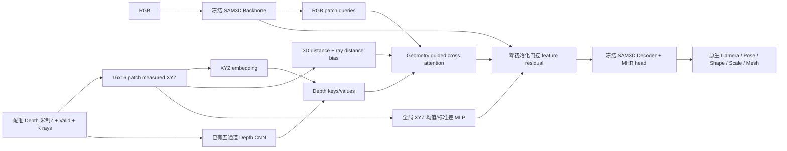
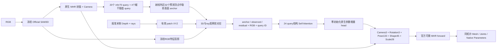

# 两个独立候选的实际结构

实现入口：[fusion_r31.py](../../../../research/rgbd_sam3d_mhr/fusion_r31.py)。Official SAM3D backbone、decoder 和 MHR 资产均冻结。A 与 B 分别训练；本轮没有组合，也没有自由顶点形变。

## A：Geometry-Guided Cross-Attention

每个 RGB/Depth patch 是原生 512×384 crop 的 16×16 区域，token grid 为 32×24。公制坐标为 `XYZ=(ray_x*Z, ray_y*Z, Z)`，只对有效深度像素平均。attention bias：

`−||XYZ_i−XYZ_j||²/(2*0.15²) − ||ray_i−ray_j||²/(2*0.20²)`。

无深度 query 只保留 ray locality；无深度 key 被 mask。全局 XYZ 均值/标准差提供公制 context，经 output projection 和零初始化 gate 加回 RGB 特征。1,852,545 个可训练参数。

风险：邻近点不一定属于同一人体语义部位；3D bias 可能偏爱遮挡边界；常量 feature context 可能被冻结 decoder 忽略。机制消融分别去掉 3D bias（保留 ray）和 global metric context。它们是**已训练模型的推理干预**，不能替代重训消融的因果结论。

## B：MHR-Aware Geometry Refinement

Query ID 使用官方 mhr70 定义；`5/6` 为双肩，`9/10` 为双髋，已查官方 metadata。20 个原生 query 的 ID 写在实现中；另外计算肩中心、髋中心和两个躯干插值点。它们不是医生穴位或精确椎体标志。

预测关节附近的 camera ray 找 32 个邻近预测 mesh 顶点，选 Z 最小的前表面 anchor。该过程使用预测 mesh 与 Camera A；不使用 Camera B。软对应基于预测 anchor 与 Camera A patch XYZ 的距离，同时保留 ray 距离。

参数增量 head 为 212 维；Camera、全局转角、body pose、shape、scale 分别以 0.1 m、0.1 rad、0.1 rad、0.1、0.05 缩放；body pose 索引 124 以后保持不变，手与表情保持初值。完整参数经官方 `mhr_forward` 再生成 mesh，native cm 在 head 内转换成 m，Y/Z convention 只翻一次。2,293,460 个可训练参数。

风险：初值严重偏移时，最近预测前表面可能错误；patch 软对应并非语义对应；训练 pose 仅两种，容易学习位置而学不到真实关节变化。分别测试取消局部对应（所有有效 patch 等权池化、残差归零）与仅应用 Camera 增量。

## 本轮检查与公平性

两个候选零初始化均复现 Official，最大顶点差小于 2e−6 m，并有有限梯度。四组模型都使用同一个 frozen cache、100 个 TRAIN 身份/800 张、50 个 VAL 身份/400 张、seed 11、8 epochs、batch 16、LR 3e−4、完全相同的 R3 losses 与调度。best checkpoint 只按合成 VAL 选；真实 Camera B 从未用于训练或选择 checkpoint。

本轮比较四组新训练的小规模模型；R3 的 400 身份×30 epochs 模型只承担历史诊断。两轮结果不得包装成同预算模型排名。
