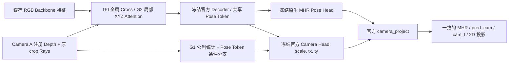

# 实际结构与官方接入点

## 四个独立对照

G0 是原 R3 Cross 架构的同预算新训练；G1 添加 MetricCamera，G2 将全局 attention 改成局部 5×5/25 邻居并添加 XYZ 相对 bias，G3 同时使用二者。旧 R3 RGB-only 与 Cross 的 3 seed 结果仍是更充分预算的历史参考，不能和 100身份短跑声称完全同预算。

原始官方实现见固定 commit `b5c765a0d89d789985e186d396315e7590887b94`：

- `sam3d_body.py:464–485`：`pose_token=tokens[:,0]` 同时输入 head_pose/head_camera，然后调用 camera_project。
- `camera_head.py:55–59`：输出 raw `(scale,tx,ty)`，叠加 init_estimate。
- `camera_head.py:78–109`：scale/Y 符号转换，bbox 与原始内参算 `pred_cam_t`，统一投影。
- `sam3d_body.py:917–970`：同一 pred_cam 投影 keypoints 和 vertices。

我们的 forward hook 加在 `official.head_camera` 的返回值，处于所有官方投影之前。条件来自测量 Z 的 10/25/50/75/90 分位数、XYZ 均值/标准差、深度范围、覆盖、原内参/图像大小/bbox，以及预测 raw camera/估计距离差。预测的 root depth 不被强行设成测量中位数。

MetricCamera 末层零初始化。raw scale 乘 `exp(0.5*tanh(delta))` 保持符号，raw tx/ty 加 `0.15*tanh(delta)`；缺失 Depth 残差为零。没有直接修改最终 cam_t，也没有新 Camera Token。中间 Camera 条件还可能通过官方 keypoint-token 更新影响后续 pose，故 G1 不是“固定人体形状只改最终相机”的消融。

局部 attention 保留 G0 的 RGB/Depth 编码器、Q/K/V 和输出投影；每查询只看 25 个临近网格。注册 XYZ 以米和 FP32 计算，相对 XYZ 输入可学习 bias，并加初始 sigma=0.15m 的三维距离项。无测量的查询原样返回 RGB。G2 与 G0 的区别同时包括“局部邻域”和“几何 bias”，后续关闭几何 bias 的固定 checkpoint 消融只能隔离后者，不能把全部 G2 增益归给三维信息。

新增代码全部位于 `research/rgbd_sam3d_mhr/fusion_r4.py`；官方 Backbone、Decoder、heads、MHR 资产不改、不解冻。无自由顶点偏移。

## 技术依据与边界

[DFormerv2 CVPR2025](https://openaccess.thecvf.com/content/CVPR2025/html/Yin_DFormerv2_Geometry_Self-Attention_for_RGBD_Semantic_Segmentation_CVPR_2025_paper.html) 启发几何 prior；本实现采用有限邻居的 XYZ bias，未复现其分割网络/轴分解。
[UniSH](https://murphylmf.github.io/UniSH/) 启发独立公制对齐路径；我们使用真实 RGB-D 测量及原生 Camera Head，不引入场景点图教师。
完整方法/图阅读记录和其他相关论文见 [R3.1 文献决策](../rgbd-sam3d-r31-diagnosis-pilot/LITERATURE_DECISIONS.md)。

这两项改动是研究候选；机制响应、梯度与四样本下降仅证明实现有效，精度/创新必要性需由实际对照支持。
