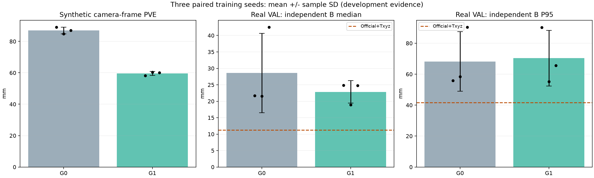
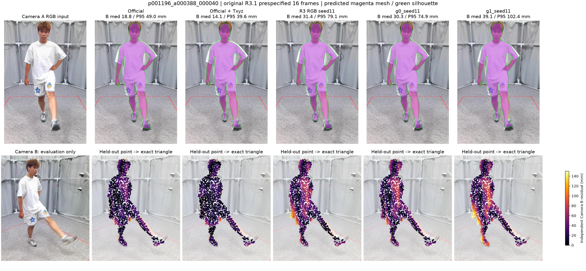

# R4 最终报告：公制 Camera 已学会响应，真实尾部仍未稳定

2026-10-10。R3.1先完成；随后R4四组8轮短跑、G0/G1各三个seed×30轮、全部开发评价完成。封存TEST未读取；没有训练穴位检测器、解冻官方Decoder或自由形变顶点。

**结论：保留G1公制Camera分支作为下一阶段研究候选；当前工程主基线仍为Official+Cheap Txyz。G2局部XYZ Attention和G3组合只完成短跑，没有证据支持晋升。**

G1解决了“Depth进了网络，公制距离却几乎不响应”的机制问题，但没有同时解决真实人体形状及失败尾部。不能称已得到可部署的俯卧背部/穴位定位模型。

## 1. 实际做了什么

|架构|改动|实际训练|
|---|---|---|
|G0|现有RGB-D全局Cross-Attention，经R4同一训练入口重新初始化|100身份×8轮；400身份×30轮×seeds 11/23/37|
|G1|G0＋公制统计与共享Pose Token条件化Camera raw参数，之后走官方投影链|同G0|
|G2|5×5局部窗口＋FP32相对XYZ bias/距离权重|100身份×8轮，seed11|
|G3|G1＋G2|100身份×8轮，seed11|

Camera接入发生在`head_camera`输出`(scale,tx,ty)`之后、每一次官方`camera_project`之前；没有虚构独立Camera Token，没有在最终字典直接替换`pred_cam_t`。六层中间及最终投影保持同一合同。Camera影响中间keypoint反馈，因此G1也可能间接改变后续人体参数，不能把它称为“人体完全不变的Camera-only模型”。详见[架构与源码](ARCHITECTURE.md)。

数据：500程序化MHR身份×2姿态×4相机=4000图，400/50/50身份TRAIN/VAL/封存TEST；实际缓存仅3600张TRAIN/VAL，未重算原backbone。真实HuMMan18 TRAIN身份/192帧＋4 VAL身份/40帧；Kinect000输入，Kinect001固定2048点/帧评价。新增物理距离探针为4个TRAIN/VAL身份×4相机距离，共16张；固定Mesh/姿态/纹理/光照/K，RGB与Depth联合重渲染，未读TEST。

训练统一Batch16、AdamW 3e−4、warm-up/cosine、R3损失；仅训练融合与新Camera分支，Official/MHR冻结。Best仅按合成VAL对应顶点误差选择，Last全部保存。G0/G1为同数据、同seed标签、同预算的配对对照；不同结构的随机数消耗不保证逐步相同。历史R3 RGB-only/Cross是未配对参考，不替代本轮G0。

## 2. 三个seed的正式结果

下表为三个seed均值±**样本标准差**。合成先身份等权；真实先每帧点距离median/P95，再sequence平均、身份等权，最后跨seed平均。真实“median”不是所有点混池后的中位数，“P95”也不是全数据的一个混池P95。

|指标|G0|G1|
|---|---:|---:|
|合成Camera坐标对应顶点误差 mm|86.95±2.09|**59.55±1.25**|
|合成去平移顶点误差 mm|55.88±0.78|53.66±1.36|
|合成Camera XYZ误差 mm|66.47±0.92|**27.07±0.85**|
|合成Camera坐标关节误差 mm|88.85±2.03|60.99±1.65|
|合成Shape RMSE|1.0209±0.0044|1.0223±0.0022|
|合成Scale RMSE|0.5139±0.0027|0.4866±0.0072|
|合成global rotation角误差 °|14.30±0.26|14.15±0.36|
|合成body pose角误差 °|4.461±0.010|4.484±0.006|
|合成共同命中Depth median/P95 mm|66.41/143.31|30.22/109.79|
|合成Depth命中率|93.39%|93.15%|
|合成silhouette IoU|0.8850|0.8792|
|真实TRAIN B median mm|56.05±12.49|36.62±3.07|
|真实TRAIN B P95 mm|132.46±21.99|118.12±14.89|
|真实TRAIN ≤50mm覆盖率|54.30%±7.40%|68.18%±2.10%|
|真实VAL B median mm|28.59±12.06|22.83±3.41|
|真实VAL B P95 mm|68.19±19.23|**70.32±17.94**|
|真实VAL ≤50mm覆盖率|80.86%±14.54%|84.97%±4.89%|

合成PVE降低31.5%、Camera误差降低59.3%；去平移误差仅降低约4%，Shape/Pose没有同步明显改善。因此主要进展是公制位置恢复，不能说已解决局部背部形状。

|Seed|G0 best epoch|G1 best epoch|G0真实VAL med/P95 mm|G1真实VAL med/P95 mm|
|---|---:|---:|---:|---:|
|11|20|29|21.70/55.85|24.82/90.18|
|23|26|29|21.56/58.37|18.89/55.26|
|37|24|24|42.52/90.35|24.78/65.51|

G0 seed37真实转移很差，拉高了G0均值与方差；不能只靠均值断言G1稳定优于G0。G1 seed11在VAL的35/40帧P95变差，其中28帧恶化超过5mm；VAL P95>150mm帧由0增至5。seed23/37分别有20/9帧P95变差。全部40帧保留，无剔除。

**最强历史工程对照仍是Official+Txyz：**相同232帧、相同B点，TRAIN24.65/80.32mm，VAL**11.23/41.60mm**，VAL覆盖率97.07%。Official原始VAL30.59/69.84mm。G1没有击败Txyz，且其VAL平均P95没有改善Official。历史R3 RGB-only合成PVE79.29±0.68mm、Cross86.57±1.93mm，仅作为未配对参考。

全量来源：[每个seed/Best/Last与全部指标](summary/R4_SUMMARY.json)、[逐人审计](PER_IDENTITY_REVIEW.md)、[696条配对帧与机制汇总](FINAL_DIAGNOSTICS.json)、[原始正式结果目录](formal)。

## 3. Depth真的发挥了作用吗

固定RGB、原Valid Mask和Rays，跨身份替换只改Depth数值；缺失Depth是另一个回退测试，不与fixed-mask实验混为一谈。每seed完整400合成VAL图和232真实开发帧，没有只测四个小样本。

|合成VAL条件|G0 PVE mm|G1 PVE mm|
|---|---:|---:|
|正确Depth|86.95|**59.55**|
|固定人体中位Z（移除局部形状）|88.42|68.99|
|跨身份Depth，保持原mask/rays、同pose/camera标签|90.24|527.10|
|Depth +200mm|87.01|176.37|
|Depth −200mm|86.96|180.78|
|缺失Depth|157.12|157.12|
|关闭已训练Metric分支|不适用|113.20|

正确Depth的几何价值已可验证：错配及移除公制分支明显恶化对应顶点，而不仅是“梯度非零”。数值Depth偏移不是物理一致图像；正确响应还需看联合重渲染测试。

|Signed Camera Z变化：输入Depth ±200mm|G0|G1|
|---|---:|---:|
|合成VAL +200mm|+2.25mm|+168.85mm|
|合成VAL −200mm|−2.25mm|−177.91mm|
|真实VAL +200mm|−0.29mm|+89.20mm|
|真实VAL −200mm|+0.37mm|−66.65mm|

G1真实域仍有公制响应，但明显衰减/非对称；响应本身不是真实Camera误差。公开真实数据没有原生MHR根节点GT，本轮不声称测得真实Camera XYZ准确率。完整Pose/Shape/Scale/Mesh响应和每seed记录在`formal/*/ablations/DEPTH_ABLATIONS.json`。

物理一致16图：理想Camera Z响应斜率为1。G0 **0.488±0.169**，G1 **1.013±0.041**；Z绝对MAE529.96±240.85→87.29±61.78mm；相对距离变化MAE470.45→76.54mm。G1的三个seed斜率1.023/1.048/0.967，机制成立。

但这组背向、简单材质、部分远距离超训练范围的压力探针中，G1对应顶点误差仍**395±39mm**：位置响应正确不等于人体朝向/形状正确。全部16图和失败保留；不能只展示接近1的斜率。

[物理输入与QA](physical_camera_data)、[所有物理预测曲线](summary)、每cell`physical.json`可独立复核。

## 4. p001196与真实失败：没有靠好图掩盖

|p001196整序列|B median/P95 mm|
|---|---:|
|Official|17.14/50.28|
|Official+Txyz|13.12/46.56|
|G0 seeds11/23/37|27.06/67.55；32.11/83.49；22.66/70.52|
|G1 seeds11/23/37|28.90/113.90；19.79/61.71；29.11/79.23|

G1只在seed23相对G0改善这个人；三个seed仍全劣于Official+Txyz。seed11第40帧可见独立B髋腿残差增大，虽然输入A的投影乍看仍贴身；不能拿A叠图代替B几何证据。

额外做了全部232帧的输出组件交换：G0人体＋G1相机、G1人体＋G0相机，未重新拟合、未用B优化。seed11 TRAIN中G0 52.85、G1 34.63、G0人体＋G1相机27.93mm，说明Camera改进可被人体变化部分抵消；VAL对应21.70/24.82/24.15mm，Camera变化本身也可能退化。seed23及37方向不同，不能归结为单一常量偏置。

这是**保存结果的机械组件交换**，不等于因果训练贡献分解。只能定位整体平移与人体参数变化的影响；真实缺少MHR同拓扑Shape/Pose GT，不能唯一判定衣物、姿态、体型各占多少。结果见三个`formal_camera_attribution_seed*.json`及[尾部逐人图](summary/FORMAL_TAIL_BY_IDENTITY.png)。

## 5. G2/G3与短跑结论

|8轮短跑|合成PVE/Camera mm|真实VAL med/P95 mm|
|---|---:|---:|
|G0|105.70/84.44|20.32/53.01|
|G1|100.84/77.87|21.83/55.99|
|G2|108.30/86.52|22.79/57.55|
|G3|102.49/79.14|23.31/57.50|

G2/G3没有合理独立优势；G2关闭XYZ bias后PVE108.299→108.274mm，G3 102.488→102.462mm，说明短跑中新增XYZ bias没有可验证价值。`no_xyz_bias`仍保留局部邻域/有效mask，因此不是完全撤销G2；当前也没有纯局部窗口重训对照。不能把局部性与XYZ作用混称同一贡献。

G1短跑已有合成/物理方向线索，随后完整400身份、三seed充分训练证明公制响应可学得。G2/G3没有机械地投入30轮。短跑完整数据及选择理由保留在[SHORT_PILOT_REPORT.md](SHORT_PILOT_REPORT.md)、[PILOT_GATE_DECISION.json](PILOT_GATE_DECISION.json)。

## 6. 自审、资源与可复核资产

- [自审](SELF_REVIEW.md)：crop/K/rays、MHR cm→m、坐标翻转、Camera/2D一致、非零内部梯度、冻结Official、缺失Depth、真实R3 checkpoint回归、断点状态恢复均实际通过。
- G0可训练参数1,454,977，G1 1,640,964，增加185,987；官方模型冻结。单cell训练分配峰值G0约5.85GiB、G1约5.89GiB，三路训练时设备占用约23GB；训练与评价重叠的监控峰值33,206MiB。实际三路benchmark77.06图/s是短批训练吞吐，不是端到端推理速度。
- 正式每cell约68–75分钟，三路并行；累计180个正式epoch＋32个短跑epoch。模型Best/Last、Adam/scheduler/RNG保存；正常本轮长跑没有中断续训，自审单独验证恢复。续训不保证bitwise一致。
- [POST_EXECUTION_INTEGRITY.json](POST_EXECUTION_INTEGRITY.json)确认六cell×30轮、4800个合成Best/Last native预测、1392个真实native NPZ、12个正式checkpoint、执行源文件/Official/MHR/三个manifest实际SHA一致。manifest未变不等于逐个原始数据重新全盘hash；本轮不做该更强声明。
- [EVALUATION_ASSET_RECEIPT.json](EVALUATION_ASSET_RECEIPT.json)另重新读取232个实际B留出点集，逐个SHA与冻结manifest一致；记录本轮评价源文件与环境。未重新全盘hash所有原始RGB/Depth。
- 原R3 global rotation损失ZYX、native/指标xyz的历史选择保留并明确披露，没有在本轮偷偷修损失或变更比较口径。新增物理探针参数浮点容差及resume修复保留初始失败记录，见QA。

完整大文件在计算服务器`/root/autodl-tmp/rgbd_sam3d/runs/r4_geometry_v1`，并经本地E盘转存到持久服务器`172.18.6.218:436`的`/raid5/xuhd/rgbd_sam3d_backups/2026-10-10_r4_geometry_v1`。公开Git不含权重、native大数组和原始数据。实际备份状态以[PILOT_BACKUP_RECEIPT.json](PILOT_BACKUP_RECEIPT.json)、[FORMAL_BACKUP_RECEIPT.json](FORMAL_BACKUP_RECEIPT.json)、执行Ledger为准。

## 7. 回答本轮的三个问题与下一步

1. **Metric Anchor是否有效？**合成Camera真值、正确/错配Depth及物理重渲染的证据一致，公制路径有效。真实Camera B平均表面改善不稳定；没有真实根节点GT，不能声称已改善真实Camera XYZ准确率。
2. **Geometry Attention是否改善局部几何？**本轮G2/G3短跑没有支持证据，不晋升；不能由8轮否定这一类所有设计。
3. **组合能否同步改善合成Mesh与真实B、且不增加严重失败？**尚未成立。G3短跑较差；G1虽合成进步，但真实VAL尾部及p001196仍不稳定，也未击败Cheap Txyz。

下一轮先保持**G1＋匹配G0＋Official/Txyz**作为小而完整的对照，针对合成→真实域与人体方向/局部形状问题设计一个独立改动；建议优先增加真实TRAIN相机A的公制表面监督与背向/俯卧、衣物/床面、物理距离域覆盖，保持B仅考试、封存TEST继续不碰。是否解冻Decoder必须另设匹配预算消融，不能与数据改动一起归因。暂不继续堆G2/G3或未经证据增加复杂模块。

这轮已完成研究任务；下一轮不是临床验收。当前数据没有俯卧裸背穴位独立参考，机器人坐标和接触精度仍需后续真实部署验证。
