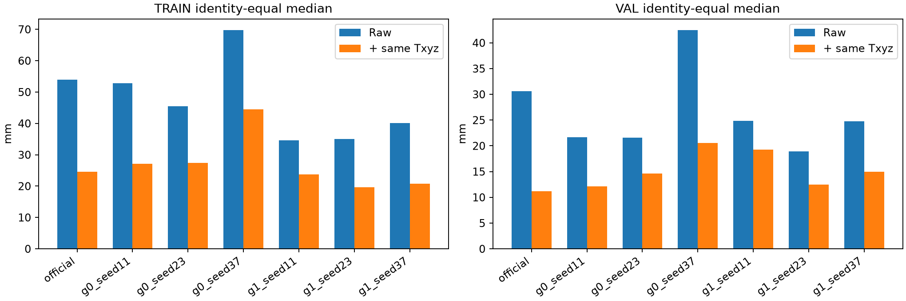
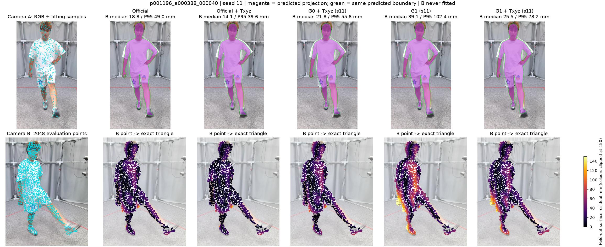

# R4.1：公平 Txyz 后，G1 尚未超过工程强基线

2026-10-10。只复用 R3.1/R4 缓存做几何诊断：零训练、零新推理、零架构改动、零数据再生成。沿用 HuMMan 18 TRAIN 身份/192 帧及 4 VAL 身份/40 帧；这些是已消费的开发身份，封存 TEST 未读。

**结论：G1＋Txyz 未稳定超过 Official＋Txyz。工程继续采用 Official＋Txyz；研究优先隔离 Camera 与 Body 的相互影响，再考虑人体几何改进。本轮完成后暂停。**

## 1. 四个核心回答

**1）能否稳定超过？不能。** VAL 三个 seed 的 median/P95 均劣于 Official＋Txyz；TRAIN 三个 seed 的 median 较低，但 P95 全部更高，且只有 2/18、7/18、7/18 身份 median 改善。不能把 TRAIN 总平均当成稳定人体几何优势。

**2）差在哪里？整体平移校正后仍有局部残差，尤其是腰部、四肢、手脚。** p001196 的三个 seed 校正后仍全劣于基线；仅用 Camera A 保存网格中心做平移归一化也没有消除它的差距。原生 Body 参数和去 Camera 平移的对应顶点发生变化，但真实数据无原生 MHR 真值，不能唯一判定 Pose、Shape、Scale 各自的误差来源。

**3）Camera 分支主要学了 Txyz 已能做的事情吗？主要功能重叠，但不能判成完全重复。** R4 已证明公制位置响应；本轮 G1 仍需 19–41 mm 的中位平移修正。它把历史 Official 的 11 个超限回退样本救回，六组 G1 拟合均未回退；这是位置起点改善。可是在 Official 能正常应用 Txyz 的帧上，G1 三个 seed 的平均配对 median/P95 都更差，未显示额外稳定几何价值。

**4）下一阶段优先什么？工程保留 Official＋Txyz；研究先 Camera/Body 解耦，再 Body Geometry。** 最小后续研究对照是：保持 Official 的人体参数路径，单独检验公制 Camera 修正是否能减少超限而不恶化人体；之后再让可见 A 表面监督 Body。当前不依据本轮结果启动新训练或解冻 Decoder。

## 2. 公平合同与一致性

- 使用 R4 正式 G0/G1 seeds 11/23/37 的 Best 对应原生预测，实际 checkpoint SHA 与预测 SHA 全量核对。Official 实际初值 SHA 也与 R3.1 逐帧吻合。
- 直接从原始函数 AST 载入未经改写的 `fit_txyz`、`transform_camera`、`aggregate_real`；完整历史源码随包提供，避免为 CPU 缓存诊断导入 GPU 训练栈。
- 16,384 固定 face/bary Anchor；复用原 Camera A 确定性索引，最多 5,000 点；六迭代、丢弃上侧 20%、单步每轴 ±0.05 m、最终范数上限 0.17788820176363325 m；超限仍应用零平移。
- 真实原数据 SHA、232 个 B 样本实际文件 SHA、原 A 索引/数值、拓扑、米制单位与 A→B 变换均核对。B 固定 2,048 点仅评价，绝不拟合/对齐/调参。
- 四固定样本通过后，全 232 帧 Official＋Txyz 的 raw/applied/六步 trace/最终顶点和 median/P95/coverage 与历史值逐帧差异均为 **0**；之后才运行六组新校正。
- 每帧精确点到三角面距离 → sequence 均值 → identity 等权均值。最后对三个 seed 取均值和样本标准差。所有帧保留；未将 pooled 点 P95 混入。

原函数、Anchor 和索引合同见 [代码](code)、[执行配置](EXECUTION_CONFIG.json)、[一致性 Gate](OFFICIAL_REPRODUCTION_GATE.json)、[资产预检查](ASSET_PREFLIGHT.json)。

## 3. 全部 seed 的主结果

下表为身份等权的 median/P95（mm）；括号是 ≤50 mm coverage。三种子不合并挑最佳。

|模型|TRAIN 原始|TRAIN ＋Txyz|VAL 原始|VAL ＋Txyz|Fallback TRAIN/VAL|
|---|---:|---:|---:|---:|---:|
|official|53.97/119.74 (53.28%)|24.65/80.32 (84.62%)|30.59/69.84 (74.43%)|11.23/41.60 (97.07%)|11/0|
|g0_seed11|52.85/119.82 (54.88%)|27.07/86.05 (82.07%)|21.70/55.85 (89.14%)|12.12/43.06 (96.32%)|13/0|
|g0_seed23|45.48/119.71 (61.40%)|27.36/94.73 (79.27%)|21.56/58.37 (89.37%)|14.61/51.77 (93.03%)|9/0|
|g0_seed37|69.83/157.85 (46.63%)|44.43/130.68 (69.80%)|42.52/90.35 (64.08%)|20.53/58.99 (92.84%)|34/2|
|g1_seed11|34.63/134.72 (68.89%)|23.72/128.92 (79.34%)|24.82/90.18 (81.20%)|19.26/97.27 (83.11%)|0/0|
|g1_seed23|35.08/105.96 (69.83%)|19.69/91.10 (84.78%)|18.89/55.26 (90.50%)|12.47/47.70 (95.67%)|0/0|
|g1_seed37|40.15/113.68 (65.81%)|20.79/93.43 (83.82%)|24.78/65.51 (83.21%)|14.98/60.95 (92.00%)|0/0|

|模型＋Txyz，三 seed 均值±样本SD|TRAIN median/P95 mm|VAL median/P95 mm|
|---|---:|---:|
|g0|32.96±9.94 / 103.82±23.66|15.75±4.32 / 51.27±7.97|
|g1|21.40±2.08 / 104.48±21.19|15.57±3.43 / 68.64±25.66|

Official＋Txyz：TRAIN 24.65/80.32 mm、VAL **11.23/41.60 mm**。G1＋Txyz 三 seed VAL 均值 **15.57/68.64 mm**，覆盖率 90.26%±6.46%，基线 97.07%。G1 seed11 的 Txyz 使 VAL median 24.82→19.26 mm，却使 P95 90.18→97.27 mm；数值中心改善不保证尾部改善。

全量：[逐帧成对原始结果](PAIRED_RESULTS.json)、[逐帧CSV](PER_FRAME.csv)、[逐身份表](PER_IDENTITY.md)、[逐身份CSV](PER_IDENTITY.csv)。总计 1,624 组 before/after 对照，即 **3,248 条帧—方法评价**，其中 Official 只复用一次初值；不是 3,248 次新推理。

## 4. TRAIN 均值优势来自哪里

官方基线的 11 个 fallback 全在 TRAIN。以下仅做诊断分层，主表始终包含全部 232 帧；分层数是逐帧配对均值，不能替代主表的身份等权统计。

|G1 seed|Official正常应用：181帧 Δmedian/ΔP95 mm|Official回退：11帧 Δmedian/ΔP95 mm|
|---|---:|---:|
|11|+4.91/+48.77|-167.24/-173.38|
|23|+1.10/+12.34|-170.79/-172.90|
|37|+2.17/+15.94|-169.83/-174.06|

这里不能写“G1的人体整体更好”：TRAIN 的大幅救回集中于 p001195 等位置超限案例；大多数身份及正常应用帧没有同步获益。G1 避免超限是有价值的事实，不调整旧上限来扩大或消除这个优势。

## 5. 残差部位、参数变化和 p001196

区域在比较前冻结：官方 LBS 分组，canonical 原始 cm 的 torso Y 上/下四分位构成肩上躯干/腰下躯干工程代理；B 点按历史 Official＋Txyz 最近三角面一次性归类，所有模型共享。不是医学分区，也不是后背解剖真值。主结果仍是全身可见表面。

|VAL 区域 P95 mm|Official＋Txyz|G1＋Txyz s11|s23|s37|
|---|---:|---:|---:|---:|
|shoulder_upper_torso_proxy|18.12|26.06|18.74|25.88|
|middle_torso_proxy|27.82|37.52|27.59|30.57|
|waist_lower_torso_proxy|32.84|64.49|37.98|42.96|
|arms|32.69|66.50|35.86|52.41|
|legs|51.50|108.46|55.49|69.11|
|hands_feet|123.38|223.36|137.57|173.42|

s23 中段躯干接近基线，但腰部与四肢并未跟上；s11/s37 在 VAL 的肩部代理也恶化。没有“只因为腿差，背部已经足够准”的结论。完整 regional median/P95/coverage、可见点数和原生参数变化见 [ANALYSIS.json](ANALYSIS.json)。

|p001196，校正后|median/P95 mm|
|---|---:|
|official＋Txyz|13.12/46.56|
|g1_seed11＋Txyz|24.11/114.70|
|g1_seed23＋Txyz|15.37/58.47|
|g1_seed37＋Txyz|16.59/72.90|

只用 A 保存网格做中心平移归一化后，p001196 三 seed 的 B median/P95 仍为 24.33/102.95、16.91/58.48、19.75/66.43 mm，均劣于 Official＋Txyz 13.12/46.56 mm。这支持“差距不只是一项整体平移”，但不能分出真实 Pose 与 Shape 误差。

G1 相对 Official 的 VAL 去 Camera 平移对应顶点变化（frame→sequence→identity 等权），三个 seed 为 101.00、55.40、56.90 mm；同时 Body Pose、Shape、28维Scale、global rotation 参数都改变。它们是**输出变化**，不是参数真值误差；去 Camera 平移的 Mesh 仍含 global rotation。机械 Camera/Body 交换仅在原 16 个复核帧进行，完全由 A 保存输出决定变换，见 [AUXILIARY_COMPONENTS.json](AUXILIARY_COMPONENTS.json)，不能当训练因果分解。

## 6. 失败与可视化

相对 Official＋Txyz，G1 的 VAL P95 恶化帧数：s11 **35/40**、s23 **32/40**、s37 **32/40**；恶化超过5 mm为35/23/28。逐身份 median 改善为0/4、1/4、0/4，P95改善为0/4、1/4、0/4；s23的两项改善不在同一个身份。

保留全部负样本：[所有P95恶化记录](P95_WORSENING_CASES.json)、[全身份P95图](visualizations/ALL_IDENTITY_P95.png)。48张对照图 = 原R3.1固定16帧×三个seed，无新挑好图。上排为输入A/预测投影，下排为独立B固定点残差。紫色及绿色都属于预测；绿色不是GT。所有热图固定0–150 mm色标，极端值详见原始数值。投影图只作显示，未冒充 rendered-depth 评价。

## 7. 自审、备份和边界

- 4帧小检查及232帧历史Txyz回归均PASS，逐帧差值0；六R4原始结果全量重新评价也与既有表一致。
- 1,624原始文件/1,624最终文件实际哈希，Txyz恰好应用一次，global rotation/Pose/Shape/Scale逐数组不变，六迭代/边界/fallback合同核对PASS。
- 8个已保存案例独立重开最终Mesh重算距离，逐点数组差为0；包含Official fallback。代码与固定A/B资产前后哈希一致。
- 运行在本地CPU六进程，Python3.11.9、NumPy2.4.6、SciPy1.17.1。无卡AutoDL只读取原资产；不加载模型训练。
- 真实数据是公开标定合同下的衣物可见表面证据，缺畸变系数；不是裸背皮肤、MHR对应顶点、解剖标志或穴位精度。HuMMan本轮多为站姿，不能替代最终俯卧验证。

[实际自审记录](POST_EXECUTION_INTEGRITY.json)、[资产与checkpoint回执](manifests/SOURCE_RECEIPT.json)、[备份回执](BACKUP_RECEIPT.json)、[恢复与重算](REPRODUCE.md)。缓存Mesh、原始点、权重不进Git；Git包含代码、配置、索引、所有数值及科研对照图。

完整私有包 1,337,910,222 bytes，SHA256 `a321385e044dc304768e8caed9225684288fbb03616e10d9ead13107de6bbb64`；本地与218持久服务器一致。11:23:39对AutoDL执行最后一条命令 `/usr/bin/shutdown`，exit 0，随后SSH端口拒绝连接；见 [关机回执](SHUTDOWN_RECEIPT.json)。

**本轮暂停。** 后续研究方向须根据这次结果确认，当前不扩大数据、不续训、不重构网络。
