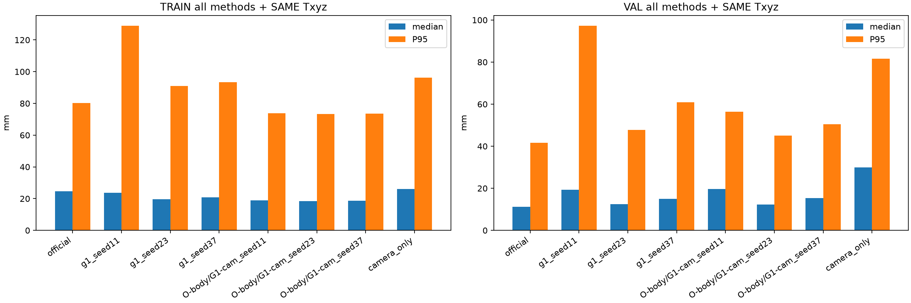
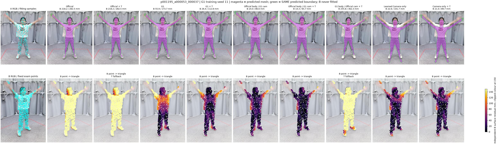
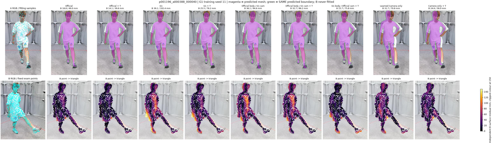

# R4.2：解耦减少尾部错误，但没有得到更好的最终模型

2026-10-10。232帧全部保留：18个TRAIN身份/192帧、4个VAL身份/40帧；这些是历史已消费开发身份，TEST未读。G1仍使用R4 Best的11/23/37三个训练seed；Official是同一个冻结checkpoint，固定缓存Txyz三seed重复性检查已通过。

**核心回答：机械交换能保留G1的Camera输出并保持Official人体不变，三个seed的尾部都减轻；但最终位置仍不如Official＋Txyz。实际训练的39系数Camera-only小模型也失败了。因此只支持“把Camera与Body分开”，不支持“解耦后已经能部署”，本轮不晋升、不启动正式长跑。**

## 1. 对执行指令的独立判断

方向正确，前提需收窄：R4.1支持G1的公制响应和位置起点改善，却未证明它的全部失败都由Body变化引起。本轮同时检查Camera、Body和有限迭代Txyz的初值影响。机械交换只作诊断，不能冒充可训练架构的因果贡献。

G1原接入会改变Decoder中间投影/关键点反馈，因此“冻结官方权重”不等于“人体输出不变”。本轮新接口把Camera修正放在**Official人体解码完成之后**，保持原生MHR人体字段，再调用官方投影函数同步更新raw Camera、3D translation、全图/裁剪2D关键点和网格投影。

## 2. 完整主结果

下表为 frame → sequence → identity 等权汇总的 median/P95，单位mm。每帧固定2048个Camera B点到精确三角面；B不参与拟合、训练或模型选择。Txyz全部沿用历史Anchor/A索引、六迭代、20%trim、单步每轴50mm、总范数177.88820176363325mm与原fallback。

|方法|TRAIN 原始|TRAIN ＋Txyz|VAL 原始|VAL ＋Txyz|
|---|---:|---:|---:|---:|
|Official|53.97/119.74|24.65/80.32|30.59/69.84|**11.23/41.60**|
|G1 s11|34.63/134.72|23.72/128.92|24.82/90.18|19.26/97.27|
|G1 s23|35.08/105.96|19.69/91.10|18.89/55.26|12.47/47.70|
|G1 s37|40.15/113.68|20.79/93.43|24.78/65.51|14.98/60.95|
|Official Body＋G1 Camera s11|28.61/88.10|18.81/73.86|26.96/68.55|19.69/56.38|
|Official Body＋G1 Camera s23|32.21/92.21|18.52/73.30|20.40/56.01|12.26/45.05|
|Official Body＋G1 Camera s37|40.82/105.79|18.72/73.63|22.54/58.36|15.36/50.52|
|G1 Body＋Official Camera s11|66.68/172.25|40.28/142.12|56.23/134.14|28.86/91.21|
|G1 Body＋Official Camera s23|57.84/135.51|29.13/102.32|39.28/85.77|13.80/47.22|
|G1 Body＋Official Camera s37|57.73/139.94|28.54/102.95|33.59/85.66|14.86/53.07|
|Camera-only小模型|38.18/113.69|26.04/96.17|39.88/102.74|29.98/81.59|
|公制median基座，无学习偏置|62.07/191.05|45.08/167.02|53.42/147.27|34.97/121.43|

Official Body＋G1 Camera＋Txyz三seed VAL为**15.77±3.73 / 50.65±5.66mm**；耦合G1＋Txyz为15.57±3.43 / 68.64±25.66mm。尾部改善明确，中间误差没有稳定改善；不可只挑seed23。三组VAL分别只有1/4身份median优于Official＋Txyz，P95优于的身份数为0/4、1/4、1/4。



完整数据：[ALL_RESULTS.json](ALL_RESULTS.json)、[逐帧](PER_FRAME.csv)、[逐身份](PER_IDENTITY.md)、[多seed/区域/失败/初值分析](ANALYSIS.json)。共12个缓存基底×232帧×原始/校正两阶段＝**5568条帧—方法评价**，包含复用历史结果；不是5568次新网络推理。

## 3. 11个fallback：能救回，但只来自一个TRAIN身份

历史Official的11帧fallback全部来自**p001195**。三个Official Body＋G1 Camera组合和新小模型在全部232帧均没有fallback。这是有价值的位置起点改善，但不是11个独立受试者的泛化证据。

三个固定Body组合在这些11帧的配对median改善约172mm、P95改善约178mm；TRAIN平均也改善。但正常Official应用帧和4个VAL身份没有同样一致的优势。完整分层保留在`ANALYSIS.json/fallback_subgroups`，主表不移除任何失败。



## 4. p001196和腰部：减少Body干扰不等于已贴准

|方法＋Txyz|p001196 median/P95 mm|VAL腰下躯干代理P95 mm|
|---|---:|---:|
|Official|13.12/46.56|32.84|
|G1 s11|24.11/114.70|64.49|
|G1 s23|15.37/58.47|37.98|
|G1 s37|16.59/72.90|42.96|
|Official Body＋G1 Camera s11|22.24/62.11|45.68|
|Official Body＋G1 Camera s23|16.75/51.01|33.87|
|Official Body＋G1 Camera s37|16.60/53.36|41.40|
|Camera-only小模型|21.98/65.35|65.71|

区域沿用R4.1固定拓扑代理和固定B点标签，所有方法一致。**这是腰下躯干工程代理，不是裸背/后背医学区域真值。**p001196仍未超过强基线。



## 5. 剩余差距有一部分仍是Camera/Txyz

对于Official Body＋G1 Camera，人体参数逐数组相同；与Official＋Txyz最终网格的差异仅是平移，加上最多0.000119mm的float32舍入。

三seed VAL逐帧最终Camera差异范数中位数为**25.75、15.52、14.41mm**，P95为85.53、29.49、80.77mm。相同身体、相同A点、相同Anchor、相同六轮算法，改变起点仍可得到不同最终位置。

因此：**Txyz不是完全消除Camera差异的理想对齐器。**有限迭代、最近Anchor对应和非凸表面可能产生不同路径；本轮没有增加迭代、改变可见面筛选或放宽上限来改善结果。不能把Txyz后所有差距都解释成Body真值误差，也不能唯一断言每一帧是某个具体局部极小值。

## 6. 实际训练的最小方案

只做CPU机制小验证，未假装完成原G1神经Camera头的同预算合成重训：

```text
RGB → frozen Official → 原生MHR Body（保持）
                            ↓ body固定表面Anchor
Camera A RGB-D → 观测XYZ → 中位位置＋居中几何特征
                            ↓
                   39系数Camera-only偏置头
                            ↓
           final-only原生Camera＋官方完整投影
                            ↓
                 同一Txyz（可选）→ B仅评价
```

Camera基座是“观测XYZ中位数−人体相对root Anchor中位数”；12个居中IQR几何特征预测3维偏置，共39个线性系数，ridge闭式拟合，无Attention、无自由顶点形变、无Decoder解冻。

- **监督来自真实TRAIN的A伪标签：**Official Camera＋历史六步Txyz raw平移，包含旧fallback未应用的raw值；不是Camera GT，没有修改任何比较基线的fallback合同。
- 192 TRAIN帧，18身份留一身份交叉验证，只按A伪标签root L2选择λ，候选0.1/1/10/100，最终λ=100。标准化、样本权重及选择全在TRAIN内。
- 四VAL身份没有进入训练或λ选择，B观测不读取、不作为特征/目标或选模依据；历史报告中的B字段不用于这些计算。
- **训练域与G1不同：**本轮真实A伪监督，G1为合成监督，不能将两者结果写成公平训练预算下的架构排名。
- 确定性闭式模型，没有训练随机seed；复制三个标签不会增加独立训练证据。三个G1训练seed全部保留。

留一TRAIN身份伪root误差为183.69mm，提示简单统计模型不可靠。真实VAL加Txyz后29.98/81.59mm，4/4身份均差，40/40帧P95均差，38帧恶化超过5mm。权重冻结后没有按B表现追加拟合或更换λ。

全空间点云平移测试的Camera响应误差小于3.5e−10mm，这是结构保证的等变性。固定RGB/rays的Depth±200mm数值扰动，学习头VAL中位Z变化约±187mm；无学习基座约±200mm。**这些是响应检查，不是物理重渲染的距离准确率。**保持人体参数与有公制响应都不能保证最终定位正确。

失败的合理解释是：可见点云中位统计与完整人体表面统计不等价，表面到root偏置依赖姿态、可见范围及预测身体；当前特征容量与A伪监督无法可靠建模。交叉验证支持“不可靠”，但尚不能唯一分出上述各原因的比例。不能据此否定所有Camera-only神经结构。

## 7. 自审和实际执行边界

- 四固定缓存零交换控制的Txyz raw/applied/六步trace与历史精确相同。
- 696个实际A compact、Official、B样本文件重新SHA验证；1856组新原始/校正网格，全部人体参数保持、只应用一次Txyz、A→B变换一致。
- 8组缓存最终网格独立重算B逐点距离，不调用拟合，误差精确0。
- 无卡AutoDL完成4个CPU Torch投影接口检查，加载原生缓存和**原封不动的官方投影函数AST**；Camera误差小于8.5e−8m、全网格投影误差0px、Body/缺失Depth精确保持。**没有重新加载完整SAM权重或运行新GPU网络推理。**
- Torch QA首个失败为测试namespace中两个同名投影函数覆盖，修复后通过；不是相机算法修改。无学习偏置消融最初错记学习头的Depth响应，已重跑评价修复；模型未重训，全部表面分数不变。
- 推理接口补了缺失Depth精确旁路；实际训练源码快照保留，`features/fit/predict`的AST与最终代码精确一致，checkpoint SHA未变。
- 81张图＝旧16复核帧＋全部11旧fallback帧，共27帧×3个G1 seed；没有挑新好例。绿色和紫色都表示预测，青色才是观测点；B误差色标统一，150mm以上只截断颜色、不丢弃距离。

[实际完整性](POST_EXECUTION_INTEGRITY.json)、[缓存文件SHA清单](CACHE_MESH_MANIFEST.json)、[Torch接口QA](TORCH_ADAPTER_QA.json)、[训练与选模](camera_only_pilot/TRAINING_RESULT.json)、[81张可视化](visualizations)、[备份回执](BACKUP_RECEIPT.json)。

## 8. 下一阶段决定

**工程继续Official＋Txyz。当前39系数头不晋升，不做正式多seed长跑。**

研究保留Camera/Body独立路径：下一项应是与G1使用同一合成TRAIN/VAL和同一短跑预算的**final-only MetricCamera**，只读取冻结Official最终token和Depth几何；不把Depth或Camera反馈送回人体Decoder。用合成Camera GT约束公制位置，若加真实A表面监督则单独消融，避免把“换监督数据”和“改架构”混为同一贡献。

同时优先改进合成到真实的可见表面对应与监督；本轮的失败不足以要求重训Pose/Shape。只有在Camera路径稳定后仍有明确局部几何差距，才让Body Geometry模块学习原生MHR残差。当前不改Body来补偿Camera误差，不把站姿衣物表面评价当作俯卧裸背或穴位精度。

本轮机制验证与小规模实验完成；后续GPU短跑尚未运行，需下一阶段确认，未自动开启训练。
