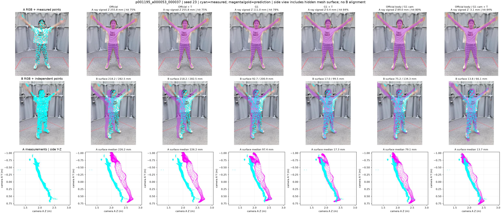
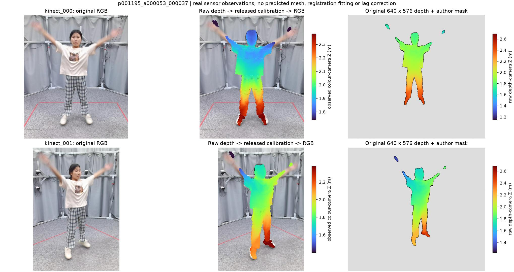

# R4.2 独立几何核验：二维贴合不代表深度位置正确

2026-10-10。承接 `4ac1f413` 已完成的232帧组件交换和CPU Camera-only小模型，本轮新增原始传感器核验；不重复训练，不重新跑SAM，不改Txyz、相机、评价点或历史结果。18 TRAIN身份/192帧、4 VAL身份/40帧均为已消费开发数据，封存TEST未读。

**结论：没有发现能解释20厘米错误的坐标变换或距离计算bug。p001195的大偏差在输入相机A就存在，主要是预测人体的公制位置偏远；Txyz超限后未应用修正。隔离Body可以减少G1造成的尾部干扰，但Camera起点和六步Txyz仍不稳定。工程保留Official＋Txyz作为研究基线；当前结果不能称俯卧背部部署精度。**

## 1. 这次真正做了什么

|实际核验|范围|结果|
|---|---|---|
|重新下载原始官方标定，与缓存K/R/T逐元素比较|29序列、232帧，A/B两相机|全部相同|
|官方4×4逆变换，对照历史R转置实现|232帧|最大坐标差0.0003375 mm；投影差约1e−13 px|
|独立平面＋三条边暴力距离，对照原三角面评价器|固定四帧×2阶段×8个B点＝64检查|最大差3.47e−13 mm|
|透视射线解析例和大三角面内部点|解析控制|通过；射线参数为公制Z，不误用射线长度|
|从原始uint16 Depth、作者mask、官方标定独立重建|固定27帧×A/B＝54视图|缓存点到重建点最近距离最大0.001263 mm|
|从视频开头顺序解码，对照历史随机seek的当前RGB|四帧×A/B＝8视图；每视图另取前后1帧|当前RGB逐像素相同|
|A侧点到面、同射线深度差、命中率和共同命中点|27帧×14个缓存方法/阶段＝378记录|全部保留；只作新增诊断，不替换B主指标|
|结束后实际文件重新SHA|696个历史输入＋378个被诊断网格|全部未变|

27帧沿用上一轮“旧16张复核图＋全部11个旧fallback”集合，未按新分数重选。四个原始帧核验例预先固定为 `p001195_a000053_000037`、`p001196_a000388_000040`、`p001194_a000062_000005`、`p100069_a005191_000006`。三个G1训练seed均保留。

机器可读证据：[完整几何核验](GEOMETRY_AUDIT.json)、[原始传感器核验](RAW_SENSOR_QA.json)、[原始导出回执](RAW_EXPORT_RECEIPT.json)、[实际输入/输出完整性](POST_EXECUTION_INTEGRITY.json)、[378条A诊断表](A_DEPTH_DIAGNOSTICS.csv)。原始NPZ、点云及视频片段在私有备份，原始人体数据与权重不进Git。

## 2. 为什么RGB看起来对，三维却差很多

透视图约束的是 `u = fx·X/Z + cx`。二维轮廓接近，不会唯一确定人体到相机的距离、尺度和局部三维形状。投影好看与独立深度正确是两件事。

`p001195` 的11个旧fallback帧，Official同射线预测表面比实测A表面更远 **204.2–260.0 mm**，这些逐帧signed median的中位数为 **218.6 mm**。历史raw Txyz范数中位数为 **205.1 mm**，超过177.888 mm上限，因此按冻结规则回退，applied translation为零。不能把这11帧写成“Txyz实际修过但没改善”。

以固定帧 `p001195_a000053_000037` 为例：

|方法|A点到面median mm|A同射线signed median mm|B点到面median/P95 mm|
|---|---:|---:|---:|
|Official|226.23|+255.81|218.21/282.54|
|Official＋Txyz，fallback|226.23|+255.81|218.21/282.54|
|G1 seed23＋Txyz|17.26|+0.42|17.04/99.46|
|Official Body＋G1 Camera seed23＋Txyz|13.68|−3.14|13.81/66.14|

该帧Official射线命中384/512；所有14组共同命中342点，其Official绝对深度差median仍为254.86 mm。大偏差不是漏掉难点后的选择效应。表中单帧不是主体结论，三seed和全部失败见[四例完整表](CASE_TABLE.md)及上一轮232帧结果。

图第一行为A投影和同射线深度差；第二行为B投影与独立表面误差；第三行为A物理Y–Z侧视。青色为真实观测，紫色/金色为预测。第三行是侧向投影，包含不可见网格背面，**不是解剖切片**。没有用B做对齐。

## 3. 原始RGB–Depth和同步核验的边界

本轮从原始深度重新走官方Depth-camera → world → color-camera链，并使用历史前表面5mm窗口过滤，得到了几乎相同的缓存点云。说明单位、帧号、缓存与发布标定的计算对应正确；**不等于测量精度0.0013 mm**。

官方文档明确RGB/Depth本身并非完美像素对齐，原始深度为640×576，RGB为1920×1080。这里按[官方工具箱](https://github.com/MotrixLab/humman_toolbox/blob/main/humman_point/README.md)及[官方变换实现](https://github.com/MotrixLab/humman_toolbox/blob/main/humman_point/tools/visualizer_rgbd.py)核验，没有为改善Mesh而反调标定。

独立A/B实测点云按4px投影邻近关联，27个选定帧中，p001195的11帧绝对Z差逐帧median再取median约 **4.54 mm**，p001196八帧约 **6.18 mm**。与20厘米预测错误量级明显不同。但该关联不能保证两相机看见同一皮肤点；边界、遮挡、衣物及运动会影响它。**不把4–6mm当标定精度或人体GT。**

尤其 `p100072` 两帧该观测比较median为39.15/41.07 mm、P95约1.42/1.44 m；全部保留，没有滤掉、重配准或从主评价删除。这提示4px关联会混入不同可见表面或观测异常，其具体原因尚未唯一定位。不能用几个正常帧宣布全部物理配准PASS。

原始图中快速移动的手臂模糊、Depth手部有断裂/孤立区域，不能给每个点都赋予可靠人体对应。原始Depth Z与转换后的color-camera Z属于不同相机轴，不能直接相减。

四帧顺序解码证明当前RGB取帧没有seek错位；前后1帧边缘邻近median约1–2px，没有选择或应用某个最优时间偏移。边缘统计会被衣纹和内部边缘影响，**不是硬件同步测量**。[HuMMan论文](https://arxiv.org/abs/2204.13686)描述硬件同步及≥33ms异常序列筛查；我们没有本次发布帧的原始硬件时间戳，因此状态是 `FRAME_INDEX_PASS_HARDWARE_TIMESTAMPS_UNAVAILABLE`，不是“零时间差证明”。

## 4. Camera/Body解耦：沿用全量结果，不因新图改结论

真正的隔离路径是：纯RGB Official完成原生Body预测 → 在最终Camera输出处读Depth修正 → 同步更新投影。原G0/G1的Depth融合不进入这条Body路径。人体参数保持已在实际缓存和官方投影接口中验证；不是靠detach命名解耦。机械组件交换只作诊断。

以下仍为232帧中VAL四身份的 frame → sequence → identity 等权汇总，median/P95 mm：

|方法＋同一Txyz|seed11|seed23|seed37|
|---|---:|---:|---:|
|Official，冻结缓存重复SD＝0|11.23/41.60|11.23/41.60|11.23/41.60|
|G1|19.26/97.27|12.47/47.70|14.98/60.95|
|Official Body＋G1 Camera|19.69/56.38|12.26/45.05|15.36/50.52|

固定Official Body后，相比耦合G1，三个seed的VAL P95都下降；但全部仍未超过Official＋Txyz。11个旧fallback被救回，但它们只来自一个TRAIN身份，不是11个独立人物。p001196及腰下躯干代理P95仍偏差。

这次A侧也看到了反例：`p001196_a000388_000040` 的Official＋Txyz A表面median为14.01 mm；换G1 Camera seed23、Body不变后为28.20 mm，射线signed median为−63.23 mm。**位置和有限步配准本身仍能出问题，不能把所有Txyz后的差距归给Pose/Shape。**

[上一轮完整报告](../rgbd-sam3d-r42-camera-body-decoupling/FINAL_REPORT.md)、[逐身份](../rgbd-sam3d-r42-camera-body-decoupling/PER_IDENTITY.md)、[所有帧和种子](../rgbd-sam3d-r42-camera-body-decoupling/ALL_RESULTS.json)、[81张完整旧对照图](../rgbd-sam3d-r42-camera-body-decoupling/visualizations)均保留，不覆盖。

## 5. 哪些判断有证据，哪些还没有

|问题|现在的判断|
|---|---|
|错相机、错单位、A/B变换代码是20cm错误主因？|本轮原始标定、独立变换和A侧深度不支持这个解释。不能排除所有物理传感器误差。|
|p001195主要是公制位置错？|支持。A侧同射线20–26cm偏远、raw平移超限和固定Body换Camera均提供证据。不能唯一拆分RGB的距离/尺度歧义。|
|G1改变Body会产生额外干扰？|支持。固定Official Body后各seed尾部下降；不证明Official人体参数是真值。|
|保留Body就能部署？|不支持。VAL与p001196仍不如Official＋Txyz，六步Txyz保留起点差异。|
|合成到真实域差异是原因？|合理假设。现有数据近中性随机姿态、程序颜色与无床场景确实不同；尚未完成控制数据消融，不能量化贡献。|
|真实Pose、Shape、裸背与穴位精度？|没有原生MHR对应/临床真值，当前不能证明。|

上一轮已经实际训练39系数Camera-only CPU头，纯TRAIN A伪监督、TRAIN内选λ，VAL＋Txyz **29.98/81.59 mm**，4/4身份退化。因此本轮不重复拟合、不按B追加调参，也不因为“可训练接口跑通”开启正式训练。这个小模型与G1训练域不同，失败不等于否定所有Camera-only神经分支。

## 6. 下一阶段建议与交付

工程保留Official＋Txyz强基线及严格fallback记录。研究优先：**真实俯卧数据资格 → 更广姿态/床面视角 → 真实外观与结构化深度噪声**；再做与G1相同合成数据、相同短跑预算的final-only Camera分支，先证明超过强基线，再决定Body几何学习。[R5详细建议](R5_DATA_UPGRADE.md)是计划，未下载新训练集、未生成R5、未租GPU或启动长跑。

新增16张图为四固定例×三seed的12张几何对照＋四张原始传感器图，全部可直接浏览。[图像索引](visualizations/README.md)。代码、实际环境、失败修复记录和私有备份见[复现说明](REPRODUCE.md)、[执行记录](EXECUTION_LEDGER.json)、[备份](BACKUP_RECEIPT.json)。按用户最新指令，AutoDL保持无卡模式运行，未执行关机；见[服务器状态](SERVER_STATUS_RECEIPT.json)。
