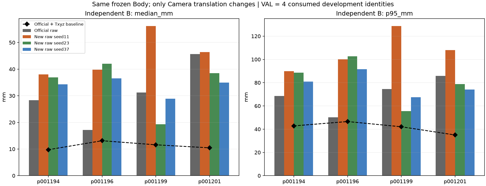
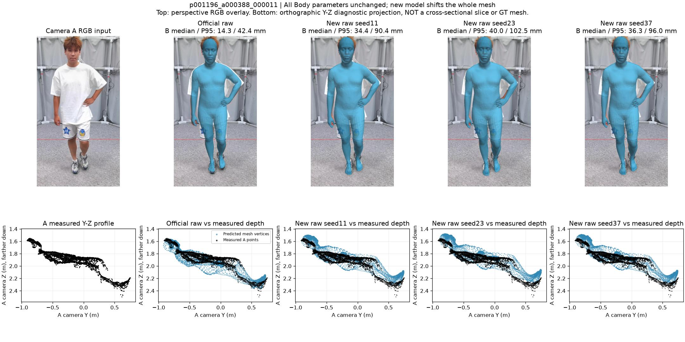
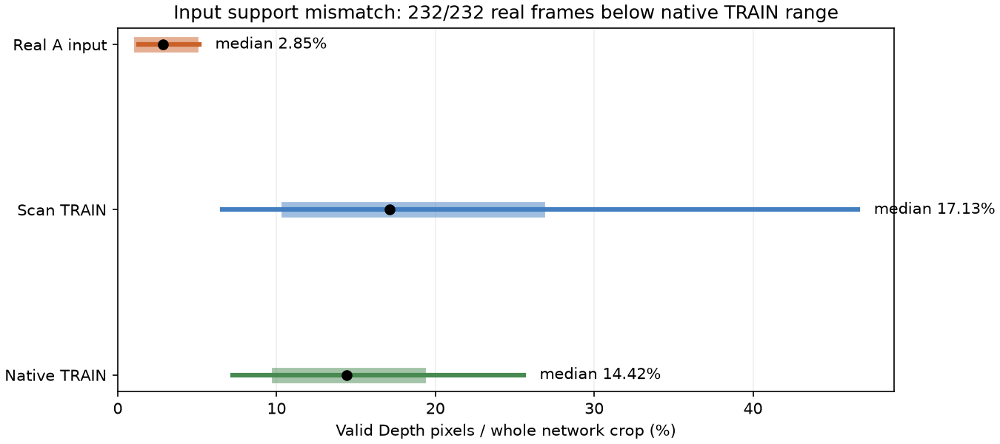
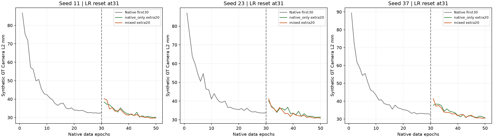

# 新模型的误差到底从哪里来？

**目前这个小 Camera 头，学会了利用深度调整距离，但还没学会“该移动多少、哪些本来就对的样本不要移错”。在真实 VAL 四个人上，三个 seed 的新模型直接输出都比 Official 平均更差。现在不能拿它替换工程基线。**

本报告把新模型不加 Txyz 的输出作为主结果。Official＋Txyz 是工程强基线；给新模型补 Txyz 只用于分析位置问题。上一份总报告首先展示了新模型＋Txyz，容易让人误以为那就是我们要交付的新模型，本报告修正这一呈现方式，历史数值不覆盖。

Material Passport：Origin Skill = academic-research-suite / experiment-agent；Mode = validate；Date = 2026-10-11；Verification Status = **ANALYZED**；Version = R5_RAW_ERROR_ANALYSIS_V1。已有评价结果重新对账，实际缓存与特征敏感性检查在 CPU 执行；本轮没有重新训练，也没有重新运行全量三角面距离评价。

## 1. 先把“新模型”说清楚

这里分析的是 R5 Camera-only pilot，**不是重新训练整个 SAM3D，也不是已经完成之前设想的“粗定位＋细精修”全架构**。

目前实际流程是：

```text
RGB → 冻结的 Official SAM3D → 原来的人体姿态、体型、尺度、旋转、局部 Mesh
                                      ↓ 全部保留
RGB 的1280维池化特征 + 36维深度/相机/人体统计量
→ 小 MLP → 三维 Camera 平移残差 → 重新生成相机空间 Mesh 和投影
```

36维输入包括深度分位数、观测 XYZ 的均值/标准差、有效深度占比、归一化内参、bbox、Official Camera 和人体顶点统计。这个小头读取全局统计，**没有逐像素“哪个实测点对应哪个人体面片”的细精修模块**。

本轮重新打开全部 **15 cell × 232帧＝3,480个实际预测 NPZ**，与 Official 的完整缓存比较：12个 Body 字段全部逐数组相等，包括 Pose、Shape、Scale、global rotation、完整 MHR 参数和局部顶点。相机空间顶点变化与统一平移的最大偏差只有 **0.000238 mm**，属于浮点构造误差。

因此，可以确定：**新模型相对 Official 新增的误差来自它改变了整体位置，不是这轮网络把姿态或体型改坏了。**但它最终剩余的全部误差，也包含 Official 原有的人体误差和观测差异，不能全部归为位移。

证据：[实际缓存核验](CACHE_CAMERA_AND_FEATURE_AUDIT.json)、[原实现](../../../../research/rgbd_sam3d_mhr/r5_camera_only/camera_head.py)。

## 2. 我们到底在量什么误差？

真实 HuMMan 里，Camera A 的 RGB/Depth 是输入；独立 Camera B 的固定2,048个点只考试。对每个 B 点，算它到预测 Mesh 最近三角面的三维距离。

- median：这一帧中，一半被测点的距离不大于它，反映典型表面偏离。
- P95：这一帧中，95%被测点的距离不大于它，帮助看到局部严重失败。
- ≤50mm coverage：距离不超过50mm的点占比。50mm只是沿用评价阈值，不能当按摩机器人合格线。

总表继续使用历史 **帧指标均值→sequence等权均值→身份等权均值**。表里的“median/P95”是这个层级汇总后的值，**不是把全部点混起来重新算的分位数**。

这量的是独立相机可见人体/衣物表面到 Mesh 的距离。它不是穴位误差，不是解剖对应顶点误差，也没有同时惩罚所有多出来的 Mesh 表面。当前这些人体分区还是旧的 shoulder/torso/waist proxy，不能把它们叫纯后背医学区域。二维贴图、三维点面距离、后背穴位准确性仍是三件事。

## 3. 先看总结果：新模型直接输出还不够好

下表全部是新模型 **raw、不加 Txyz**。每单元格为 median / P95，单位 mm。

|方法|真实 TRAIN 18人/192帧|真实 VAL 4人/40帧|
|---|---:|---:|
|Official raw|53.97 / 119.74|30.59 / 69.84|
|Official＋Txyz 工程基线|24.65 / 80.32|11.23 / 41.60|
|mixed 新模型 seed11|43.26 / 115.82|45.08 / 106.66|
|mixed 新模型 seed23|32.98 / 96.53|34.19 / 81.34|
|mixed 新模型 seed37|34.05 / 101.35|33.67 / 78.47|
|mixed 三seed均值±样本标准差|36.76±5.65 / 104.57±10.04|37.65±6.44 / 88.82±15.52|

真实 VAL 的50mm覆盖率：Official **74.43%**；新模型 seed11/23/37 **56.67% / 70.55% / 71.91%**，三seed均值 **66.38%**。Official＋Txyz 为97.07%。种子标准差只是这三个训练结果的波动，不是总体置信区间。

与匹配的 native-only 续训比较，新纹理 scan 确实有价值：真实 VAL raw median 的三个 seed 从 **57.35 / 46.21 / 41.50** 降到 **45.08 / 34.19 / 33.67**。但“比我们自己的弱版本更好”不等于“已经超过 Official”。

TRAIN 和 VAL 方向不同：TRAIN 平均改善，VAL 平均恶化，不能混成一个分数给出乐观结论。这些真实 TRAIN/VAL 名称继承旧开发划分；**R5没有用这18名真实 TRAIN 受试者训练**，详见第7节。



## 4. 是哪些人把误差拉高了？

### 4.1 VAL：最稳定的恶化来自 p001196、p001194

|身份|帧数|Official raw median/P95|新seed11|新seed23|新seed37|
|---|---:|---:|---:|---:|---:|
|p001194|16|28.37 / 68.59|37.99 / 89.98|36.87 / 88.53|34.30 / 80.93|
|p001196|8|17.14 / 50.28|39.79 / 100.01|42.06 / 102.57|36.52 / 91.48|
|p001199|8|31.21 / 74.58|56.15 / 128.61|19.32 / 55.52|28.89 / 67.45|
|p001201|8|45.61 / 85.89|46.40 / 108.04|38.52 / 78.74|34.96 / 74.01|

**p001196 原来相对好，三个 seed 都被改坏；p001194 也三个都变差。**p001199 对 seed 非常敏感，seed11明显失败，seed23/37反而改善；所以不能挑 seed23 来宣传。

按既有四身份等权算，新模型三seed平均比 Official raw 多 **7.06mm**：

|身份|对总表 median 变化的贡献|
|---|---:|
|p001196|+5.58mm|
|p001194|+2.00mm|
|p001199|+0.89mm|
|p001201|−1.41mm，部分抵消恶化|

这里的贡献是“该人三seed平均变化÷4”，不是误差因果百分比。**最应该优先修的是 p001196 这类原本较好的样本被过度改位置。**

逐帧也有同样问题：VAL 40帧里，seed11/23/37 的 median 分别有 **33 / 21 / 21帧**比 Official 更差；P95有 **37 / 27 / 23帧**更差。全部帧保留。

### 4.2 TRAIN：大错样本被救回，同时有新的失败

|身份|Official raw median/P95|新seed11|新seed23|新seed37|解释|
|---|---:|---:|---:|---:|---|
|p001195|165.28 / 207.44|32.05 / 82.63|30.81 / 75.16|29.13 / 79.42|救回明显位置偏差|
|p001225|113.17 / 184.43|23.49 / 66.32|19.26 / 58.32|19.38 / 62.53|另一名明显改善者|
|p100089|38.54 / 107.78|115.07 / 222.96|77.78 / 198.17|60.29 / 187.99|新位置变化明显恶化|
|p001202|23.43 / 64.57|59.22 / 143.92|41.02 / 93.01|49.17 / 111.00|三个seed均恶化|
|p001210|53.09 / 238.74|77.04 / 260.48|54.84 / 241.73|67.25 / 254.37|原来就有很大的局部残差|

TRAIN 总体 median 改善17.21mm，其中 p001195、p001225 两人的等权贡献合计约12.62mm。它们的改善是真的，但不能代表原本较好的样本同样受益。18人中，seed11/23/37 分别有 **7 / 7 / 6人**的 median 比 Official 更差。

每个seed的10个最差帧见 [ANALYSIS_SUMMARY.json](ANALYSIS_SUMMARY.json)，例如 seed11 的 `p100072_a001242_000048` P95 **314.6mm**，以及三个seed均严重的 `p001210_a001226`。**全部22人、每人每seed、所有232帧都见[完整附录](NUMERICAL_APPENDIX.md)和[逐帧CSV](ALL_REAL_FRAMES.csv)，没有只交好例子。**

## 5. 位移、姿态、体型：现在能分清到什么程度？

### 5.1 新模型主要动的是距离方向

这里 X/Y/Z 是 Camera A 坐标：X横向，Y图像向下，Z向前；负Z表示向相机靠近。下表是新模型相对 Official 的**实际变化**，不是相对未知真值的 Camera 误差。

|样本|seed11 ΔX/ΔY/ΔZ mm|seed23|seed37|
|---|---:|---:|---:|
|p001196|−4.99 / +19.82 / −72.97|+0.61 / +19.74 / −88.35|+0.48 / +10.95 / −72.39|
|p001194|−3.04 / +26.41 / −139.96|+2.41 / +30.29 / −137.94|−1.78 / +24.83 / −126.35|
|p001199|+1.99 / +0.80 / −233.45|+2.00 / +4.21 / −95.00|−3.53 / −0.73 / −125.87|
|p001195|+1.28 / +56.39 / −286.50|+8.20 / +48.53 / −248.18|+3.08 / +51.14 / −274.57|

这些值是各人的帧中位数。对 p001196，网络把整个人向相机拉近约7–9厘米，同时向下移动约1–2厘米，Body不变，B误差反而变大；对 p001195，向相机移动约25–29厘米却明显改善。**一个“倾向向前拉”的规则，对大位置错误有用，对原本贴得好的样本会有害。**这不是说所有帧都同一个常量，完整XYZ分布已经公开。



上图蓝色是预测Mesh，黑点是A实测点云；底部是明确标注的Y-Z投影，包含预测的前后表面，不能把未观测的背面顶点直接当深度错误。上方数字来自独立B。可以看到二维轮廓差别不大，但沿Z的位置不同；“看起来贴上去了”不代表三维已贴准。

### 5.2 已有 Txyz 诊断说明：不是把新 Body 改坏了

Txyz对新模型、Official都只用A固定点拟合。补上它后，新模型 VAL median 三seed是 **37.94 / 24.08 / 22.86mm**，仍高于 Official＋Txyz **11.23mm**；P95分别 **93.12 / 67.37 / 62.86mm**，基线 **41.60mm**。

这**不能**推出“剩下的是新模型姿态坏了”，因为两者Body本来完全相同。重读缓存后发现，对 p001196，两种初始化经同一A优化后的 Camera位置仍相差帧中位约 **61.55 / 87.78 / 48.57mm**；对p100089约 **110.78 / 107.79 / 105.41mm**。有限六步优化与对应选择没有把它们带到同一个位置。Txyz不是能消掉所有平移差异的真值对齐器。

新模型三个seed的 Txyz fallback 都为0，Official有11帧且全部来自p001195。**没有回退只说明没触发177.888mm限制，不等于人体更准。**本轮不把新模型＋Txyz作为最终系统。

### 5.3 有些大误差确实是平移之外的问题，但还不能分成 Pose/Shape 真值错误

p001210 的 Official＋Txyz P95仍 **227.27mm**，新模型诊断＋Txyz仍 **230.37 / 229.10 / 229.48mm**。两种初始化的优化后位置已很接近，帧中位约 **6.81 / 2.68 / 5.00mm**，大残差仍共同存在。Official校正后，该人的手臂proxy P95约 **306.6mm**、手脚约 **372.8mm**，显著高于腿部约89.7mm。

这支持“它有当前整体平移不能解决的局部对应/人体表面/观测问题”。可能包含Official原有的姿态、体型、衣物表面差异、遮挡或数据问题；**HuMMan这批真实帧没有原生MHR对应顶点或Pose/Shape真值，不能把这几项各占多少百分比编出来。**

在有MHR真值的原生合成VAL，证据更直接：固定Official Body的对应顶点误差约 **100.23mm**，去除顶点均值平移后仍 **76.24mm**；mixed最终相机空间对应顶点误差 **95.78–97.46mm**。Camera root误差约30mm，不等于人体Mesh误差30mm。原生GT下Camera三轴平方误差约 **84–85%来自Z**；这个比例只适用于这400张合成root GT，不能套到真实表面误差。

### 5.4 对按摩目标尤其要看腰背，不能被全身median骗了

真实VAL分区，以下新模型取三seed平均 raw：

|固定proxy部位|Official median/P95 mm|新模型平均 median/P95 mm|
|---|---:|---:|
|肩/上躯干|43.05 / 56.05|35.70 / 61.74|
|中躯干|48.29 / 68.00|51.99 / 82.50|
|腰/下躯干|38.14 / 71.26|51.78 / 81.49|
|腿|22.25 / 56.86|36.28 / 91.93|
|手脚|16.92 / 110.86|45.04 / 185.44|

肩部典型距离改善但尾部恶化，腰和中躯干仍不理想。**这不是“背部已经准了，只差论文包装”。**各seed与完整七分区见[附录](NUMERICAL_APPENDIX.md)。

## 6. 我找到的数据问题：真实 Depth 比合成稀疏得多

有效深度占比指经过同一RGB affine裁剪、侧边裁去64像素后，网络Depth输入中有效值占整个crop的比例；不是“人体内部有效率”，也不单独代表传感器准确性。

|输入集合|有效Depth占比中位数|最小—最大|
|---|---:|---:|
|原生MHR TRAIN 3,200张|14.42%|7.22%—25.56%|
|纹理scan TRAIN 2,304张|17.13%|6.59%—46.61%|
|真实A输入232帧|2.85%|1.29%—5.13%|

**232/232真实帧都低于这两套训练数据的最低有效占比。**真实深度由640×576深度像素反投影、转换、投到1920×1080 RGB，每个投影像素保留前表面，空洞保留0；随后用nearest裁剪。合成Depth是渲染到RGB网格上的相对密集表面，两者经历同一个crop函数，也仍然不具有同一种采样密度。

RGB的person prompt mask可以膨胀，Depth本身没有用膨胀填洞。因此这里没有发现“悄悄把Depth插值当真测量”的新bug；发现的是**训练和实际输入支持范围确实不一致**。有效占比同时混合了“人体占画面多少”和“测量点有多稀疏”，小头可能把两件事混在一起学。

此外，Depth Z中位数在 native TRAIN约 **4.28m**、scan TRAIN约 **2.29m**、真实约 **1.84m**；这只是分布中位差异，并不意味着所有真实距离都在训练范围之外。XYZ、bbox和人体统计的完整分布见[36维审计](CACHE_CAMERA_AND_FEATURE_AUDIT.json)。之前的恒定主点归一化bug已经修复，本报告全部使用 `repaired__` 缓存，没有把旧的数米错误混进来。



我又做了一个CPU机制检查：RGB、其他35维特征、mask/rays、Body和checkpoint全部固定，只把有效占比这一维替换为 **native TRAIN中位14.42%**。mixed三个seed的预测Z中位响应为 **+45.54 / +14.47 / +28.55mm**，说明这一个输入差异就足以明显影响距离输出，而且响应随seed不同。

**这个干预不是合法的部署修复，也不是更好的新成绩**：单改一个统计特征不等于物理生成了一张相同密度的Depth，没有为干预计算B分数。它只证明“网络对这个分布差异敏感”，不能证明全部真实失败都由这一维造成。见[逐帧敏感性](VALID_FRACTION_SENSITIVITY.json)。

已有原生VAL Depth消融也显示，这个头主要读全局距离：mixed seed11正确Depth Camera **29.62mm**；去掉绝对Z约 **766.73mm**；只保留绝对深度而抹平局部形状约 **38.93mm**；局部值顺序打乱约 **29.63mm**。输入Z±100mm，输出Z平均约−95/+94mm。**读到了公制Depth是真的，学会局部人体对应还没有证据。**

## 7. 训练、验证、测试的数据分别是什么？

|集合|训练实际使用|验证/检查|TEST及标签性质|
|---|---|---|---|
|原生MHR合成，500身份×2姿态×4相机＝4,000张|400身份3,200张；`mhr3_0000–0399`|50身份400张；`mhr3_0400–0449`；用于best checkpoint选择|50身份400张封存未读；有原生MHR参数、对应顶点、root真值|
|带照片纹理HuMMan扫描重渲染，12身份、48源Mesh×64相机＝3,072张|9身份2,304张，mixed额外弱监督|3身份768张，只做诊断，不选best|衣物外表面扫描；有虚拟K/R/t、clean Z、mask，无原生MHR root/Pose/Shape GT|
|真实HuMMan多Kinect，22身份232帧|**本轮没有参与训练**|沿用真实开发角色：18 TRAIN/192帧、4 VAL/40帧；A输入，B独立评价|这不是封存TEST成绩；已多轮分析消费，真实MHR对应真值缺失|

scan TRAIN：`p000448,p000496,p000534,p000560,p000587,p000592,p000598,p000599,p100047`。

scan VAL：`p000460,p000495,p000526`。

真实开发TRAIN：`p001195,p001197,p001202,p001203,p001204,p001210,p001216,p001225,p001226,p001231,p100067,p100069,p100072,p100085,p100086,p100089,p100090,p100092`。

真实开发VAL：`p001194,p001196,p001199,p001201`。

**“真实TRAIN”不等于这轮模型拿它训练过，“验证表现”不等于独立封存测试表现。**本轮best只按原生合成VAL Camera L2选择，没用B拟合、改权重或挑checkpoint。

扫描相机有0.8–4m距离、多个yaw、0–85°仰角、±90°roll、焦距/偏心等配置。但3,072张仍然只有48个源扫描Mesh、12个人，多视角不能当3,072种新姿态；训练仅9个真人身份。截断464张保留。原生合成每人仅两种姿态。

当前R5所用资料主要是这些合成/扫描视图和站立动作开发帧，**不是已覆盖真实俯卧床面接触的训练/独立验证**。此前PressurePose、BEHAVE结果是历史工程证据，未进入本轮Camera头训练，不能补成“R5已经在俯卧患者上验证”。

完整身份数量、源Mesh、相机列表：[DATASET_USAGE.json](DATASET_USAGE.json)、[身份角色CSV](DATASET_IDENTITY_ROLES.csv)；逐图索引仍在[源manifest](../r5-camera-overnight-v1/data_manifests)。

## 8. 训练轮次够不够？学习率是不是正确？

### 8.1 实际训练了多少

- 第一阶段：raw-bounded、公制XYZ、RGB-only三种小头，各seed11/23/37，全部30轮。native batch16，每轮3,200张、200次更新，共6,000步。
- 第二阶段：公制XYZ的每个seed从同一30轮last继续，native-only与mixed两组各20轮。每组共50轮native曝光、10,000次更新。两组native顺序、优化器状态和调度相同。
- mixed每次更新另抽4张scan：每native epoch800次scan抽取，20轮合计 **16,000张次**，不是20×2,304。平均约 **6.94遍scan曝光**。

|mixed seed|scan抽取张次|不同scan实际见过|没抽到的TRAIN图|每图次数范围|
|---|---:|---:|---:|---:|
|11|16,000|2,225 / 2,304|79|0–31|
|23|16,000|2,243 / 2,304|61|0–29|
|37|16,000|2,243 / 2,304|61|0–28|

因此“训练了50轮”只对native数据曝光成立，**不能说新纹理数据充分训练了50轮或者20完整遍**。

### 8.2 曲线告诉我们什么

|seed|第一阶段公制头best Camera mm / epoch|native-only额外20轮best|mixed额外20轮best|
|---|---:|---:|---:|
|11|32.32 / 29|30.00 / 19|29.62 / 18|
|23|33.63 / 29|31.28 / 18|30.83 / 20|
|37|32.61 / 30|30.66 / 20|30.44 / 19|

这里是合成VAL有GT的Camera L2，不能与真实B点面median横向混算。公制头最初约87–89mm，下降到32–34mm；mixed又到约30mm，确实学到了东西。mixed最后五轮改善约 **0.33 / 0.77 / 0.46mm**，已经是小幅，但best还靠近末轮，**没有证明完全收敛**。

RGB-only小头best出现在第13/16/16轮，误差约75–77mm，30轮末分别约79.65/77.45/78.15mm。继续降训练loss并没有一直改善VAL；不能所有模型都用“轮数不够”来解释。

我的判断：**轮次足够做这一版小头的机制验证，不能说充分到能交付最终模型；当前真实失败也不支持只加几十轮就解决。**原生数据学得不错，真实样本被移错、scan身份少和Depth采样不匹配，是更具体的问题。想加轮数应先修数据合同，再用开发曲线证明值得，不用B挑最漂亮epoch。



### 8.3 学习率实际用了什么

优化器AdamW，weight decay `1e-4`，梯度clip `1.0`。本轮只实际比较了 `lr=3e-4`，**没有完成1e-4与3e-4的LR对照**。

第一阶段2轮warmup：第1轮 `1.5e-4`，第2轮 `3e-4`，然后余弦下降，第30轮 `3e-5`。第二阶段保留优化器动量，但两组都把LR重新升到 `3e-4`，做20轮余弦下降，第20轮实际 `3.1662e-5`。

重置LR后，第一轮额外训练的合成VAL会从约32–34mm暂时升到38–41mm，再逐渐恢复。这说明重置确实有扰动；公平对照的两组都采用同一策略，但**这个调度未必最高效**。

我的判断：**实现和使用记录正确，能稳定优化；“3e-4是最佳学习率”没有证据。**下一轮可以在native/scan开发集做保持低LR的续训与 `1e-4` 对照，不能根据真实B分数反复选LR。本轮没有把这项未做过的对照写成已验证。

### 8.4 损失函数与它能做、不能做的事

native监督：Camera XYZ逐轴Smooth-L1，beta **0.05m**，三轴及batch平均；有真实MHR root标签。

mixed额外scan监督：完整clean person-mask内渲染轴向Z的Smooth-L1，beta **0.02m**，未命中也计入；加逐图抗锯齿轮廓IoU损失。输入为noisy Depth，目标为clean渲染；使用原透视渲染器。权重由TRAIN32 native＋TRAIN32 scan的输出Camera梯度中位量级校准并固定：Z **0.1944463**、轮廓 **0.2604647**。

这个损失能教Camera把固定人体放到扫描表面附近；**scan没有MHR root真值，而且Body始终冻结，人体与衣物形状不匹配时，Camera可能被迫折中**。这是合理风险解释，还没被逐项因果验证。

续训末轮native loss约0.0017，加权weak loss约0.10。不能仅因为标量loss相差约60倍就说梯度必然相差60倍；当前只有初始梯度校准，没有完整训练过程的逐项梯度比例记录。**所以也不能宣称这两个损失在全程始终平衡。**源冻结、全部loss曲线都已公开。

## 9. 我的结论与下一步优先级

已证实的事实：

1. 硬保留Official Body已经做到。新模型新增的问题是位置改变，不是这次训练改坏Pose/Shape。
2. 公制Depth有实际价值；scan弱监督比仅延长native训练更好。
3. 当前raw新模型在真实VAL仍弱于Official；p001196、p001194是稳定恶化，p001199暴露seed波动。
4. 两套合成TRAIN都没有覆盖当前真实Depth的有效占比，网络对此有厘米级响应。
5. 仅改Camera不能消除p001210等既有局部问题，也没有验证穴位传播准确性。

还不能确定：全部失败中数据稀疏、人体衣物差异、全局统计表达、loss折中、优化调度各占多少；真实Pose和Shape分别错多少；针对俯卧裸背的最终精度。**不能用一个总分把这些未知项补齐。**

我的下一步建议是：先让训练Depth覆盖真实稀疏采样、空洞与crop支持范围，在有root GT的合成开发集做小对照；同时做一次1e-4/3e-4及不重置LR的有限对照，解决“数据合同”和“训练充分性”这两个能被直接检验的问题。之后再实现Body硬固定下的**单次前向几何细精修**，让模型利用真实点与预测表面的空间关系，而不仅凭全局中位Depth猜距离。

目标仍是**新模型直接输出，不依赖外挂Txyz**。Official＋Txyz保留作强对照；Txyz只用于揭示位置误差。当前不要扩大同一小头长跑，也不要把这些全身开发分数写成俯卧背部或穴位临床精度。

## 10. 审计范围与证据纪律

源结果commit：`be5a0f2a585fcd313789ee1ff4e8da8b683b8b08`。本轮使用218 CPU核验真实NPZ、Camera XYZ、固定A采样SHA、三套输入特征；用本地CPU汇总已有结果与缓存透视图；6个checkpoint做仅有效占比这一维的敏感性干预。新模型参数、训练数据、超参数、best选择和B评价点都没有改动。

结果表3,712条帧记录、352条身份记录，包含15个模型及Official；主mixed子表696帧记录、66身份记录；全部390条轮次曲线；全3seed的4个案例图；既有数据原始备份继续保留。见[交付索引](README.md)和[复算方法](REPRODUCE.md)。

|统计误读检查|本轮处理|
|---|---|
|Simpson分组反转|TRAIN改善与VAL恶化分开；不以合并平均掩盖|
|生态谬误|逐人逐帧公开；平均分不能代替每个局部点|
|Berkson/选择偏差|22人是已消费开发集；scan VAL仅3人，不推断人群泛化|
|Collider条件化|未按模型分数剔样或作因果回归；例图只辅助解释|
|基率误用|coverage写清固定点分母；不是临床敏感度或成功率|
|回归均值|11个旧fallback是已知极端组，只报告配对，不代表全部样本|
|幸存者偏差|保留232帧、全部seed、失败/截断/空洞，未只报最佳|
|多重探索|15个cell完整公开，没有挑最优seed或宣称统计显著|
|分析路径选择|新增为事后探索性诊断；原评价、阈值、拆分不修改|
|相关不等于因果|Body固定的变化可定位到Camera；特征漂移对真实失败的总贡献仍未知|
|逆向因果|A的优化平移不是GT误差；局部残差不反推唯一Pose病因|

没有做显著性检验或虚构统计功效；3seed的标准差不是置信区间；真实VAL仅4个身份，结果不能保证正式TEST或患者表现。
