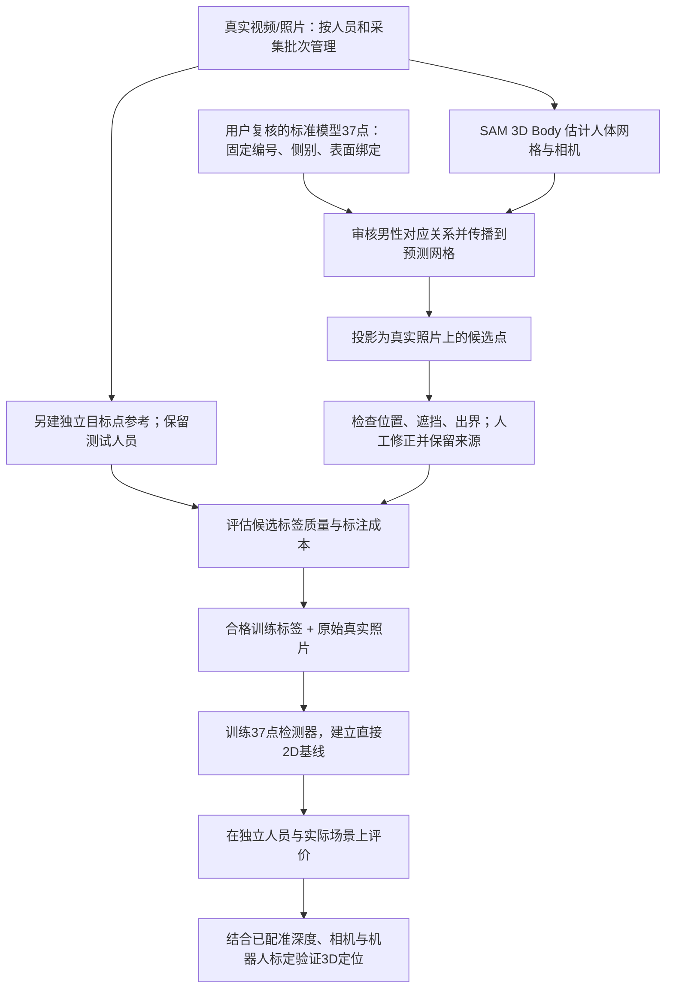

# 真实场景关键点定位：整体流程、路线判断与下一步

> **执行状态：2026-09-08 用户明确恢复微调/训练策略主线。** 本文保留既有方案/历史判断；最新官方MHR下载、20图对照、单步可微更新及后续训练消融方案见[当前状态](ai-workflow-pause-2026-09-08.md)。尚无新正式checkpoint或泛化提升结论。

> 最新复审：首批53条AI暂定标签已暂停训练使用，S01的37点已重新检查，当前没有完成有依据的新坐标修正。见[最新批次状态](dmd37-ai-pilot-2026-09-07.md)。当前继续由AI推进位置判断，而非等待医生；下方首批产标数字属于历史记录。

> 后续决策（2026-09-07）：用户明确要求当前以AI标注与复核推进，不等待医生真实标签。下文独立参考是后续精度评价路线，已不作为工程试训的前置门槛。[首批三帧结果](dmd37-ai-pilot-2026-09-07.md)已完成：53条AI暂定标签、58条排除，21个通道得到部分监督。下文“尚未执行三帧投影”保留为本计划形成时的历史状态。

## Material Passport

- Origin Skill: academic-research-suite / experiment-agent
- Origin Mode: plan
- Origin Date: 2026-09-07
- Verification Status: UNVERIFIED（后续实验计划；已完成事实以下方项目证据为准）
- Version Label: real_scene_pipeline_v1

## 结论

方向可以继续，但必须补上“真人照片上的独立参考和标签质量验证”。目前完成的是工程坐标链、真实照片上的 SAM 推理和用户复核的标准模型37点布局，还没有完成可靠真人标签、真人训练与真人定位精度验证。

训练输入使用原始真实照片。Mesh 和 Atlas 用来辅助产生、检查和修正候选标签；叠加了网格或点的检查图不作为训练输入。工程优先的含义是先证明目标点在实际拍摄条件下能被可靠定位，再扩大训练和发展论文方法。

## 一、我们已经做到哪里

| 阶段 | 已完成 | 证据边界 |
|---|---|---|
| 合成工程链 | SKEL 表面点绑定、姿态/体型变化、多视角导出、旧20点 RTMPose、深度回投与可靠性处理 | 工程资产可复用；合成指标不能代表真人精度 |
| 真实照片推理 | 从工作目录视频取得8帧，完成 SAM 3D Body 输出和叠加检查 | 6帧需修正、2帧严重遮挡；有 mesh 不代表标签正确 |
| 旧20点映射审计 | 检查 SKEL→SMPL-X→MHR→图像的数值约定、面序及投影 | 数值自洽不能证明点的解剖位置正确 |
| 三帧审查 | S01/S03/S05 的60个旧工程点区域状态及轮廓参考 | 三帧来自同一视频，只适合当前调试；参考仍为草稿 |
| Mask 对照 | S05 三处轮廓差从87/68/5变为86/66/7像素 | 此次没有实质改善；不能推广为所有 mask 均无效 |
| 37点参考 | 核对 DMD-BAK 的19种/37通道，建立 ENG_D01–ENG_D37，用户复核另存并读取实际绑定 | 工程布局已确认；并非取得 DMD 原标签或完成医学标注 |
| 真人训练与评价 | 尚未启动 | 当前没有获准的高精度真人训练标签，也没有独立真人目标点测试集 |

最新点位及证据见[用户复核交付](handoffs/real-scene-2026-09-06/reviewed-dmd37-2026-09-07/README.md)，前序实测见[真实照片交付](handoffs/real-scene-2026-09-06/README.md)。

## 二、建议采用的完整流程

**1. 先把“点是什么”固定下来。** 保留37点的工程身份、编号顺序、人体左右和表面绑定。医学名称目前是参考，不作为精度已通过的证据。旧 E01–E20 与新 ENG_D01–ENG_D37 是不同任务；旧20点模型不能直接当37点模型使用。

**2. 用真实照片获得候选标注。** 读取已完成的 SAM 预测，通过经过核验的男性模型对应关系，把标准模型37点传播到照片。已有男性 canonical/mapping 文件可供检查，无需先重建全部资产；但女性旧链的通过记录不能替代本次男性37点检查。

**3. 在照片上审查与修正。** 每点记录坐标、是否在画面内、是否位于可见背部、是否被设备遮挡、位置是否能够确认、是否允许用于训练。可见性与位置正确性是两件事。遮挡点可以保留为模型预测，但不能冒充已观察到的标签；不确定点不强制补齐参与监督。

**4. 建立独立参考。** 在一个小的真实样本子集上，按明确的目标定义独立标注，再与候选点比较。用于最终评估的参考应先于查看模型叠加结果建立，避免评价标准跟着预测走。能在照片中辨认的工程目标可以先做；无法仅凭照片确认的位置，需要额外采集或专业标注才能建立相应真值。

这里有一个必须区分的问题：模型上定义的任意表面坐标，未必能在另一个真人的照片上独立辨认。若无法建立这种对应，实验最多证明“标准模板的稳定投影”，不能声称完成了“真人目标位置的准确检测”。不能用 SAM 生成标签，再只用相同生成方法评价模型并据此宣称真实准确。

**5. 开始小规模真人训练。** 输入原图和经确认的标签，复用现有训练、导出和推理代码，建立37点输出与数据规范。先按人员划分训练/验证/测试，再处理视频帧，避免相邻帧跨集合。最早的同一视频试训可以检查代码，但不能评价跨人泛化。

**6. 验证工程效果。** 同时看平均误差、较差样本的误差、失败率和拒绝率，并按遮挡、姿态、体型等拆开分析。不能通过拒绝大量难样本仅报告剩余样本的低误差。2D先报告原图像素误差和明确归一化定义；真人毫米误差须有深度/标定和独立空间参考，不能从旧合成结果外推。

**7. 接入机器人坐标。** 候选在线路径为“真实RGB→37点检测→可见性/可信度判断→读取已配准深度→相机坐标→机器人坐标”。设备遮挡时，直接读取该像素深度可能得到设备表面，不能当作人体点。SAM 暂作离线产标和诊断工具；是否加入在线流程由后续精度、延迟及失败情况决定。

## 三、这样做对不对：我的判断

### 值得保留的部分

- **真实照片训练与目标场景一致。** 原来合成流程继续用于导出验证、可见性检查和可能的预训练；是否提高真人精度留给对照实验回答。
- **先固定点定义是必要的。** 用户此次复核让我们有了可追溯的工程参考，避免每轮都更改目标。但37是起始参考点集，未证明所有点都适合当前俯卧、遮挡任务。
- **用 mesh 辅助标注值得小规模测试。** 它可能节省人工并保持结构一致，是否有效要同时看标签误差与人工修改时间。

### 现在不能接受的假设

- **“贴上 mesh 就贴准穴位”。** 表面轮廓贴合只约束外观，不能独自确定内部椎节或表面目标的语义位置。
- **“标准模型复核后，真人也正确”。** 当前椎节高度仍有视觉估计，42/84毫米是模型中的示意比例，肩部定义还受T姿态影响；这些误差可能随映射进入真人标签。
- **“多生成伪标签，学生就能纠正教师”。** 在没有额外可靠监督或约束时，不能期待学生自动消除 SAM 或跨模型映射的系统偏差。
- **“先把完整 refinement 做完才可以继续”。** 当前还不知道主要误差来自点定义、对应关系、姿态、相机还是网格形状。应通过小样本定位误差来源，再决定局部修正哪一环。

因此，保留这条路线作为候选方案，同时保留“直接人工标注真实照片→2D检测”的工程基线。若 mesh 辅助反而更费人工或持续产生偏差，就应让它退出主产标路径，保留为诊断工具。

## 四、接下来按什么顺序做

### 第一步：37点在三张真实照片上的可复核投影

这是最近的一项工程里程碑，尚未执行。

输入：用户另存文件中提取的37点绑定、现有男性对应资产、S01/S03/S05 的既有 SAM 预测。保持照片、ROI、相机、预测和旧20点结果不变，本轮只接入并核验男性37点链，不同时调 mask 或重新拟合。

交付：

1. 三张原图上的37点编号叠加图，以及关键区域放大图。
2. 共111条候选记录；出界、遮挡、无法确认均如实记录，不要求111条均可见。
3. 点位来源、模型版本、对应关系、坐标单位、左右约定和映射误差诊断记录。
4. 可见性初审和待人工确认清单，未获确认的标签继续禁用训练。

验收：无漏点/重复编号、左右与坐标约定可核查、每点可追溯、投影图与坐标一致。这证明流程接通，不是定位精度验收。实施时再给出与实际脚本一致的运行命令，不虚构已存在的37点执行入口。

### 第二步：补一小批独立真人参考，判断路线是否值得扩大

先从容易确认的样本开始，再纳入俯卧、肩部、腰部和设备遮挡等困难条件；补充其他人员和采集批次，不能将同一视频三帧当作独立泛化测试。记录逐点标注者、可确认性、复核差异以及标注/修改耗时。

比较“从空白原图标注”和“修改 mesh 候选标签”的耗时与最终质量；先保留一份不看候选点建立的独立参考。具体样本量、2D容许误差和后续毫米目标在初步采集条件明确后确定，目前不编造已经达标的阈值。

若候选标签准确且省时，则扩大辅助产标；若偏差集中，针对具体来源修正；若误差大且修改费时，优先直接标注与训练2D模型。

### 第三步：真人37点基线及有针对性的对照

先建立独立真实标签训练的2D基线，再比较加入经筛选的 mesh 辅助标签是否提高独立测试集表现。合成预训练、结构约束、局部 refinement 分别作为后续单独变量。固定人员划分、种子、训练预算与评价协议，不同时改多项后将收益归因于其中一项。

是否做到高精度，要由实际目标参考与测试结果回答；是否能发论文，还需要证明清楚的方法贡献和适用边界。可检验的研究问题是：在俯卧与设备遮挡的真实背部图像上，经过语义核验和质量筛选的 mesh 辅助标注，能否在相同标注成本下改善跨人定位，或在相同精度下减少标注成本？目前是候选问题，未证明创新性或效果。

## 五、公开数据在这里扮演什么角色

公开数据获取与自有场景参考并行推进，不把整个工程押在等待数据上。本次已下载 DMD-BAK 当前包，但只有作者更新说明，没有训练图像；其代码和37点定义已利用。另两项背部研究未核实可独立取得的训练包；AcuSim 为合成头颈数据，不能填补真人背部监督缺口。详细事实和来源见[数据资源核查报告](public-back-dataset-audit-2026-09-07.md)。

未来取得公开真人数据后，先核对通道顺序、人体左右、人员划分与目标场景差异，再用于训练或预训练。公开数据模型在我们照片上的预测仍是预测，不能替代本项目独立测试参考。

## 六、与此前计划的区别

以前重点在于接通“真实照片→mesh→标准点投影”。现在这一链条继续推进，但下一阶段的核心变成“投影是否准确、是否省标注时间、何时允许进入训练”。

新37点替换的是当前候选任务定义，不能继承旧20点的精度结论。我们不重做所有工程资产；先做三帧37点检查，再建立少量独立参考，用结果决定扩大 mesh 产标、修正局部问题还是优先直接2D训练。机器人3D定位另行验收，论文贡献从可靠对照中提炼。
