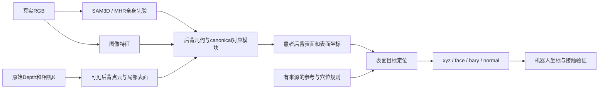

# 阅读后的路线修订：工程保留，研究重新定焦

本文件是设计判断，**不包含新训练结果或新医学精度结论**。论文机制与原始出处见[PAPER_NOTES](PAPER_NOTES.md)。

## 近期证据真正指向什么

[10月4日三项工程实验](../../handoffs/real-scene-2026-10-04/continuous-execution-summary-v1/README.md)已经区分：表面是否贴近、参考线是否可靠、对应是否放大参考误差。

- 30个真实扫描上的作者线差异约3.69 mm，评价的是作者画线；来源目录不是已证实独立患者身份，扫描也不是本项目俯卧医学标签。
- 俯卧接口中，12名三种子均完整的测试角色的沟槽：Rigid+D贴面距离约1.58 mm，但对应点跨划分跨度约25.41 mm。它直接说明贴面与稳定点位是两个问题。
- 受控参考实验的Convex带噪切向中位误差改善，但P95变差，正确初值还会被错误参考带偏。它证明一个机制的取舍，没有证明真人穴位准确。

因此当前应研究：**局部RGB-D观测下，如何得到符合测量的后背表面，并让canonical坐标对应保持稳定、可核验。** 确定椎体编号和穴位是下一层，需要对应标签/参考，不能由贴合分数替代。

## 旧idea需要怎样改

| 既有提法 | 阅读后发现 | 本轮修订 |
|---|---|---|
| 可见性＋深度token＋关节图补全 | VoteHMR已做局部点云投票/补全；SAM也已有prompt decoder | 可作实现参考；通用架构不再作为充分新意 |
| 多相机教师→单相机学生 | SAM已有多视图fitting；几何教师不自动带来解剖身份 | 有价值的数据策略；新意需落到新的监督对象/学习机制与独立验证 |
| Mesh→参考点→规则→穴位 | 是合理工程分工，单独串流程不足以证明方法贡献 | 保留接口；真人点位证据齐备后再主张医学有效性 |
| 非负归一化插值不放大参考噪声 | Point2SSM等已有注意力加权输出；我们自己的尾部误差仍会退化 | 保留受控基线；不把凸权重或投影包装成完整新理论 |
| 学一个背部线U-Net | 可以检验真实几何监督/缺失增强是否有用 | 定位为低成本基线，不能担负整篇论文主贡献 |

这修订了[9月21日idea文件](../../handoffs/real-scene-2026-09-21/rgbd-mhr-acupoint-pipeline-v1/ORAL_IDEA_SET_V1.md)的优先级；原文件作为历史提案保留。

## 更贴近目标的模型分工

保留SAM3D的全身形状/姿态先验，让真实深度承担可见后背的度量证据，再学习“这块表面属于哪个canonical位置”。

具体候选实现：点云编码先比较PointNet++/DGCNN；按实测K把RGB特征关联到深度点/表面；用固定canonical后背查询与局部特征生成表面位置和对应。DiffusionNet可作为已有表面特征传播基线。先冻结SAM，再判断是否需要让其参与学习。

必须保持的分工是：**身体先验提供整体结构，传感器提供观测几何，对应模块提供身份。** 三者误差分别评价。消费级Depth或衣物表面不等于裸背皮肤；模型不能用表面形状猜测结果冒充已识别椎骨。

该架构并不因此成为创新：模板形变、表面特征采样、深度编码、注意力与functional map都已有工作。下一轮应针对可见后背的非等距形变、参考缺失和identity滑移，找出现成对应方法仍未解决的具体情况，再定义新机制。

## 数据具体能承担什么

| 资产 | 可监督/评价 | 当前不能承担 |
|---|---|---|
| PressurePose真实20人 | 俯卧RGB-D推理；现有划分下几何与稳定性诊断 | 精确裸背、椎体/穴位GT；全新泛化集 |
| PCdare/IIR真实30扫描＋作者线 | XYZ曲线提取/学习与不完整输入对照 | 完整canonical UV、椎体编号、独立俯卧患者穴位标签 |
| BEHAVE已用多相机样本 | K0输入/优化，held-out传感器评价；fitted SMPL作支持 | 俯卧裸背医学定位；把fitted reference称绝对GT |
| 合成MHR/SMPL表面 | 已知拓扑/对应、缺失与变形机制实验 | 用模型生成的身份验证同一模型在真人上的身份 |
| SLP/BodyPressureSD，论文资产 | 床上深度预训练/适配的候选来源 | 未核对前默认俯卧覆盖、裸背参考或本项目已下载 |
| 医学参考点/穴位 | 后续形成点位验证层 | 目前不能由AI判断代替独立参照 |

作者线按长度归一化后的纵向坐标，不等于T3/T5/L2；给左右位置按比例编号，也不会自动变成医学标注。同样，DenseCorr3D物体语义组数据适合测试对应代码，不适合当人体穴位训练集。

若收集新公开人体表面数据，应先核对患者/扫描身份、原始几何与注册标签的来源，再冻结人级划分；多帧或多个扫描目录不能直接按数量充作独立受试者规模。

## 下一轮最值得做的对照

本轮只是学习，以下尚未执行。既有曲线原型仍待服务器环境/资产恢复后运行。

1. **参考层。** 在现有XYZ作者线数据上，一次完成几何基线与已有U-Net缺失增强对照；按来源组划分，报告完整输出、失败与跨缺失变化。只回答线能否提供较稳定参考，不延长为穴位标签生产。
2. **对应层。** 在完全相同的固定表面和输入上比较：固定拓扑、带正则的模板配准、Point2SSM式对应。已有受控程序对应可用于机制核验，真人身份结论另需真实参考。几何与点位误差分开报告。
3. **模型层。** 只有对应方法证明能稳定利用观测，才比较加入RGB语义、深度几何、canonical约束的增量；不一开始堆完整扩散/多head系统。

核心读数：共同点上的表面median/P95与命中率、canonical/测地对应误差、重复观测一致性、参考噪声后的尾部误差、翻面/局部伸缩、逐人变化。平移与相机误差仍单独检查。单相机留点只验证空间留出，不能写成跨传感器验证。

论文的可检验主张可以先写成：**在后背表面测量精度相近时，显式学习/约束对应是否改善点位稳定性，并保留个体形状。** 这是研究问题，不是已成立贡献。若只有距离改善而对应没有改善，便不支持该主张。

## 第二轮阅读边界

本轮已重点学习八篇方法论文、审计两篇并复读SAM。仍需更集中核对 **DV-Matcher（CVPR2025）、RINO（CVPR2026）、MHR及HSMR**，判断非刚性/部分对应和内部骨骼恢复的边界；当前只有检索记录，不将其当作已读原文。

因此现在不宣称“新的完整架构已设计完成”或“能强接受”。工程流程可以继续，论文贡献应由明确的机制差异和足够的真实证据形成。
