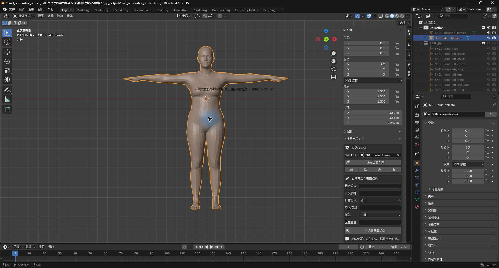
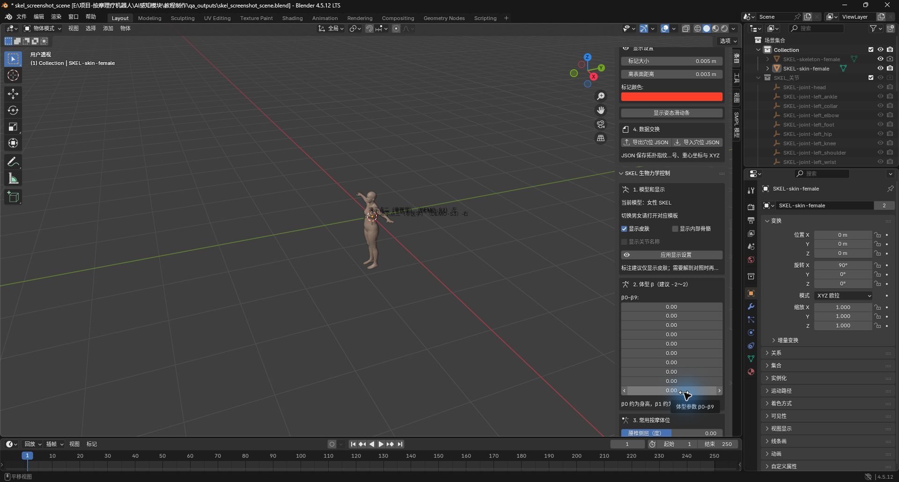
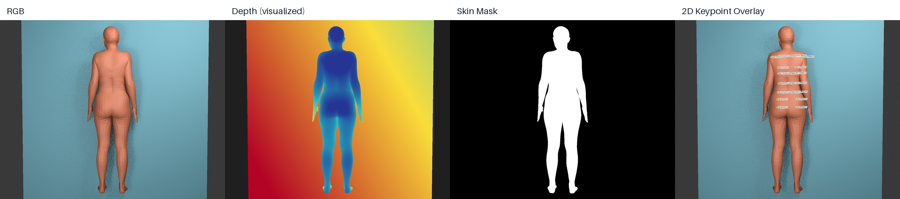
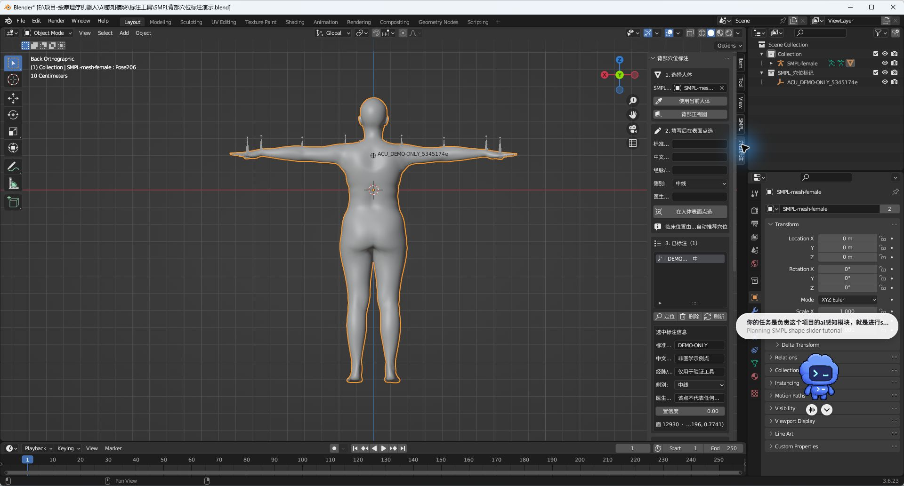
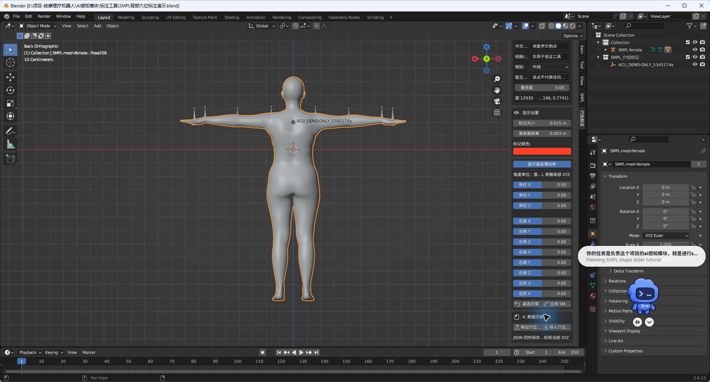
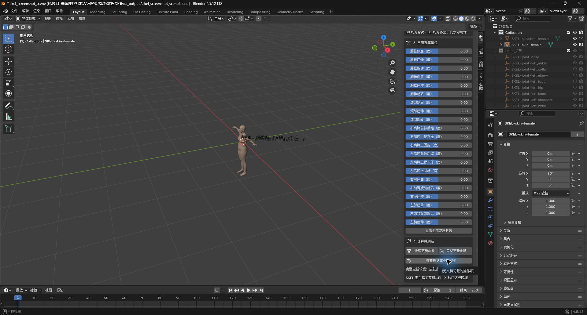
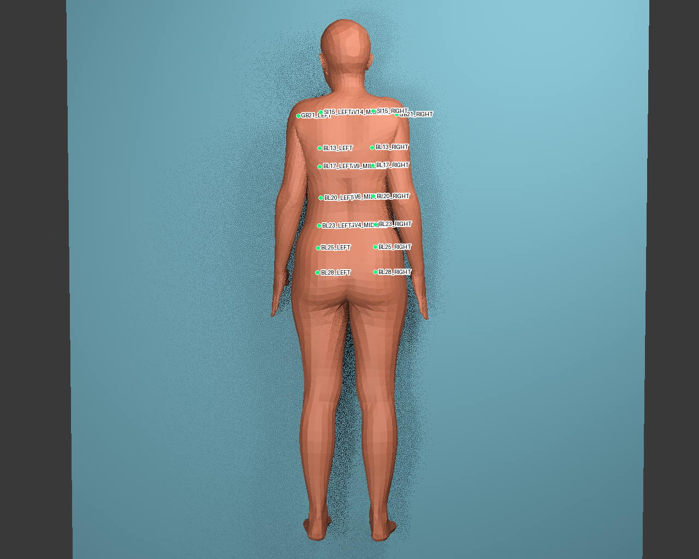
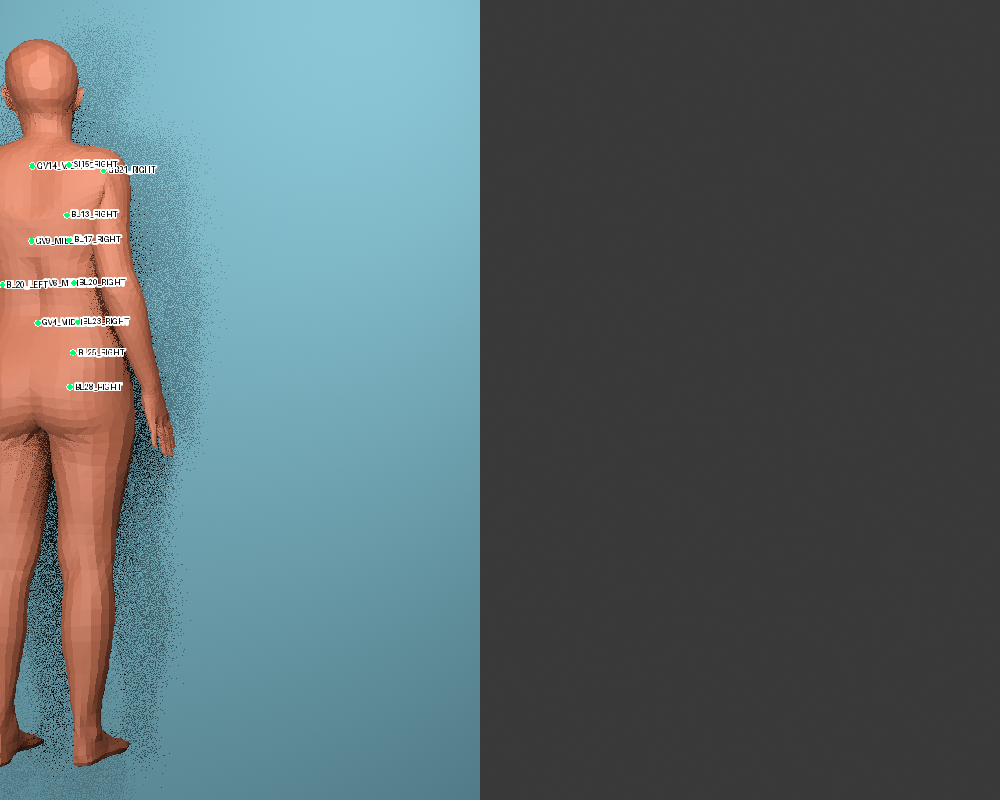
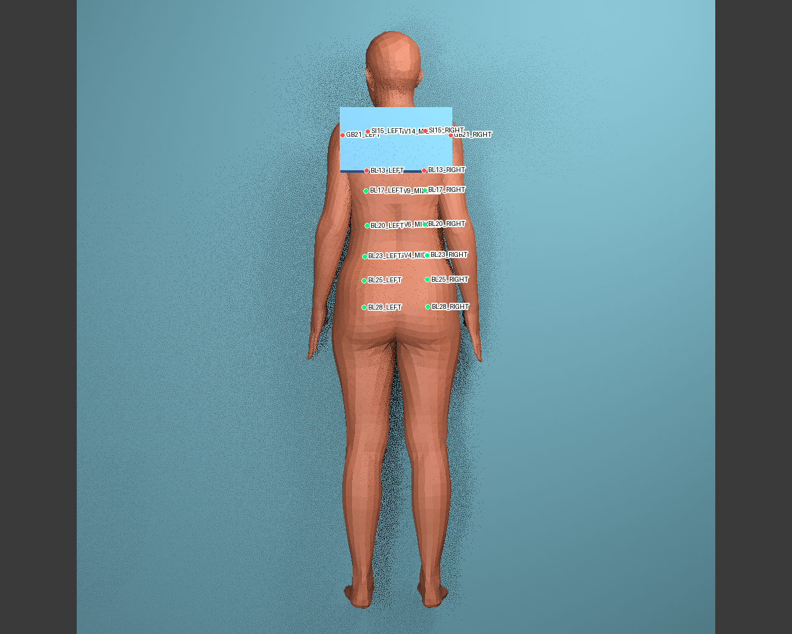
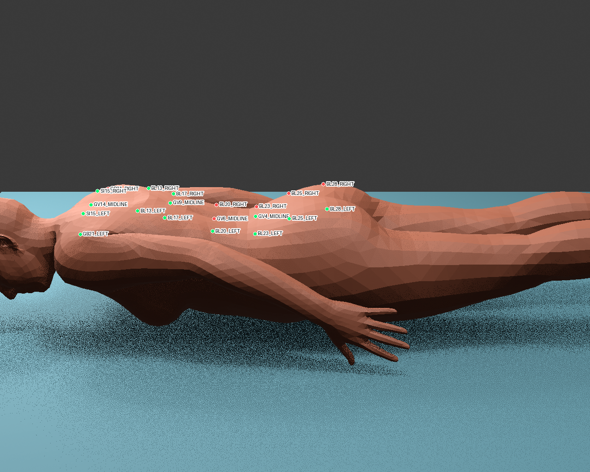

# 内容排版与素材映射（待确认）

## 统一视觉系统

- 画布：16:9，纯白背景。
- 配色：炭黑文字；低饱和青绿色作为结构色；穴位与关键限制使用珊瑚红。
- 标题：左对齐，约占页面高度 10%；不使用大面积色块。
- 正文：每页只保留一句主结论、3—5 个短标签和必要数字。
- 图片：真实插件截图与真实输出图作为严格输入素材；允许裁切和加边框，不重绘截图内容。
- 页脚：只在需要时使用一条浅灰结论线；不放装饰图标、背景纹理或页码。

## Slide 1｜研究目标

布局：左 36% 文字，右 64% 单张插件截图。右图裁掉 Blender 顶部菜单与无关属性栏，只保留 SKEL 人体、穴位标注插件面板和“在人体表面点选”区域。

主视觉：

文字层级：

- 标题：基于 SKEL 与虚拟 RGB-D 的穴位定位数据生成
- 三个短点：面向机器人穴位定位 / 真人三维标注困难 / 参数化人体生成带标注 RGB-D
- 底部结论条：为后续穴位定位模型准备带二维与三维标签的 RGB-D 训练数据

## Slide 2｜总体技术路线

布局：页面中央是一条六节点横向流程；下方只放三个窄截图切片，分别对应“标注”“Shape/Pose”“RGB-D输出”。

截图 1（裁右侧标注面板）：

截图 2（只裁右侧 Shape 控制区）：

截图 3（最终输出缩略图）：

流程文字：标准 SKEL 人体 → 表面穴位标注 → 改变体型与姿势 → 虚拟 RGB-D 相机 → RGB / Depth / Mask → 2D / 3D 标签。

底部限制：当前使用 20 个工程测试点验证流程，尚未作为正式医学标注。

## Slide 3｜穴位 Atlas 与表面传播

布局：左侧 55% 放插件主截图；右侧 45% 分成上下两张功能裁切图。最下方增加一个窄的“固定坐标 × / 表面绑定 ✓”对比条。

左图（人体与已标注点）：

右上（JSON 导入导出按钮及说明）：

右下（Pose 参数与更新按钮）：

核心文字只保留：`face_index + barycentric`、Atlas 导出/导入、随 Shape / Pose 传播。

## Slide 4｜虚拟 RGB-D 数据生成

布局：上方一句结论；中部四张等宽真实输出图；下方一行标签字段。

严格使用：

下方字段：2D / 3D 坐标 · 表面法向 · 可见性 · 遮挡原因。

## Slide 5｜投影与遮挡验证

布局：左侧 58% 放正常 Overlay 大图；右侧 42% 放三个纵向局部截图，依次为出画、外部遮挡、极端侧视。页面上方用一条简洁闭环表示 `3D → 2D → Depth → 3D`。

主图：

三个小图：

只写五个验证标签：多点投影 / 反投影 / 出画 / 外部遮挡 / 自遮挡与背向。

## Slide 6｜Shape 与 Pose 验证结果

布局：左右双栏。左栏 Shape-only 九宫格，右栏 Pose-only 十二格；顶部用两个短标题分区，底部横排三个结果数字。

左图：

右图：

结果数字：17 个合格组合 / 固定主相机 17/17 通过 / 最大反投影误差约 1.295 mm。

## Slide 7｜Camera 与可见性验证结果

布局：左侧约 62% 为 2×2 四场景截图矩阵；右侧约 38% 为表格与三个数字卡片。

四图仍使用 Slide 5 的四张原始 Overlay，但完整显示，不做局部裁切。

右侧表格：轻微斜视 17/17、边缘出画 17/17、外部遮挡 17/17、极端侧视 3/17。

数字卡片：54 / 68 兼容；Depth 2.909 mm；反投影 2.944 mm。

底部状态：`PASS_WITH_RESTRICTIONS`。

## Slide 8｜当前进度与下一步

布局：左、右两栏清单；中间用一条细竖线分隔。顶部右侧放两个大数字 `17` 与 `54`。底部放一条很窄的插件截图—输出图组合带，呼应已完成闭环。

底部截图来源：Slide 1 的插件主界面裁切 + Slide 4 的 RGB-D 四联图裁切。

左栏“已完成”：Atlas / 表面传播 / RGB-D 与标签 / 17 个组合 / 54 个兼容配对。

右栏“下一步”：冻结 Pilot 规则 / 生成小规模工程数据集 / 验证第一版定位模型。
